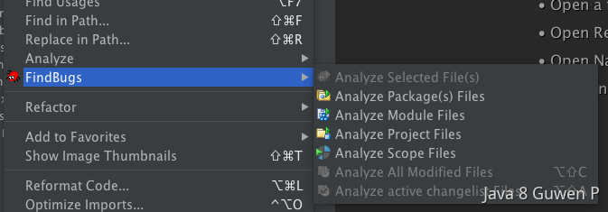
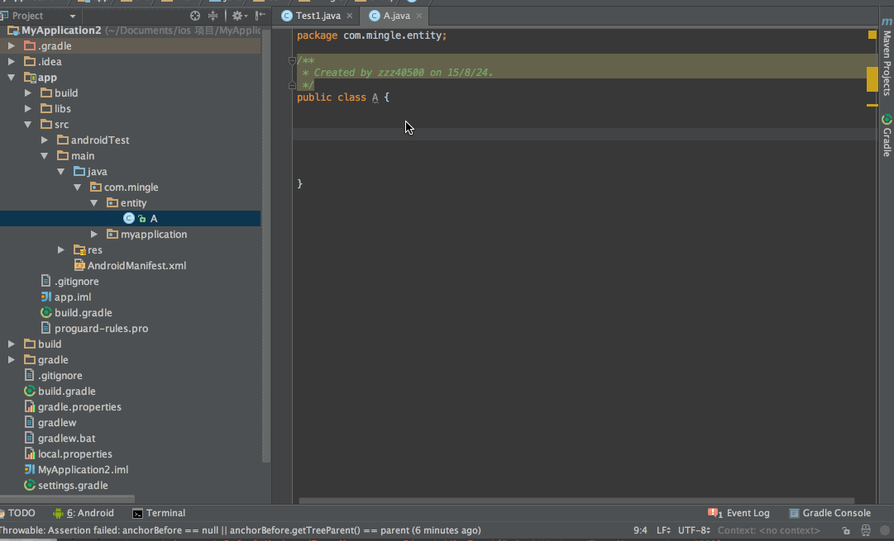
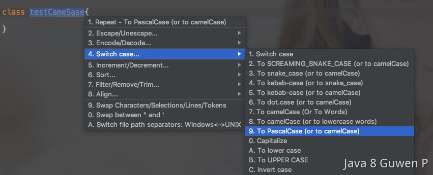
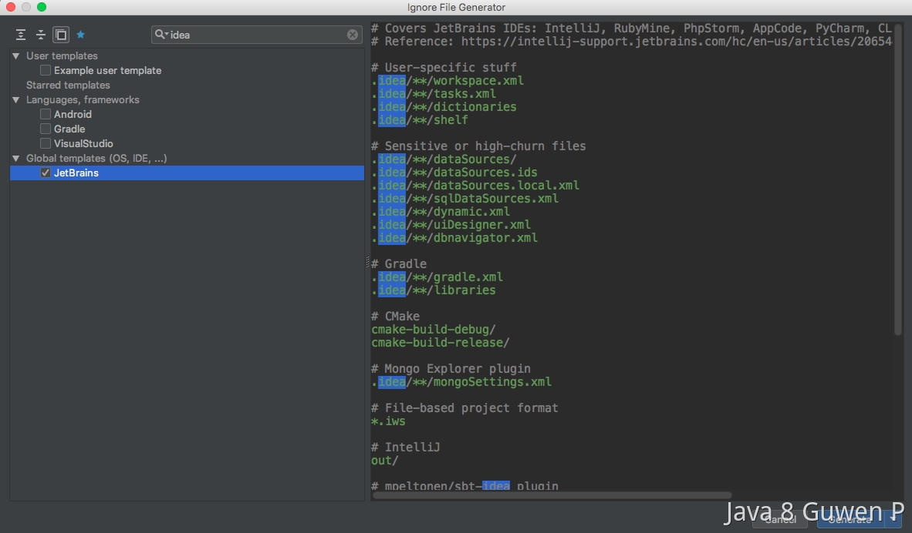
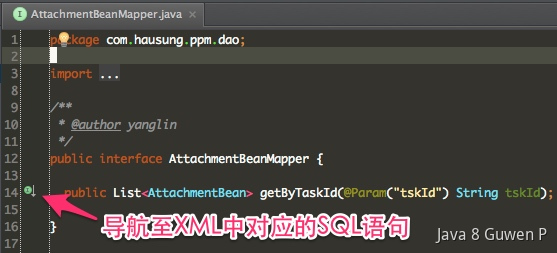
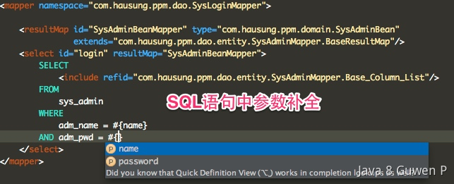
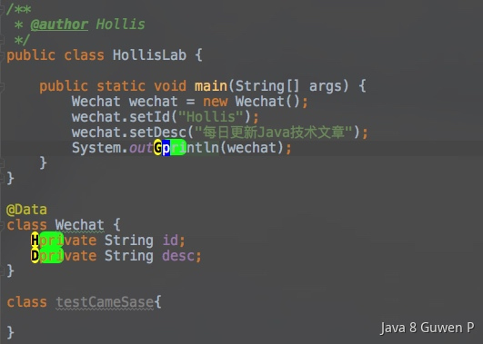
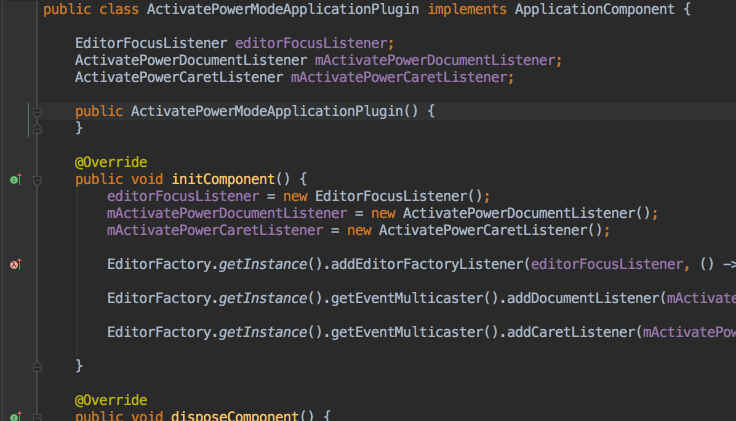

# ✅你平常用哪些idea插件？


# 典型回答

推荐几个我在用的插件！

### Maven Helper
目前，Java开发很多都在使用maven进行项目管理和自动构建。
日常开发中，可能经常会遇到jar包冲突等问题，就需要通过查看maven依赖树来查查看依赖情况。这种方式不是很高效，这里推荐一个插件，安装之后，直接打开pom文件，即可查看依赖数，还能自动分析是否存在jar包冲突。
一旦安装了Maven Helper插件，只要打开pom文件，就可以打开该pom文件的Dependency Analyzer视图（在文件打开之后，文件下面会多出这样一个tab）。

进入Dependency Analyzer视图之后有三个查看选项，分别是Conflicts(冲突)、All Dependencies as List(列表形式查看所有依赖)、All Dependencies as Tree(树结构查看所有依赖)。并且这个页面还支持搜索。

### FindBugs-IDEA
FindBugs很多人都并不陌生，Eclipse中有插件可以帮助查找代码中隐藏的bug，IDEA中也有这款插件。
使用方法很简单，就是可以对多种级别的内容进行finbugs

分析完之后会有一个视图进行提示，详细的说明是哪种问题。

 按照提示解决完问题之后再执行findbug查看情况即可。

### 阿里巴巴代码规约检测
2017年10月14日杭州云栖大会，Java代码规约扫描插件全球首发仪式正式启动，规范正式以插件形式公开走向业界，引领Java语言的规范之路。
Java代码规约扫描插件以今年年初发布的《阿里巴巴Java开发规约》为标准，作为Eclipse、IDEA的插件形式存在，检测JAVA代码中存在不规范得位置然后给予提示。规约插件是采用kotlin语言开发的，感兴趣的同学可以去开看插件源码。
阿里巴巴规约插件包含三个子菜单：编码规约扫描、关闭试试检测功能。

并且，该插件支持在编写代码的同时进行提示，

这款插件，真的可以很大程度上提升代码质量，一定要安装。

### GsonFormat
Java开发中，经常有把json格式的内容转成Object的需求，比如项目开始时，合作方给你提供了一个json格式request/response，这时候你就需要将其定义成一个Java类，GsonFormat这款插件可以实现该功能。


### Lombok plugin
在Java中，我们经常会定义很多JavaBean，这些Bean需要有getter、setter、toString、equals和hashCode等方法。

通常情况下，我们可以使用IDEA的快捷键生成这些代码，但是自动生成的代码后，如果bean中的属性一旦有修改，需要重新生成，给代码维护增加了一定的负担。

有一款很好的插件，可以帮助开发者节省这部分工作。那就是Lombok。

只要在IDEA中安装了该插件，只需要在JavaBean中添加一行注解代码，插件就会自动帮我们生成getter、setter、toString、equals和hashCode等方法。

当然，这些方法不止在IDE中的代码调用中需要用到，在真正线上部署的时候也需要有，所以，还需要使用maven引入一个lombok的包。
```
<dependency>
      <groupId>org.projectlombok</groupId>
      <artifactId>lombok</artifactId>
      <version>1.16.10</version>
</dependency>

/**
 * @author Hollis
 */
public class HollisLab {

    public static void main(String[] args) {
        Wechat wechat = new Wechat();
        wechat.setId("Hollis");
        wechat.setDesc("每日更新Java技术文章");
        System.out.println(wechat);
    }
}

@Data
class Wechat {
    private String id;
    private String desc;
}
```
输出结果：
```
Wechat(id=Hollis, desc=每日更新Java技术文章)
```
我们在Wechat类上面添加了@Data注解，插件就自动帮我们添加了getter/setter和toString方法。

### 

### String Manipulation
字符串日常开发中经常用到的，但是不同的字符串类型在不同的地方可能有一些不同的规则，比如类名要用驼峰形式、常量需要全部大写等，有时候还需要进行编码解码等。这里推荐一款强大的字符串转换工具——String Manipulation。
它强大到什么程度，看下他的功能列表你就知道了：


- 文本转换操作
   - 切换样式（camelCase, hyphen-lowercase, HYPHEN-UPPERCASE, snake_case, SCREAMING_SNAKE_CASE, dot.case, words lowercase, Words Capitalized, PascalCase）
   - 转换为SCREAMING_SNAKE_CASE (或转换为camelCase)
   - 转换为 snake_case (或转换为camelCase)
   - 转换为dot.case (或转换为camelCase)
   - 转换为hyphen-case (或转换为camelCase)
   - 转换为hyphen-case (或转换为snake_case)
   - 转换为camelCase (或转换为Words)
   - 转换为camelCase (或转换为lowercase words)
   - 转换为PascalCase (或转换为camelCase)
   - 选定文本大写
   - 样式反转
- Un/Escape
   - Un/Escape 选中的 java 文本
   - Un/Escape 选中的 javascript 文本
   - Un/Escape 选中的 HTML 文本
   - Un/Escape 选中的 XML 文本
   - Un/Escape 选中的 SQL 文本
   - Un/Escape 选中的 PHP 文本
   - 将 diacritics(accents) 转换为 ASCII
   - 将非ASCII 转换为转义的Unicode
   - 将转义的Unicode转换为字符串
- Encode/Decode
   - Encode 选中的文本为 MD5 Hex16
   - De/Encode 选中的文本为 URL
   - De/Encode 选中的文本为 Base64
- 递增/递减
   - 递增/递减所有找到的数字
   - 复制行并且递增/递减所有找到的数字
   - 创建序列：保持第一个数字，递增替换所有其他数字
   - 递增重复的数字
- 按自然顺序排序
   - 按行倒序
   - 按行随机排序
   - 区分大小写A-z排序
   - 区分大小写z-A排序
   - 不区分大小写A-Z排序
   - 不区分大小写Z-A排序
   - 按行长度排序
   - 通过子选择行排序：每行仅处理一个选择/插入符号
- 对齐
   - 通过选定的分隔将选定的文本格式化为列/表格
   - 将文本对齐为左/中/右
- 过滤/删除/移除
   - grep选定的文本，所有行不匹配输入文字将被删除。 （不能在列模式下工作）
   - 移除选定的文本
   - 移除选定文本中的所有空格
   - 删除选定文本中的所有空格
   - 删除重复的行
   - 只保留重复的行
   - 删除空行
   - 删除所有换行符
- 其他
   - 交换字符/选择/线/标记
   - 切换文件路径分隔符：Windows < - > UNIX

安装好插件后，选中需要处理的内容后，按快捷键Alt+m，即可弹出工具功能列表。
很好很强大的一款字符串处理工具。

### .ignore
目前很多开发都在使用git做版本控制工具，但是有些时候有些代码我们是不想提到到我们的代码仓库中的，比如ide自动生成的一些配置文件，或者是我们打包生成的一些jar文件等，这时候就需要编写一个.ignore文件，来排除那些不想被版本管理的文件。
这里推荐一个好用的插件.ignore，他可以帮我们方便的生成各种ignore文件。
安装插件后，选中项目，右键新建的时候，会多出一个.ignore文件的选项，可以通过这个选项创建ignore文件。

在弹出的对话框中，可以自动帮我们生成一份.ignore文件，这里我们让其帮忙自动排除所有和idea有关的文件。

### Mybatis plugin
目前ORM框架中，Mybatis非常受欢迎。但是，同时给很多开发带来困扰的就是Mybatis需要很多xml的配置文件，有的时候很难去进行修改。
这里推荐一款神器，可以让你像编辑java代码一样编辑mybatis的文件。
Intellij Idea Mybatis插件主要功能：

- 提供Mapper接口与配置文件中对应SQL的导航
- 编辑XML文件时自动补全
- 根据Mapper接口, 使用快捷键生成xml文件及SQL标签
- ResultMap中的property支持自动补全，支持级联(属性A.属性B.属性C)
- 快捷键生成@Param注解
- XML中编辑SQL时, 括号自动补全
- XML中编辑SQL时, 支持参数自动补全(基于@Param注解识别参数)
- 自动检查Mapper XML文件中ID冲突
- 自动检查Mapper XML文件中错误的属性值
- 支持Find Usage
- 支持重构从命名
- 支持别名
- 自动生成ResultMap属性





但是这款插件是收费的，但是不影响他确实是一个很实用，可以很大程度上提升开发效率的插件。读者可以考虑使用Free Mybatis plugin（这款插件我没用过，具体是否好用有待考证）。

### Key promoter X
对于很多刚刚开始使用IDEA的开发者来说，最苦恼的就是不知道快捷键操作是什么。
使用IDEA，如果所有操作都使用鼠标，那么说明你还不是一个合格的程序员。
这里推荐一款可以进行快捷键提示的插件Key promoter X。
Key Promoter X 是一个提示插件，当你在IDEA里面使用鼠标的时候，如果这个鼠标操作是能够用快捷键替代的，那么Key Promoter X会弹出一个提示框，告知你这个鼠标操作可以用什么快捷键替代。
当我使用鼠标查看一个方法都被哪些类使用的时候，就会提示：

记住这个快捷键以后，就可以使用快捷键代替鼠标啦。

### AceJump
前面介绍了一款可以通过使用快捷键来代替鼠标操作的插件，这里再介绍一款可以彻底摆脱鼠标的插件，即AceJump
AceJump允许您快速将光标导航到编辑器中可见的任何位置，只需点击“ctrl +;”，然后输入一个你想要跳转到的字符，之后键入匹配的字符就跳转到你想要调整的地方了。

如以上代码，我想在这个类中，跳转到println那个位置，只需要按下快捷键：“ctrl +;”，然后输入println，即可定位到目标位置。
上图中，我输入了pri三个字母后，页面提示三个可选项，分别用字母G、H、D标注，这时候只需要按下对应字母，即可快速定位到指定位置，是不是很方便。

### activate-power-mode
最后，介绍一款程序员很好的在妹子面前装X的插件——activate-power-mode 。
安装了这款插件之后，你写代码的时候，就会附加一些狂拽炫酷屌炸天的效果：



> 原文: <https://www.yuque.com/hollis666/dr9x5m/vxmblxpk6mmqesn4>