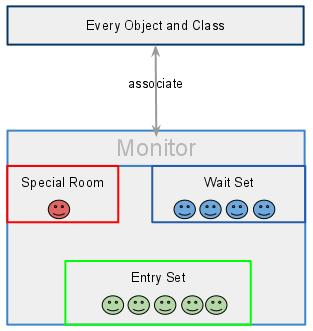
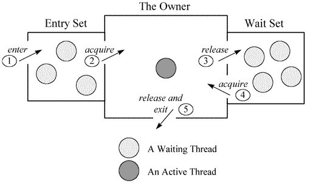
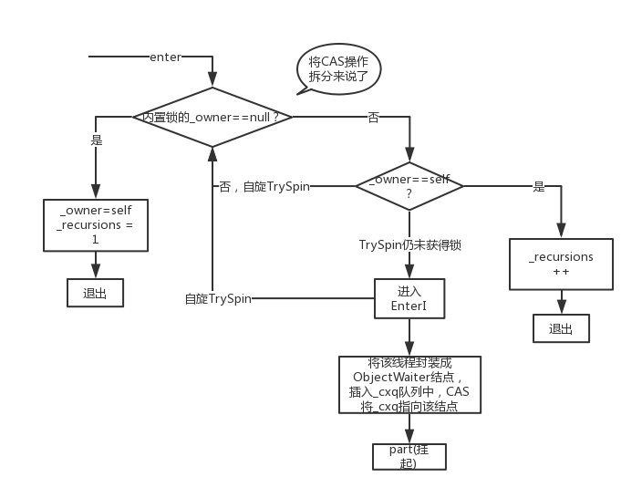
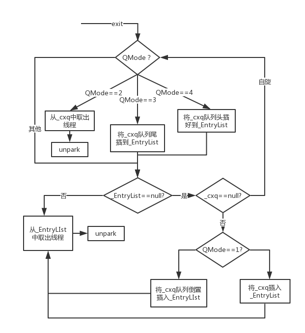

# ✅synchronized是怎么实现的？


# 典型回答
`synchronized` 是 Java 中的一个很重要的关键字，主要用来加锁，`synchronized` 所添加的锁有以下几个特点。synchronized 的使用方法比较简单，主要可以用来修饰方法和代码块。根据其锁定的对象不同，可以用来定义同步方法和同步代码块。

方法级的同步是隐式的（同步方法）。同步方法的常量池中会有一个 `ACC_SYNCHRONIZED` 标志。当某个线程要访问某个方法的时候，会检查是否有 `ACC_SYNCHRONIZED`，如果有设置，则需要先获得监视器锁，然后开始执行方法，方法执行之后再释放监视器锁。这时如果其他线程来请求执行方法，会因为无法获得监视器锁而被阻断住。值得注意的是，如果在方法执行过程中，发生了异常，并且方法内部并没有处理该异常，那么在异常被抛到方法外面之前监视器锁会被自动释放。

同步代码块使用 `monitorenter` 和 `monitorexit` 两个指令实现。 可以把执行 `monitorenter` 指令理解为加锁，执行 `monitorexit` 理解为释放锁。 每个对象维护着一个记录着被锁次数的计数器。未被锁定的对象的该计数器为 0，当一个线程获得锁（执行 `monitorenter` ）后，该计数器自增变为 1 ，当同一个线程再次获得该对象的锁的时候，计数器再次自增。当同一个线程释放锁（执行 `monitorexit` 指令）的时候，计数器再自减。当计数器为 0 的时候。锁将被释放，其他线程便可以获得锁。


# 扩展知识


## synchronized
`synchronized` 是 Java 中的一个很重要的关键字，主要用来加锁，`synchronized` 所添加的锁有以下几个特点。

- 互斥性 
   - 同一时间点，只有一个线程可以获得锁，获得锁的线程才可以处理被 synchronized 修饰的代码片段。
- 阻塞性 
   - 只有获得锁的线程才可以执行被 synchronized 修饰的代码片段，未获得锁的线程只能阻塞，等待锁释放。
- 可重入性 
   - 如果一个线程已经获得锁，在锁未释放之前，再次请求锁的时候，是必然可以获得锁的。


### synchronized 的用法

synchronized 的使用方法比较简单，主要可以用来修饰方法和代码块。根据其锁定的对象不同，可以用来定义同步方法和同步代码块。

**同步方法**

```java
//同步方法，对象锁  
public synchronized void doSth(){
    System.out.println("Hello World");
}

//同步方法，类锁  
public synchronized static void doSth(){
    System.out.println("Hello World");
}
```

以上代码，在方法的作用域（public）后面增加 `Synchronized`，即可声明一个同步方法。

**同步代码块**

```java
//同步代码块，类锁
public void doSth1(){
    synchronized (Demo.class){
        System.out.println("Hello World");
    }
}

//同步代码块，对象锁
public void doSth1(){
    synchronized (this){
        System.out.println("Hello World");
    }
}
```

以上代码，在代码块前面增加 `synchronized`，即可声明一个同步代码块。

在上面的同步方法和同步代码块的例子中，均提供了两个代码 demo，分别是两种类型的锁，即类锁和对象锁。区分方式按照其锁定的内容进行划分。对象锁锁定的内容是对象，类锁锁定的内容是类。其实，类锁也是通过对象锁实现的，因为在 Java 中，万物皆对象。

无论是同步方法还是同步代码块，其实现其实都要依赖对象的监视器（Monitor）。


## Monitor 

为了解决线程安全的问题，Java 提供了同步机制、互斥锁机制，这个机制保证了在同一时刻只有一个线程能访问共享资源。

这个机制的保障来源于监视锁 Monitor，每个对象都拥有自己的监视锁 Monitor。当我们尝试获得对象的锁的时候，其实是对该对象拥有的 Monitor 进行操作。


### 什么是 Monitor

先来举个例子，然后我们再上源码。我们可以把监视器理解为包含一个特殊的房间的建筑物，这个特殊房间同一时刻只能有一个客人（线程）。这个房间中包含了一些数据和代码。


如果一个顾客想要进入这个特殊的房间，他首先需要在走廊（Entry Set）排队等待。调度器将基于某个标准（比如 FIFO）来选择排队的客户进入房间。如果，因为某些原因，该客户暂时因为其他事情无法脱身（线程被挂起），那么他将被送到另外一间专门用来等待的房间（Wait Set），这个房间的可以在稍后再次进入那件特殊的房间。如上面所说，这个建筑屋中一共有三个场所。



总之，监视器是一个用来监视这些线程进入特殊的房间的。他的义务是保证（同一时间）只有一个线程可以访问被保护的数据和代码。

Monitor 其实是一种同步工具，也可以说是一种同步机制，它通常被描述为一个对象，主要特点是：

> 对象的所有方法都被“互斥”的执行。好比一个 Monitor 只有一个运行“许可”，任一个线程进入任何一个方法都需要获得这个“许可”，离开时把许可归还。
>  
> 通常提供 singal 机制：允许正持有“许可”的线程暂时放弃“许可”，等待某个谓词成真（条件变量），而条件成立后，当前进程可以“通知”正在等待这个条件变量的线程，让他可以重新去获得运行许可。


### Monitor 的代码实现

在 Java 虚拟机(HotSpot)中，Monitor 是基于 C++ 实现的，由 ObjectMonitor 实现的，其主要数据结构如下：

```c
ObjectMonitor() {
    _header       = NULL;
    _count        = 0;
    _waiters      = 0,
    _recursions   = 0;
    _object       = NULL;
    _owner        = NULL;
    _WaitSet      = NULL;
    _WaitSetLock  = 0 ;
    _Responsible  = NULL ;
    _succ         = NULL ;
    _cxq          = NULL ;
    FreeNext      = NULL ;
    _EntryList    = NULL ;
    _SpinFreq     = 0 ;
    _SpinClock    = 0 ;
    OwnerIsThread = 0 ;
}
```

ObjectMonitor 中有几个关键属性：

> _owner：指向持有 ObjectMonitor 对象的线程
>  
> _WaitSet：存放处于 wait 状态的线程队列
>  
> _EntryList：存放处于等待锁 block 状态的线程队列
>  
> _recursions：锁的重入次数
>  
> _count：用来记录该线程获取锁的次数


当多个线程同时访问一段同步代码时，首先会进入 `_EntryList` 队列中，当某个线程获取到对象的 monitor 后进入 `_Owner` 区域并把 monitor 中的 `_owner` 变量设置为当前线程，同时 monitor 中的计数器 `_count` 加1。即获得对象锁。

若持有 monitor 的线程调用 `wait()` 方法，将释放当前持有的 monitor，`_owner` 变量恢复为 `null`，`_count` 自减 1，同时该线程进入 `_WaitSet` 集合中等待被唤醒。若当前线程执行完毕也将释放 monitor(锁)并复位变量的值，以便其他线程进入获取 monitor(锁)。如下图所示



下面是 ObjectMonitor 类中提供的几个方法，我在关键节点处都增加了注释，便于读者阅读，可以对照上面的例子以及后文的流程图进行理解。

**获得锁**

```c
void ATTR ObjectMonitor::enter(TRAPS) {
    Thread * const Self = THREAD ;
    void * cur ;
    //通过CAS尝试把monitor的`_owner`字段设置为当前线程
    cur = Atomic::cmpxchg_ptr (Self, &_owner, NULL) ;
    //获取锁失败
    if (cur == NULL) {         
        assert (_recursions == 0   , "invariant") ;
        assert (_owner      == Self, "invariant") ;
        // CONSIDER: set or assert OwnerIsThread == 1
        return ;
    }
    // 如果旧值和当前线程一样，说明当前线程已经持有锁，此次为重入，_recursions自增，并获得锁。
    if (cur == Self) { 
        // TODO-FIXME: check for integer overflow!  BUGID 6557169.
        _recursions ++ ;
        return ;
    }

    // 如果当前线程是第一次进入该monitor，设置_recursions为1，_owner为当前线程
    if (Self->is_lock_owned ((address)cur)) { 
        assert (_recursions == 0, "internal state error");
        _recursions = 1 ;
        // Commute owner from a thread-specific on-stack BasicLockObject address to
        // a full-fledged "Thread *".
        _owner = Self ;
        OwnerIsThread = 1 ;
        return ;
    }

    // 省略部分代码。
    // 通过自旋执行ObjectMonitor::EnterI方法等待锁的释放
    for (;;) {
        jt->set_suspend_equivalent();
        // cleared by handle_special_suspend_equivalent_condition()
        // or java_suspend_self()

        EnterI (THREAD) ;

        if (!ExitSuspendEquivalent(jt)) break ;

        //
        // We have acquired the contended monitor, but while we were
        // waiting another thread suspended us. We don't want to enter
        // the monitor while suspended because that would surprise the
        // thread that suspended us.
        //
        _recursions = 0 ;
        _succ = NULL ;
        exit (Self) ;

        jt->java_suspend_self();
    }
}
```



释放锁

```
void ATTR ObjectMonitor::exit(TRAPS) {
   Thread * Self = THREAD ;
   //如果当前线程不是Monitor的所有者
   if (THREAD != _owner) { 
     if (THREAD->is_lock_owned((address) _owner)) { // 
       // Transmute _owner from a BasicLock pointer to a Thread address.
       // We don't need to hold _mutex for this transition.
       // Non-null to Non-null is safe as long as all readers can
       // tolerate either flavor.
       assert (_recursions == 0, "invariant") ;
       _owner = THREAD ;
       _recursions = 0 ;
       OwnerIsThread = 1 ;
     } else {
       // NOTE: we need to handle unbalanced monitor enter/exit
       // in native code by throwing an exception.
       // TODO: Throw an IllegalMonitorStateException ?
       TEVENT (Exit - Throw IMSX) ;
       assert(false, "Non-balanced monitor enter/exit!");
       if (false) {
          THROW(vmSymbols::java_lang_IllegalMonitorStateException());
       }
       return;
     }
   }
    // 如果_recursions次数不为0.自减
   if (_recursions != 0) {
     _recursions--;        // this is simple recursive enter
     TEVENT (Inflated exit - recursive) ;
     return ;
   }

   //省略部分代码，根据不同的策略（由QMode指定），从cxq或EntryList中获取头节点，通过ObjectMonitor::ExitEpilog方法唤醒该节点封装的线程，唤醒操作最终由unpark完成。
```



除了 enter 和 exit 方法以外，[objectMonitor.cpp][3]中还有

```
void      wait(jlong millis, bool interruptable, TRAPS);
void      notify(TRAPS);
void      notifyAll(TRAPS);
```

等方法。

我们知道了 `synchronized` 对某个对象进行加锁的时候，会调用该对象拥有的 objectMonitor 的 `enter` 方法，解锁的时候会调用 `exit` 方法。

事实上，只有在 JDK1.6 之前，`synchronized` 的实现才会直接调用 ObjectMonitor 的 `enter` 和 `exit` ，这种锁被称之为重量级锁。为什么说这种方式操作锁很重呢？

- Java 的线程是映射到操作系统原生线程之上的，如果要阻塞或唤醒一个线程就需要操作系统的帮忙，这就要从用户态转换到核心态，因此状态转换需要花费很多的处理器时间，对于代码简单的同步块（如被 `Synchronized` 修饰的 `get` 或 `set` 方法）状态转换消耗的时间有可能比用户代码执行的时间还要长，所以说 `synchronized` 是 java 语言中一个重量级的操纵。

所以，在 JDK1.6 中出现对锁进行了很多的优化，进而出现轻量级锁，偏向锁，锁消除，适应性自旋锁，锁粗化(自旋锁在 1.4 就有 只不过默认的是关闭的，JDK1.6 是默认开启的)，这些操作都是为了在线程之间更高效的共享数据 ，解决竞争问题。后面的文章会继续介绍这几种锁优化机制以及他们之间的关系。


> 原文: <https://www.yuque.com/hollis666/dr9x5m/gxq5p0>