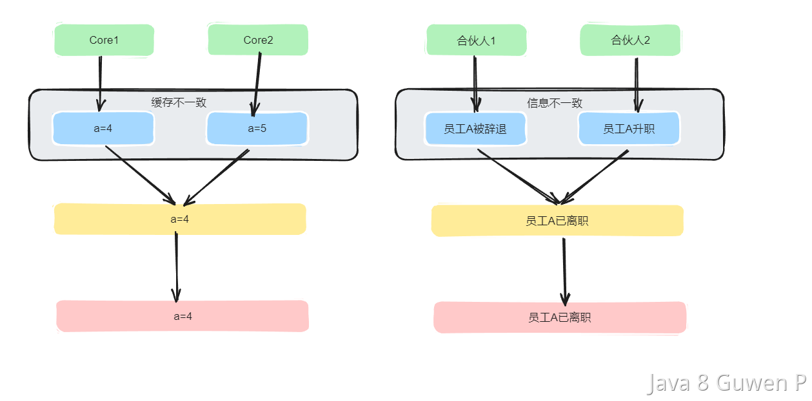
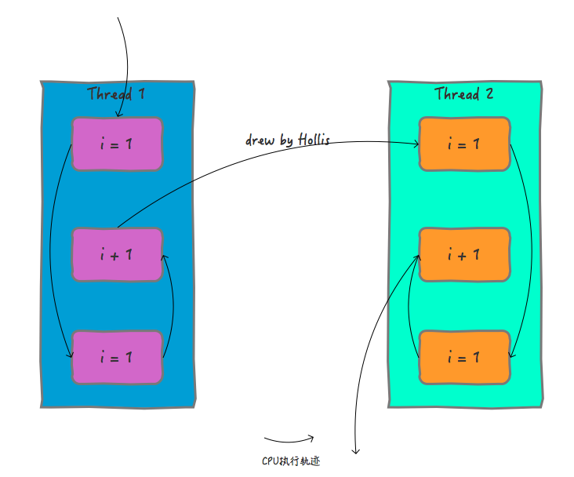

# ✅什么是Java内存模型（JMM）？

# 典型回答

Java程序是需要运行在Java虚拟机上面的，Java内存模型（Java Memory Model ,JMM）就是一种符合内存模型规范的，屏蔽了各种硬件和操作系统的访问差异的，保证了Java程序在各种平台下对内存的访问都能保证效果一致的机制及规范。
提到Java内存模型，一般指的是JDK 5 开始使用的新的内存模型，主要由JSR-133: JavaTM Memory Model and Thread Specification 描述（http://www.cs.umd.edu/~pugh/java/memoryModel/jsr133.pdf）

Java内存模型规定了所有的共享变量都存储在主内存中，每条线程还有自己的工作内存，线程的工作内存中保存了该线程中使用到的变量的主内存副本拷贝，线程对变量的所有操作都必须在工作内存中进行，而不能直接读写主内存。不同的线程之间也无法直接访问对方工作内存中的变量，线程间变量的传递均需要自己的工作内存和主存之间进行数据同步进行。

而JMM就作用于工作内存和主存之间数据同步过程。他规定了如何做数据同步以及什么时候做数据同步。

JMM是一种规范，目的是解决由于多线程通过共享内存进行通信时，存在的本地内存数据不一致、编译器会对代码指令重排序、处理器会对代码乱序执行等带来的问题。

# 扩展知识

## 计算机硬件升级带来的问题

### 多级缓存和一致性问题

[✅什么是操作系统的多级缓存](https://www.yuque.com/hollis666/dr9x5m/nm0sde8ek7ccfg1w?view=doc_embed)

先看下上面关于多级缓存的介绍。

随着计算机能力不断提升，开始支持多线程。那么问题就来了。我们分别来分析下单线程、多线程在单核CPU、多核CPU中的影响。

**单线程。** cpu核心的缓存只被一个线程访问。缓存独占，不会出现访问冲突等问题。

**单核CPU，多线程。** 进程中的多个线程会同时访问进程中的共享数据，CPU将某块内存加载到缓存后，不同线程在访问相同的物理地址的时候，都会映射到相同的缓存位置，这样即使发生线程的切换，缓存仍然不会失效。但由于任何时刻只能有一个线程在执行，因此不会出现缓存访问冲突。

**多核CPU，多线程。** 每个核都至少有一个L1 缓存。多个线程访问进程中的某个共享内存，且这多个线程分别在不同的核心上执行，则每个核心都会在各自的cache中保留一份共享内存的缓存。由于多核是可以并行的，可能会出现多个线程同时写各自的缓存的情况，而各自的cache之间的数据就有可能不同。

在CPU和主存之间增加缓存，在多线程场景下就可能存在**缓存一致性问题**，也就是说，在多核CPU中，每个核的自己的缓存中，关于同一个数据的缓存内容可能不一致。

### CPU时间片与原子性问题

很多人都知道，现在我们用到操作系统，无论是Windows、Linux还是MacOS等其实都是多用户多任务分时操作系统。使用这些操作系统的“用户”是可以“同时”干多件事的，这已经是日常习惯了，并没觉得有什么特别。

但是实际上，对于单CPU的计算机来说，在CPU中，同一时间是只能干一件事儿的。

为了看起来像是“同时干多件事”，分时操作系统是把CPU的时间划分成长短基本相同的时间区间,即”时间片”，通过操作系统的管理，把这些时间片依次轮流地分配给各个“用户”使用。

如果某个“用户”在时间片结束之前，整个任务还没有完成，“用户”就必须进入到就绪状态，放弃CPU，等待下一轮循环。此时CPU又分配给另一个“用户”去使用。

> CPU 就好像是一个电话亭，他可以开放给所有用户使用，但是他有规定，每个用户进入电话亭之后只能使用规定时长的时间。如果时间到了，用户还没打完电话，那就会被要求去重新排队。

不同的操作系统，在选择“用户”分配时间片的调度算法是不一样的，常用的有FCFS、轮转、SPN、SRT、HRRN、反馈等，由于不是本文重点，就不展开了。

> 这个电话亭可以允许哪个用户进入打电话是有不同的策略的，不同的电话亭规定不同，有的电话亭采用排队机制（FCFS）、有的优先分配给打电话时间最短的人（SPN）等

我们说原子性问题，其实指的是多线程场景中操作如果不能保证原子性，会导致处理结果和预期不一致。

前面我们提到过，线程是CPU调度的基本单位。CPU有时间片的概念，会根据不同的调度算法进行线程调度。所以在多线程场景下，就会发生原子性问题。因为线程在执行一个`读改写`操作时，在执行完`读改`之后，时间片耗完，就会被要求放弃CPU，并等待重新调度。这种情况下，`读改写`就不是一个原子操作。

> 就好像我们去电话亭打电话，一共有三个步骤，查找电话，拨号，交流。由于我们在电话亭中可以停留的时间有限，有可能刚刚找到电话号码，时间到了，就被赶出来了。

在单线程中，一个`读改写`就算不是原子操作也没关系，因为只要这个线程再次被调度，这个操作总是可以执行完的。但是在多线程场景中可能就有问题了。因为多个线程可能会对同一个共享资源进行操作。

比如经典的 `i++` 操作，对于一个简单的`i++`操作，一共有三个步骤：`load` , `add` ,`save` 。共享变量就会被多个线程同时进行操作，这样读改写操作就不是原子的，操作完之后共享变量的值会和期望的不一致，举个例子：如果i=1,我们进行两次`i++`操作，我们期望的结果是3，但是有可能结果是2。

#### 并发中的原子性和数据库中的原子性

原子性的概念是指：一个操作是不可中断的，要全部执行完成，要不就都不执行。
数据库事务中，保证原子性通过事务的提交和回滚，但是在并发编程中，是不涉及到回滚的。所以，并发编程中的原子性，强调的是一个操作的不可分割性。
所以，在并发编程中，原子性的定义不应该和事务中的原子性完全一样。他应该定义为：一段代码，或者一个变量的操作，在没有执行完之前，不能被其他线程执行。

### 指令重排与有序性问题

而且，我们知道，除了引入了时间片以外，由于处理器优化和指令重排等，CPU还可能对输入代码进行乱序执行，比如`load`->`add`->`save` 有可能被优化成`load`->`save`->`add` 。这就是有序性问题。

> 我们打电话的时候，除了可能被中途赶出来以外，本来正常步骤是要查找电话、拨号、交流的。但是电话亭非要给我们优化成查找电话、交流、拨号。这肯定不是我们想要的啊。

还是刚刚的`i++`操作，在满足了原子性的情况下，如果没有满足有序性，那么得到的结果可能也不是我们想要的。

## 计算机内存模型

多CPU多级缓存导致的一致性问题、CPU时间片机制导致的原子性问题、以及处理器优化和指令重排导致的有序性问题等，都是硬件的不断升级导致的。那么，有没有什么机制可以很好的解决上面的这些问题呢？

最简单直接的做法就是废除处理器和处理器的优化技术、废除CPU缓存，让CPU直接和主存交互。但是，这么做虽然可以保证多线程下的并发问题。但是，这就有点因噎废食了。

所以，为了保证并发编程中可以满足原子性、可见性及有序性。有一个重要的概念，那就是——**内存模型**。

为了保证共享内存的正确性（可见性、有序性、原子性），内存模型定义了共享内存系统中多线程程序读写操作行为的规范。通过这些规则来规范对内存的读写操作，从而保证指令执行的正确性。它与处理器有关、与缓存有关、与并发有关、与编译器也有关。他解决了CPU多级缓存、处理器优化、指令重排等导致的内存访问问题，保证了并发场景下的一致性、原子性和有序性。

内存模型解决并发问题主要采用两种方式：限制处理器优化和使用内存屏障。

## Java内存模型的实现原理

了解Java多线程的朋友都知道，在Java中提供了一系列和并发处理相关的关键字，比如volatile、synchronized、final、concurrent包等。其实这些就是Java内存模型封装了底层的实现后提供给程序员使用的一些关键字。

在开发多线程的代码的时候，我们可以直接使用synchronized等关键字来控制并发，从来就不需要关心底层的编译器优化、缓存一致性等问题。所以，Java内存模型，除了定义了一套规范，还提供了一系列原语，封装了底层实现后，供开发者直接使用。

### 原子性

在Java中，为了保证原子性，提供了两个高级的字节码指令monitorenter和monitorexit。可以通过这两个指令来保证原子性。

### 可见性

Java内存模型是通过在变量修改后将新值同步回主内存，在变量读取前从主内存刷新变量值的这种依赖主内存作为传递媒介的方式来实现的。

Java中的volatile关键字提供了一个功能，那就是被其修饰的变量在被修改后可以立即同步到主内存，被其修饰的变量在每次使用之前都从主内存刷新。因此，可以使用volatile来保证多线程操作时变量的可见性。

除了volatile，Java中的synchronized和final两个关键字也可以实现可见性。只不过实现方式不同。

### 有序性

在Java中，可以使用synchronized和volatile来保证多线程之间操作的有序性。实现方式有所区别：

volatile关键字会禁止指令重排。synchronized关键字保证同一时刻只允许一条线程操作。

## JMM 和 MESI

[✅有了MESI为啥还需要JMM？](https://www.yuque.com/hollis666/dr9x5m/yx29gk7wsw26ec4r?view=doc_embed)

## 总线嗅探与总线风暴

[✅什么是总线嗅探和总线风暴，和JMM有什么关系？](https://www.yuque.com/hollis666/dr9x5m/ghzfwsp5n9qzsx01?view=doc_embed)

> 原文: <https://www.yuque.com/hollis666/dr9x5m/hmi3m1>