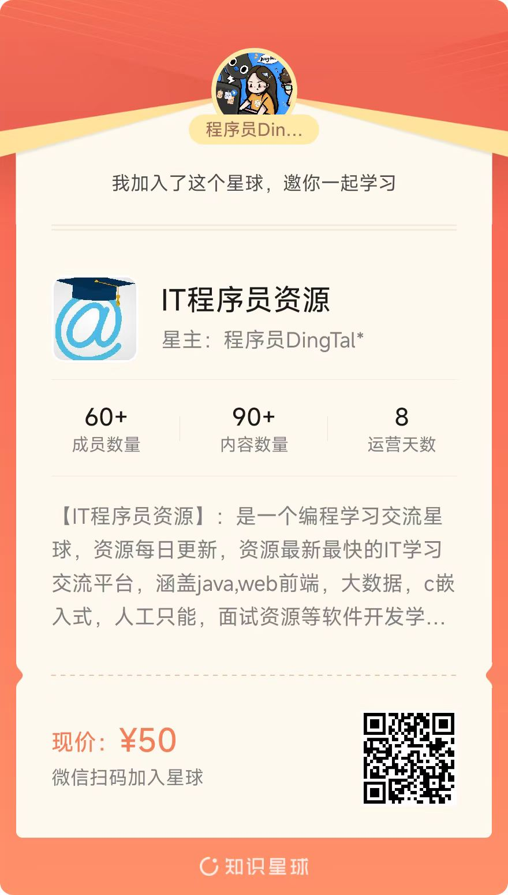

# ✅#和$的区别是什么？什么情况必须用$

我正在「IT程序员资源」和朋友们讨论有趣的话题，你⼀起来吧？
https://t.zsxq.com/kEy5Q


# 典型回答

在Mybatis的mapper文件中，可以使用#{param}和${param}来作为动态参数的替换。

#{}和${}在预编译处理中是不一样的。**#{}类似jdbc中的PreparedStatement，对于传入的参数，在预处理阶段会使用?代替，可以有效的避免SQL注入**。

```java
SELECT * FROM users WHERE id = #{userId}
```

这里的#{userId} 会被替换为 ?，并且 userId 的值在执行时会被安全地设置为参数值。

使用 $ 传递参数时，MyBatis 会将其视为字面量，并在构建 SQL 语句时直接替换成参数的实际值。这意味着参数值会直接拼接到 SQL 语句中。

```java
SELECT * FROM ${tableName}
```

由于 $ 导致的是直接替换，如果参数内容是用户输入，这可能导致 SQL 注入的风险，因为恶意的输入可以被拼接成一部分 SQL 语句执行。

所以我们在Mybatis中，能使用#{}的地方应尽量使用#{}，但是有一些情况是必须要用${}的，比如我们要把他用在order by、group by 等语句后面的时候。

```
order by ${sortParam} ${sortType} 


order by id desc;
```

当我们通过以上方式进行动态的选择排序字段的时候，就需要使用${}；


# 扩展知识


## ${}的SQL注入问题

MyBatis 中的 $ 符号在 SQL 查询中是会出现潜在的 SQL 注入问题的，因为 $ 符号会直接将参数的值替换到 SQL 查询中，而不会进行参数值的安全转义或预处理。这意味着如果不小心构造了恶意的参数值，就可能导致 SQL 注入攻击。

[✅什么是SQL注入攻击？如何防止](https://www.yuque.com/hollis666/dr9x5m/ez6yovxnwvf87xyr?view=doc_embed)

如果一定要使用${}的话，有以下几种方式可以避免被SQL注入：

**参数验证**：在将变量传递到 SQL 语句之前，对输入的参数进行严格的验证。确保输入符合预期的格式，并且移除或转义可能的 SQL 控制字符。例如，如果你知道一个参数应该是一个整数，你可以先将其转换为整数。

**使用枚举或固定列表**：如果可能的参数值是已知且数量有限的，比如排序字段（ASC, DESC），可以使用枚举或预定义的字符串列表来限制输入。比如说字段名，那么也可以定义一个枚举或者常量类，然后用户输入时做判断，是否规定的枚举项或者常量。

如：
```
public enum SortOrder {
    ASC, DESC
}

public void someMethod(SortOrder order) {
    // 在 MyBatis 映射中使用 ${order}
    // 检查是否是枚举项
    SortOrder.valueOf(order);
}
```


> 原文: <https://www.yuque.com/hollis666/dr9x5m/idozw647yfbqtkig>

