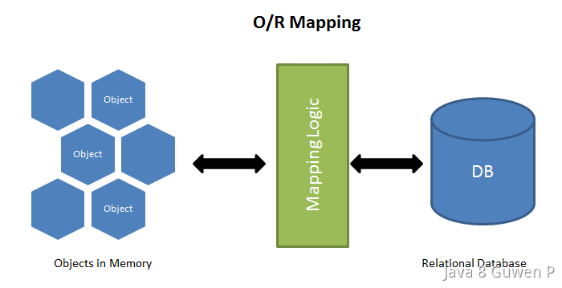

# ✅什么是ORM，有哪些常用框架？

# 典型回答

Object Relational Mapping ，简称ORM，翻译过来是对象关系映射。一般用于实现面向对象编程语言里的对象和数据库中的之间的转换。

ORM 有下面这些优点：

- 数据模型都在一个地方定义，更容易更新和维护，也利于重用代码。
- ORM 有现成的工具，很多功能都可以自动完成，比如数据消毒、预处理、事务等等。
> 数据消毒是指对用户输入的数据进行处理，以防止恶意数据或不合法数据对应用程序的攻击或错误影响。常见的数据消毒操作包括转义特殊字符、验证输入、限制输入长度等。ORM框架可以做参数化查询、数据类型验证等可以实现数据消毒

- 它迫使你使用 MVC 架构，ORM 就是天然的 Model，最终使代码更清晰。
- 基于 ORM 的业务代码比较简单，代码量少，语义性好，容易理解。
- 你不必编写性能不佳的 SQL。

但是，ORM 也有很突出的缺点：

- ORM 库不是轻量级工具，需要花很多精力学习和设置。
- 对于复杂的查询，ORM 要么是无法表达，要么是性能不如原生的 SQL。
- ORM 抽象掉了数据库层，开发者无法了解底层的数据库操作，也无法定制一些特殊的 SQL。

常见的ORM框架有Hibernate、ibatis、Mybatis等。

> 原文: <https://www.yuque.com/hollis666/dr9x5m/bi28ye>