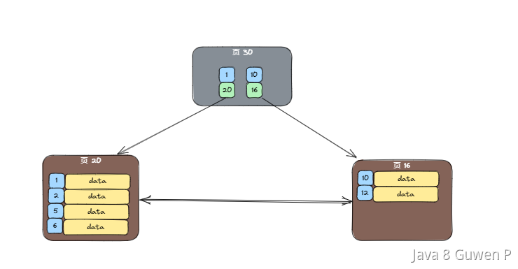
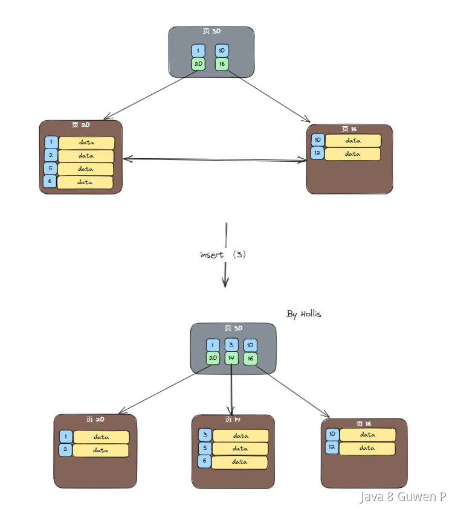
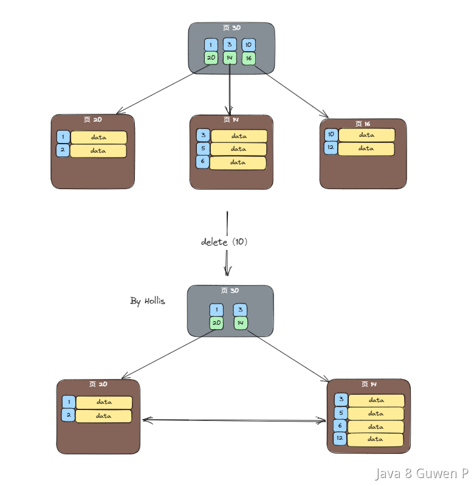

# ✅什么是InnoDB的页分裂和页合并

# 典型回答

[✅介绍一下InnoDB的数据页，和B+树的关系是什么？](https://www.yuque.com/hollis666/dr9x5m/vebvlntlc6rnvuu0?view=doc_embed)

先看上面的这个，了解下什么是InnoDB中的数据页。

InnoDB的数据页是InnoDB存储引擎中用于存储数据的基本单位，通常大小为16KB。B+树的每个节点都对应着一个数据页，包括根节点、非叶子节点和叶子节点。B+树通过节点之间的指针连接了不同层级的数据页，从而构建了一个有序的索引结构。

我们都是知道，B+树是按照索引字段建立的，并且在B+树中是有序的，假如有下面一个索引的树结构，其中的索引字段的值并不连续。

假如，现在我们插入一个新的一条记录，他的索引值是3，那么他就要按照顺序插入到页20中，在索引值为1,2的记录的后面。而如果这个索引页已经满了，那么就需要触发一次页分裂。

> **页分裂是指将该页面中的一部分索引记录移动到一个新的页面中，从而为新记录腾出空间。这样可以保持B+树的平衡和性能。**

以下，就是一次页分裂的过程：

那么，当我们向Innodb中添加数据的时候，如果索引是随机无序的，那么就会导致页分裂。而且分裂这个动作还可能会引起连锁反应，从叶子节点沿着树结构一路分裂到根节点。

有分裂，就会有合并。在InnoDB中，当索引页面中的索引记录删除后，页面可能会变得过于稀疏。这时，为了节省空间和提高性能，可能会触发**页合并**操作。

> **页合并是指将两个相邻的索引页面合并成一个更大的页面，减少B+树的层级，从而提高查询性能。**

# 扩展知识

## 页分裂（合并）的危害

首先，页分裂和合并是涉及大量数据移动和重组的操作。频繁进行这些操作会增加数据库的I/O负担和CPU消耗，影响数据库的整体性能。

分裂和合并可能导致B+树索引结构频繁调整，这个过程也会影响插入及删除操作的性能。

频繁的页分裂和合并可能会导致磁盘上存在较多的空间碎片，新分出的一个页一般会有很多空闲空间，使得数据库表占用更多的磁盘空间，而导致浪费。

## 如何避免页分裂

[✅char和varchar的区别？](https://www.yuque.com/hollis666/dr9x5m/xodf4gdc6i9goyt6?view=doc_embed)

[✅MySQL的主键一定是自增的吗？](https://www.yuque.com/hollis666/dr9x5m/glycgnryk8953c24?view=doc_embed)

在上面两篇中，我们介绍过，使用varchar或者使用UUID作为主键的话，都会导致页分裂。

所以，尽量选择使用自增的字段作为索引，尤其是主键索引，这样可以很大程度的避免页分裂。

如果要插入大量数据，尽量使用批量插入的方式，而不是逐条插入。这样可以减少页分裂的次数。

频繁删除操作可能导致页面过于稀疏，从而触发页合并。所以，一般建议使用**逻辑删除**而不是物理删除。

> 逻辑删除：即在记录中添加一个标记来表示记录是否被删除(deleted  = 0/1)，而不是真正地从数据库中删除记录。

我们当然还可以根据实际情况，适当调整InnoDB的配置参数，如页大小、填充因子、叶子页合并的阈值等，以优化数据库性能。

> 原文: <https://www.yuque.com/hollis666/dr9x5m/lq17kh7gaf8ayipw>