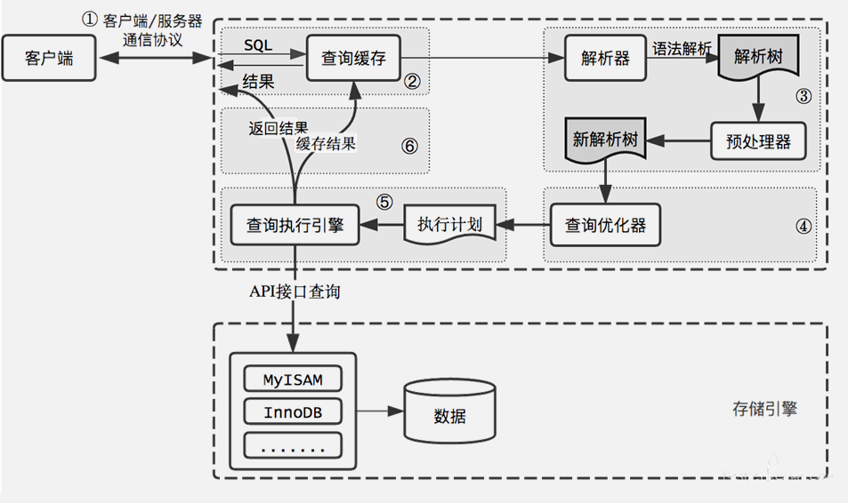

# ✅说一说MySQL一条SQL语句的执行过程？

# 典型回答
如一条简单的查询语句：`select * from users where age='18' and name='Hollis';`

执行过程如下图：

结合上面的说明，我们分析下这个语句的执行流程：
①使用**连接器**，通过客户端/服务器通信协议与 MySQL 建立连接。并查询是否有权限
②Mysql8.0之前**检查是否开启缓存**，开启了 Query Cache 且命中完全相同的 SQL 语句，则将查询结果直接返回给客户端；
③由**解析器（分析器）**进行语法分析和语义分析，并生成解析树。如查询是select、表名users、条件是age='18' and name='Hollis'，**预处理器**则会根据 MySQL 规则进一步检查解析树是否合法。比如检查要查询的数据表或数据列是否存在等。
④由**优化器**生成执行计划。根据索引看看是否可以优化
⑤**执行器**来执行SQL语句，这里具体的执行会操作MySQL的存储引擎来执行 SQL 语句，根据存储引擎类型，得到查询结果。若开启了 Query Cache，则缓存，否则直接返回。

> 原文: <https://www.yuque.com/hollis666/dr9x5m/dzkisw>