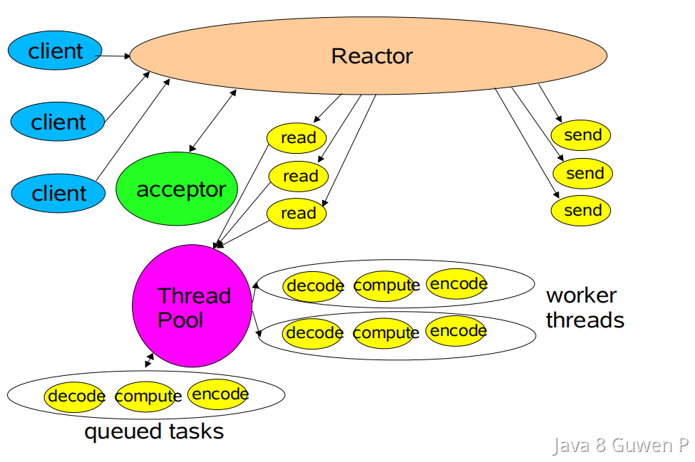
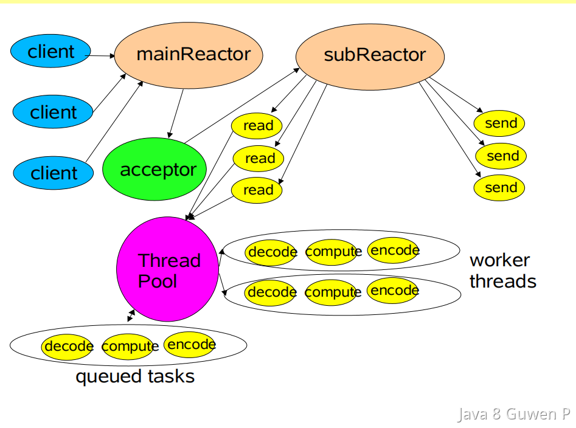

# ✅Netty的线程模型是怎么样的？

# 典型回答
Netty 通过 Reactor 模型基于多路复用器接收并处理用户请求的。多路复用IO模型参考：

[操作系统的IO模型有哪些？](https://www.yuque.com/hollis666/dr9x5m/rilxns8rh8gdxs78?view=doc_embed)

多路复用就是首先去阻塞的调用系统，询问内核数据是否准备好，如果准备好，再重新进行系统调用，进行数据拷贝。常见的实现有select，epoll和poll三种。

Netty 的线程模型并不是一成不变的，它实际取决于用户的启动参数配置。通过设置不同的启动参数，Netty支持三种模型，分别是**Reactor单线程模型、Reactor多线程模型、Reactor主从多线程模型。**

# 扩展知识

## 单Reactor单线程模型

这是最简单的Reactor模型，当有多个客户端连接到服务器的时候，服务器会先通过线程A和客户端建立连接，
有连接请求后，线程A会将不同的事件（如连接事件，读事件，写事件）进行分发，譬如有IO读写事件之后，会把该事件交给具体的Handler进行处理。

而线程A，就是我们说的Reactor模型中的Reactor，Reactor内部有一个dispatch（分发器）。【注意，这里的Reactor单线程，主要负责事件的监听和分发】
此时一个Reactor既负责处理连接请求，又要负责处理读写请求，一般来说处理连接请求是很快的，但是处理具体的读写请求就要涉及字节的复制，相对慢太多了。Reactor正在处理读写请求的时候，其他请求只能等着，只有等处理完了，才可以处理下一个请求。
通过一个Reactor线程，只能对应一个CPU，发挥不出来多核CPU的优势。所以，一个Reactor线程处理简单的小容量场景，还是OK的，但是对于高负载来说，还需要进一步升级。

## 单Reactor多线程模型

为了利用多核CPU的优势，也为了防止在Reactor线程等待读写事件时候浪费CPU，所以可以增加一个Worker的线程池，由此升级为单Reactor多线程模式。

整体流程如下：

当多个客户端进入服务器后，Reactor线程会监听多种事件（如连接事件，读事件，写事件），如果监听到连接事件，则把该事件分配给acceptor处理，如果监听到读事件，那么则会发起系统调用，将数据写入内存，之后再把数据交给工作线程池进行业务处理。
这个时候我们会发现，业务处理的逻辑已经变成多线程处理了。不过一个Reactor既要负责连接事件，又要负责读写事件，同时还要负责数据准备的过程。因为拷贝数据是阻塞的，假如说Reactor阻塞到拷贝数据的时候，服务器进来了很多连接，这个时候，这些连接是很有可能会被服务器拒绝掉的。
所以，单个Reactor看来是不够的，我们需要使用多个Reactor来处理。

## 主从Reactor模型

在主从Reactor模型中，主Reactor线程只负责连接事件的处理，它把读写事件全部交给了子Reactor线程。这样即使在数据准备阶段子线程被阻塞，主Reactor还是可以处理连接事件。巧妙的解决了高负载下的连接问题。

> 原文: <https://www.yuque.com/hollis666/dr9x5m/ind4ry>