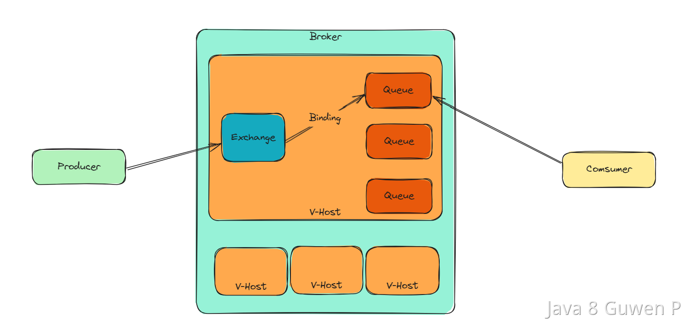

# ✅rabbitMQ的整体架构是怎么样的？

# 典型回答

RabbitMQ是一个开源的消息中间件，用于在应用程序之间传递消息。它实现了AMQP（高级消息队列协议）并支持其他消息传递协议，例如STOMP（简单文本定向消息协议）和MQTT（物联网协议）。

他的整体架构大致如下：

Producer（生产者）：生产者是消息的发送方，负责将消息发布到RabbitMQ的交换器（Exchange）。

VHost：是RabbitMQ中虚拟主机的概念，它类似于操作系统中的命名空间，用于将RabbitMQ的资源进行隔离和分组。每个VHost拥有自己的交换器、队列、绑定和权限设置，不同VHost之间的资源相互独立，互不干扰。VHost可以用于将不同的应用或服务进行隔离，以防止彼此之间的消息冲突和资源竞争。

Exchange（交换器）：交换器是消息的接收和路由中心，它接收来自生产者的消息，并将消息路由到一个或多个与之绑定的队列（Queue）中。

Queue（队列）：队列是消息的存储和消费地，它保存着未被消费的消息，等待消费者（Consumer）从队列中获取并处理消息。

Binding（绑定）：绑定是交换器和队列之间的关联关系，它定义了交换器将消息路由到哪些队列中。

Consumer（消费者）：消费者是消息的接收方，负责从队列中获取消息，并进行处理和消费。

> 原文: <https://www.yuque.com/hollis666/dr9x5m/qh56y0u8fs2gom42>