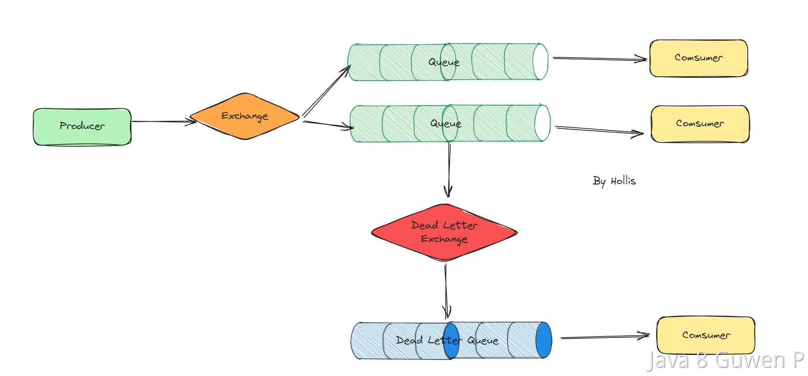

# ✅什么是RabbitMQ的死信队列？


# 典型回答

RabbitMQ的死信队列（Dead Letter Queue，简称DLQ）是一种用于处理消息处理失败或无法路由的消息的机制。它允许将无法被正常消费的消息重新路由到另一个队列，以便稍后进行进一步的处理、分析或排查问题。

当消息队列里面的消息出现以下几种情况时，就可能会被称为"死信"：

1. 消息处理失败：当消费者由于代码错误、消息格式不正确、业务规则冲突等原因无法成功处理一条消息时，这条消息可以被标记为死信。
2. 消息过期：在RabbitMQ中，消息可以设置过期时间。如果消息在规定的时间内没有被消费，它可以被认为是死信并被发送到死信队列。
3. 消息被拒绝：当消费者明确拒绝一条消息时，它可以被标记为死信并发送到死信队列。拒绝消息的原因可能是消息无法处理，或者消费者认为消息不符合处理条件。
4. 消息无法路由：当消息不能被路由到任何队列时，例如，没有匹配的绑定关系或路由键时，消息可以被发送到死信队列。



当消息变成"死信"之后，如果配置了死信队列，它将被发送到死信交换机，死信交换机将死信投递到一个队列上，这个队列就是死信队列。但是如果没有配置死信队列，那么这个消息将被丢弃。

RabbitMQ的死信队列其实有很多作用，比如我们可以借助他实现延迟消息，进而实现订单的到期关闭，超时关单等业务逻辑。

[✅rabbitMQ如何实现延迟消息？](https://www.yuque.com/hollis666/dr9x5m/lllwvk?view=doc_embed)


# 扩展知识


## 配置死信队列


在RabbitMQ中，死信队列通常与交换机（Exchange）和队列（Queue）之间的绑定关系一起使用。要设置死信队列，通常需要以下步骤：

1. 创建死信队列：定义一个用于存储死信消息的队列。
2. 创建死信交换机：为死信队列定义一个交换机，通常是一个direct类型的交换机。
3. 将队列与死信交换机绑定：将主要队列和死信交换机绑定，以便无法处理的消息能够被转发到死信队列。
4. 在主要队列上设置死信属性：通过设置队列的x-dead-letter-exchange和x-dead-letter-routing-key属性，指定死信消息应该被发送到哪个交换机和路由键。

当消息被标记为死信时，它将被发送到死信队列，并可以由应用程序进一步处理、审查或记录。这种机制有助于增加消息处理的可靠性和容错性，确保不丢失重要的消息，并提供了一种处理失败消息的方式。

以下是一个配置死信队列的方式：

```
import org.springframework.amqp.core.*;
import org.springframework.context.annotation.Bean;
import org.springframework.context.annotation.Configuration;

@Configuration
public class RabbitMQConfig {

    // 配置死信队列和交换机
    @Bean
    public DirectExchange deadLetterExchange() {
        return new DirectExchange("dead-letter-exchange");
    }

    // 死信队列
    @Bean
    public Queue deadLetterQueue() {
        return new Queue("dead-letter-queue");
    }

    // 绑定死信队列到死信交换机
    @Bean
    public Binding deadLetterBinding() {
        return BindingBuilder.bind(deadLetterQueue()).to(deadLetterExchange()).with("dead-letter-routing-key");
    }

    // 主队列的交换机
    @Bean
    public DirectExchange mainExchange() {
        return new DirectExchange("main-exchange");
    }

 		// 主队列
    @Bean
    public Queue mainQueue() {
      	Map<String, Object> args = new HashMap<>(2);
      	// 声明当前队列绑定的死信交换机 
				args.put("x-dead-letter-exchange", DEAD_LETTER_EXCHANGE);
      	// 这里声明当前队列的死信路由key 
				args.put("x-dead-letter-routing-key", "dead-letter-routing-key");

      	return QueueBuilder.durable("main-queue").withArguments(args).build();
    }


    // 绑定主队列到主交换机
    @Bean
    public Binding binding() {
        return BindingBuilder.bind(mainQueue()).to(mainExchange()).with("main-routing-key");
    }
}

```


这样，消费者在消费的时候，分别监听主队列和死信队列就可以了：

```
@Component 
public class DeadLetterMessageReceiver { 
    @RabbitListener(queues = "dead-letter-queue") 
    public void receiveA(Message message, Channel channel) throws IOException { 
      System.out.println("收到死信消息：" + new String(message.getBody())); 
      channel.basicAck(message.getMessageProperties().getDeliveryTag(), false); 
    } 
}


@Component 
public class MainMessageReceiver { 
    @RabbitListener(queues = "main-queue") 
    public void receiveA(Message message, Channel channel) throws IOException { 
      System.out.println("收到普通消息A：" + new String(message.getBody())); 
      channel.basicAck(message.getMessageProperties().getDeliveryTag(), false); 
    } 
}
```


> 原文: <https://www.yuque.com/hollis666/dr9x5m/rd0ah4r97wevzmcw>