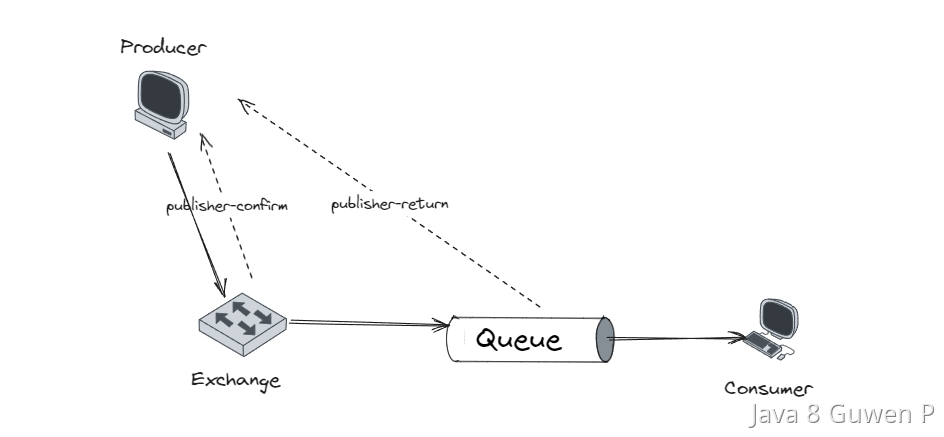

# ✅如何保障消息一定能发送到RabbitMQ


# 典型回答

当我们作为一个消费发送方，如何保证我们给RabbitMQ发送的消息一定能发送成功，如何确保他一定能收到这个消息呢？

我们知道，RabbitMQ的消息最终时存储在Queue上的，而在Queue之前还要经过Exchange，那么这个过程中就有两个地方可能导致消息丢失。第一个是Producer到Exchange的过程，第二个是Exchange到Queue的过程。



为了解决这个问题，有两种方案，一种是通过confirm机制，另外一种是事务机制，因为事务机制并不推荐，这里先介绍Confirm机制。

[介绍下RabbitMQ的事务机制](https://www.yuque.com/hollis666/dr9x5m/alxsh6b98sck90fu?view=doc_embed)

上面两个可能丢失的过程，都可以利用confirm机制，注册回调来监听是否成功。

**Publisher Confirm**是一种机制，用于确保消息已经被Exchange成功接收和处理。一旦消息成功到达Exchange并被处理，RabbitMQ会向消息生产者发送确认信号（ACK）。如果由于某种原因（例如，Exchange不存在或路由键不匹配）消息无法被处理，RabbitMQ会向消息生产者发送否认信号（NACK）。

```
// 启用Publisher Confirms
channel.confirmSelect();

// 设置Publisher Confirms回调
channel.addConfirmListener(new ConfirmListener() {
    @Override
    public void handleAck(long deliveryTag, boolean multiple) throws IOException {
        System.out.println("Message confirmed with deliveryTag: " + deliveryTag);
        // 在这里处理消息确认
    }

    @Override
    public void handleNack(long deliveryTag, boolean multiple) throws IOException {
        System.out.println("Message not confirmed with deliveryTag: " + deliveryTag);
        // 在这里处理消息未确认
    }
});

```

**Publisher Returns**机制与Publisher Confirms类似，但用于处理在消息无法路由到任何队列时的情况。当RabbitMQ在无法路由消息时将消息返回给消息生产者，但是如果能正确路由，则不会返回消息。

```
// 启用Publisher Returns
channel.addReturnListener(new ReturnListener() {
    @Override
    public void handleReturn(int replyCode, String replyText, String exchange, String routingKey, AMQP.BasicProperties properties, byte[] body) throws IOException {
        System.out.println("Message returned with replyCode: " + replyCode);
        // 在这里处理消息发送到Queue失败的返回
    }
});
```

通过以上方式，我们注册了两个回调监听，用于在消息发送到Exchange或者Queue失败时进行异常处理。**通常我们可以在失败时进行报警或者重试来保障一定能发送成功。**

完整的代码如下：

```
import com.rabbitmq.client.*;

public class PublisherCallbacksExample {

    public static void main(String[] args) throws Exception {
        ConnectionFactory factory = new ConnectionFactory();
        factory.setHost("localhost");

        try (Connection connection = factory.newConnection();
             Channel channel = connection.createChannel()) {

            // 启用Publisher Confirms
            channel.confirmSelect();

            // 设置Publisher Confirms回调
            channel.addConfirmListener(new ConfirmListener() {
                @Override
                public void handleAck(long deliveryTag, boolean multiple) throws IOException {
                    System.out.println("Message confirmed with deliveryTag: " + deliveryTag);
                    // 在这里处理消息确认
                }

                @Override
                public void handleNack(long deliveryTag, boolean multiple) throws IOException {
                    System.out.println("Message not confirmed with deliveryTag: " + deliveryTag);
                    // 在这里处理消息未确认
                }
            });

            // 启用Publisher Returns
            channel.addReturnListener(new ReturnListener() {
                @Override
                public void handleReturn(int replyCode, String replyText, String exchange, String routingKey, AMQP.BasicProperties properties, byte[] body) throws IOException {
                    System.out.println("Message returned with replyCode: " + replyCode);
                    // 在这里处理消息发送到Queue失败的返回
                }
            });

            String exchangeName = "my_exchange";
            String routingKey = "my_routing_key";
            String message = "Hello, RabbitMQ!";

            // 发布消息到Exchange
            channel.basicPublish(exchangeName, routingKey, true, null, message.getBytes());

            // 等待Publisher Confirms
            if (!channel.waitForConfirms()) {
                System.out.println("Message was not confirmed!");
            }

            // 关闭通道和连接
            channel.close();
        }
    }
}

```

另外，这里如果发送到Queue之后，是否一定能持久化下来，是否一定不丢，这就是另外一个话题了。

[RabbitMQ如何保证消息不丢](https://www.yuque.com/hollis666/dr9x5m/ku3fxiie005axgrz?view=doc_embed)

# 


> 原文: <https://www.yuque.com/hollis666/dr9x5m/inmrfqk0qyvsdgg3>