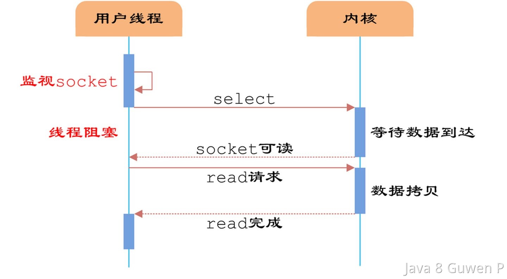

# ✅为什么Redis 6.0引入了多线程？

2020年5月份，Redis正式推出了6.0版本，这个版本中有很多重要的新特性，其中多线程特性引起了广泛关注。

但是，需要提醒大家的是，**Redis 6.0中的多线程，也只是针对处理网络请求过程采用了多线程，而数据的读写命令，仍然是单线程处理的。**

但是，不知道会不会有人有这样的疑问：

**Redis不是号称单线程也有很高的性能么？**

**不是说多路复用技术已经大大的提升了IO利用率了么，为啥还需要多线程？**

主要是因为我们对Redis有着更高的要求。

根据测算，Redis 将所有数据放在内存中，内存的响应时长大约为 100 纳秒，对于小数据包，Redis 服务器可以处理 80,000 到 100,000 QPS，这么高的对于 80% 的公司来说，单线程的 Redis 已经足够使用了。

但随着越来越复杂的业务场景，有些公司动不动就上亿的交易量，因此需要更大的 QPS。

为了提升QPS，很多公司的做法是部署Redis集群，并且尽可能提升Redis机器数。但是这种做法的资源消耗是巨大的。

而经过分析，限制Redis的性能的主要瓶颈出现在网络IO的处理上，虽然之前采用了多路复用技术。但是我们前面也提到过，**多路复用的IO模型本质上仍然是同步阻塞型IO模型**。

下面是多路复用IO中select函数的处理过程：

从上图我们可以看到，**在多路复用的IO模型中，在处理网络请求时，调用 select （其他函数同理）的过程是阻塞的，也就是说这个过程会阻塞线程，如果并发量很高，此处可能会成为瓶颈。**

虽然现在很多服务器都是多个CPU核的，但是对于Redis来说，因为使用了单线程，在一次数据操作的过程中，有大量的CPU时间片是耗费在了网络IO的同步处理上的，并没有充分的发挥出多核的优势。

**如果能采用多线程，使得网络处理的请求并发进行，就可以大大的提升性能。多线程除了可以减少由于网络 I/O 等待造成的影响，还可以充分利用 CPU 的多核优势。**

所以，Redis 6.0采用多个IO线程来处理网络请求，网络请求的解析可以由其他线程完成，然后把解析后的请求交由主线程进行实际的内存读写。提升网络请求处理的并行度，进而提升整体性能。

但是，Redis 的多 IO 线程只是用来处理网络请求的，对于读写命令，Redis 仍然使用单线程来处理。

**那么，在引入多线程之后，如何解决并发带来的线程安全问题呢？**

这就是为什么我们前面多次提到的"Redis 6.0的多线程只用来处理网络请求，而数据的读写还是单线程"的原因。

Redis 6.0 只有在网络请求的接收和解析，以及请求后的数据通过网络返回给时，使用了多线程。而数据读写操作还是由单线程来完成的，所以，这样就不会出现并发问题了。

> 原文: <https://www.yuque.com/hollis666/dr9x5m/zfpgxa93bmn9png9>