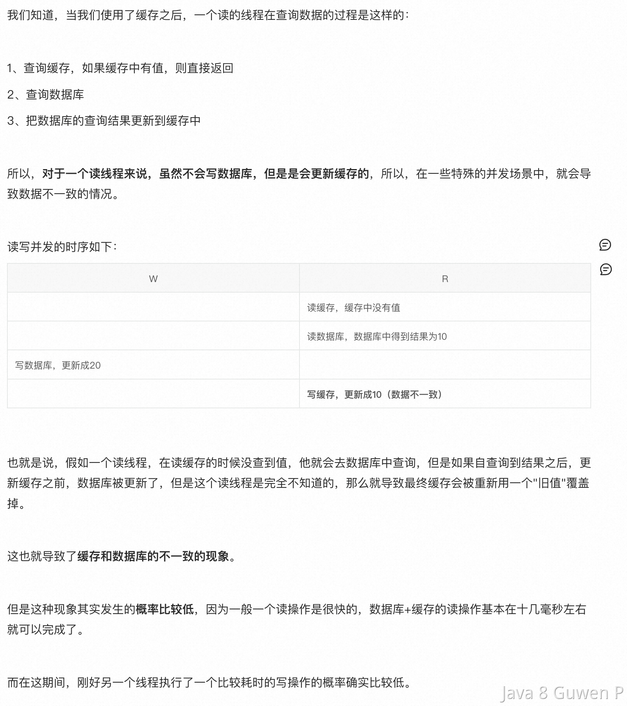

# ✅为什么需要延迟双删，两次删除的原因是什么？


# 典型回答

其实这个问题在以下两篇文章中都讲过，但是还是有的读者不太理解，那么单独把这个高频问题拿出来说一下，请先看以下两篇文章，否则会看不懂本文：

[✅什么情况下会出现数据库和缓存不一致的问题？](https://www.yuque.com/hollis666/dr9x5m/xr0h8h?view=doc_embed)

[✅如何解决Redis和数据库的一致性问题？](https://www.yuque.com/hollis666/dr9x5m/tmcgo0?view=doc_embed)

所谓延迟双删，其实是：

1、先删除缓存
2、更新数据库
3、删除缓存

```java
@Service
public class ProductService {

    @Autowired
    private StringRedisTemplate redisTemplate;

    private final BlockingQueue<String> cacheDeletionQueue = new LinkedBlockingQueue<>();

    public void updateProduct(Product product) {
        // 第一次删除缓存
        deleteCache(product.getId());

        // 更新数据库
        updateProductInDB(product);

        // 第二次删除缓存
        cacheDeletionQueue.add(product.getId());
    }

    @Scheduled(fixedDelay = 100)
    public void delayedCacheDeletion() {
        String productId = cacheDeletionQueue.poll();
        if (productId != null) {
            deleteCache(productId);
        }
    }
}

```

第一次删除缓存的原因：

第一次之所以要选择先删除缓存，而不是直接更新数据库，主要是因为先写数据库会存在一个比较关键的问题，那就是缓存的更新和数据库的更新不是一个原子操作，那么就存在失败的可能性。

**如果写数据库成功了，但是删缓存失败了！那么就会导致数据不一致。**

而如果先删缓存成功了，后更新数据库失败了，没关系，因为缓存删除了就删除了，又不是更新，不会有错误数据，也没有不一致问题。

并且，相对于缓存和数据库来说，数据库的失败的概率更大一些，并且删除动作和更新动作来说，更新的失败的概率也会更大一些。

**所以，为了避免这个因为两个操作无法作为一个原子操作而导致的不一致问题，我们选择先删除缓存，再更新数据库。这是第一次删除缓存的原因。**

一般来说，一些并发量不大的业务，这么做就已经可以了，先删缓存，后更新数据（如果业务量不大，其实先更新数据库，再删除缓存其实也可以），基本上就能满足业务上的需求了。

但是如果是并发量比较高的话，那么就可能存在一定的问题。

因为先删缓存再更新数据库的话，第一步先把缓存给清了，会放大读写并发导致的不一致的情况，关于读写并发的不一致问题，在前面的文章中写了，这里不再赘述，直接放个截图



那么这个问题怎么解决呢？怎么避免缓存在更新后，又被一个其他的线程给把脏数据覆盖进去呢，那么就需要第二次删除了，就是我们的延迟双删。

因为"读写并发"的问题会导致并发发生后，缓存中的数被读线程写进去脏数据，那么就只需要在写线程在删缓存、写数据库之后，延迟一段时间，再执行一把删除动作就行了。

这样就能保证缓存中的脏数据被清理掉，避免后续的读操作都读到脏数据。当然，这个延迟的时长也很有讲究，到底多久来删除呢？一般建议设置1-2s就可以了。

当然，这种方案也是有一个弊端的，那就是可能会导致缓存中准确的数据被删除掉。当然这也问题不大，就像我们前面说过的，只是增加一次cache miss罢了。

**所以，为了避免因为先删除缓存而导致的”读写并发问题“被放大的情况，所以引入了第二次缓存删除。**


# 扩展知识


## 有了第二次删除，第一次还有意义吗？

很多人在看完延迟双删的方案之后，会有这样的疑问：有了第二次删除，第一次还有意义吗？

如果不要第一次删除，只保留第二次删除那么就这个流程就变成了：

1、更新数据库
2、删除缓存

那么这个方案的缺点前面讲过了，一旦删除缓存失败，就会导致数据不一致的问题。那么有人又问了：延迟双删的第二次删除不也一样可能失败么？

没错，确实第二次删除也还是有概率失败，但是因为我们在延迟双删的方案中先做了一次删除，而延迟双删的第二次删除只为了**尝试解决 **因为读写并发导致的不一致问题，或者说尽可能降低这种情况发生的概率。

而如果没有第一次删除，只靠第二次删除，那么第二次删除要解决的可就不只是读写并发情况下的不一致问题了，即使没有并发，第二次只要删除失败，就会存在缓存的不一致问题。所以，第一次删除的目的就是降低不一致的发生的概率。

anyway，如果你就不想做第一次删除，或者就是不想做第二次删除，也可以，业务量不大的话都问题不大，我们要解决的就是高并发情况下的一致性问题，通过两次删除降低不一致的概率。


> 原文: <https://www.yuque.com/hollis666/dr9x5m/uswtlzlot2lcvy10>