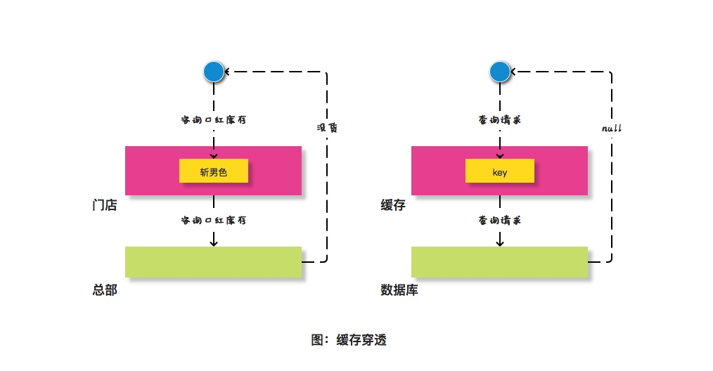
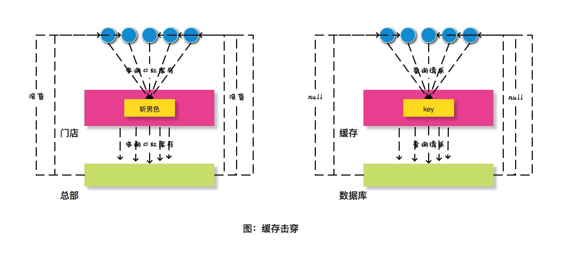
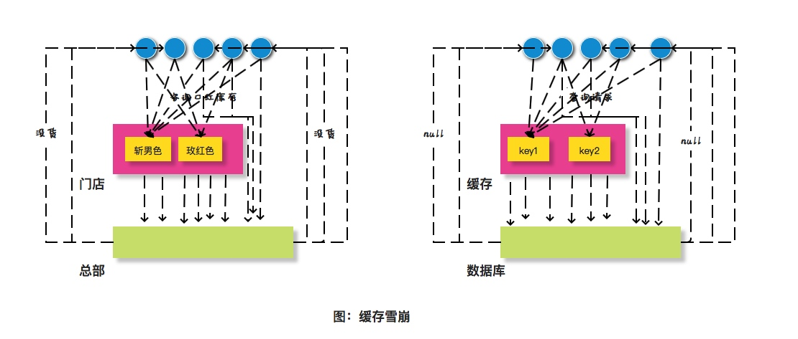

# ✅什么是缓存击穿、缓存穿透、缓存雪崩？

# 典型回答

缓存击穿：是指当某一key的缓存过期时大并发量的请求同时访问此key，瞬间击穿缓存服务器直接访问数据库，让数据库处于负载的情况。

缓存穿透：是指缓存服务器中没有缓存数据，数据库中也没有符合条件的数据，导致业务系统每次都绕过缓存服务器查询下游的数据库，缓存服务器完全失去了其应用的作用。

缓存雪崩：是指当大量缓存同时过期或缓存服务宕机，所有请求的都直接访问数据库，造成数据库高负载，影响性能，甚至数据库宕机。

在记忆这几个概念的时候，不要死记硬背，你可以尝试这样记忆：

首先，雪崩的概念比较容易记，就是很多个Key同时过期才会雪崩，"缓存雪崩的时候没有一个Key是无辜的"。至于穿透和击穿，区别在于穿透是"透"，什么叫透呢，那就是不仅缓存被击穿了，数据库也被击穿了，这种才叫透。所以，这种缓存和数据库中都没有的情况叫做"缓存穿透"。

# 扩展知识

## 缓存穿透

举个例子，一个女孩子去门店买口红，到了门店之后被告知她想要的那个色号已经没有了。于是她要求店员去问总部还有没有货。总部发现这个色号也没有了，于是女孩子就离开了。

过了一会另一个女孩子又来了，也想要购买同一个色号，店员就又总部问了一次。如此反复。

女孩子买口红不仅需要门店帮忙查询，还需要总部也进行盘货。类似这种情况，在缓存领域有一个类似的概念叫做**缓存穿透**。

缓存穿透是指缓存服务器中没有缓存数据，数据库中也没有符合条件的数据，导致业务系统每次都绕过缓存服务器查询下游的数据库，缓存服务器完全失去了其应用的作用。

### 缓存空值

解决多次询问总部的方法比较简单，如果口红门店在帮第一个女孩子查询之后，就记录下来这个色号已经没有了，下次其他女孩再来问这个色号的时候，直接告诉她没货了。

这样就可以避免每次都惊动总部了。

在缓存中，之所以会发生穿透，就是因为缓存没有对那些不存在的值得Key缓存下来，从而导致每次查询都要请求到数据库。

那么我们就**可以为这些key对应的值设置为null并放到缓存中，这样再出现查询这个key 的请求的时候，直接返回null即可 。**

但是还需要注意的就是需要有一个失效时间，因为如果不设置失效的话，如果哪天总部有货了，门店还是当做没货的话，就会影响销量了。

### BloomFilter

很多时候，缓存穿透是因为有很多恶意流量的请求，这些请求可能随机生成很多Key来请求查询，这些肯定在缓存和数据库中都没有，那就很容易导致缓存穿透。

针对类似的情况，可以使用一个过滤器。

比如如果有一群人经常来门店问一些根本不存在的色号，比如五彩斑斓的黑，这些色号该品牌根本没生产过的话，店员就可以直接告诉顾客不存在就行了，也不需要惊动总部。

在缓存穿透防治上常用的技术是**布隆过滤器(Bloom Filter)**。

[✅什么是布隆过滤器，实现原理是什么？](https://www.yuque.com/hollis666/dr9x5m/gp9ymie1n39uavah?view=doc_embed)

布隆过滤器是一种比较巧妙的概率性数据结构，它可以告诉你数据一定不存在或可能存在，相比Map、Set、List等传统数据结构它占用内存少、结构更高效。

对于缓存穿透，我们**可以将查询的数据条件都哈希到一个足够大的布隆过滤器中，用户发送的请求会先被布隆过滤器拦截，一定不存在的数据就直接拦截返回了，从而避免下一步对数据库的压力。**

## 缓存击穿

有一种比较特殊的情况，那就是如果某一个热门色号的口红刚好卖完了，这时候有很多顾客同时来咨询要购买这个色号，那么门店内的多个售货员可能分别给总部打电话咨询是否有存货。

或者如果有多家门店同时卖完了，那么总部接收到的咨询量就会剧增。类似这种情况，在缓存领域有一个类似的概念叫做**缓存击穿**。

缓存击穿是指当某一key的缓存过期时大并发量的请求同时访问此key，瞬间击穿缓存服务器直接访问数据库，让数据库处于负载的情况。

### 异步定时更新

如果提前知道某一个色号比较畅销的话，那就可以定时的咨询总部是否还有存货，定时的更新库存情况就可以避免上面这种情况了。

在缓存处理上，同理，比如**某一个热点数据的过期时间是1小时，那么每59分钟，通过定时任务去更新这个热点key，并重新设置其过期时间。**

### 互斥锁

还有一种解决办法，那就是如果很多顾客咨询的是同一个色号的口红，那么就先处理第一个用户的咨询，其他同样请求的顾客先排队等待。一直到店员从总部那里获取到最新的库存信息后，就可以安排其他人继续购买了。

**在缓存处理上，通常使用一个互斥锁来解决缓存击穿的问题。简单来说就是当Redis中根据key获得的value值为空时，先锁上，然后从数据库加载，加载完毕，释放锁。若其他线程也在请求该key时，发现获取锁失败，则先阻塞。**

## 缓存雪崩

如果门店内的多个色号的口红同时售罄了，并且门店在这个时间点刚好也不知道总部有没有库存了，这时候如果有大量顾客来到门店购物的话，就会有更多的咨询电话打到总部那里。

或者是门店突然出现问题了，不能提供服务了，很多顾客就可能自己打电话到总部咨询库存情况。类似这种情况，在缓存领域有一个类似的概念叫做**缓存雪崩**。

缓存雪崩是指当大量缓存同时过期或缓存服务宕机，所有请求的都直接访问数据库，造成数据库高负载，影响性能，甚至数据库宕机。

### 不同的过期时间

为了避免缓存雪崩，门店可以考虑给不同的色号的口红预留不同的库存，并且采用不同的频率咨询总部库存情况，更新到门店中。这样就可以避免突然同一个时间点所有色号都售罄。

**为了避免大量的缓存在同一时间过期，可以把不同的key过期时间设置成不同的， 并且通过定时刷新的方式更新过期时间。**

### 集群

为了避免门店出问题导致大量顾客直接打电话到总部，可以考虑开更多的门店，将用户分流到多个店铺中。

类似的，**在缓存雪崩问题防治上面，一个比较典型的技术就是采用集群方式部署，使用集群可以避免服务单点故障。**

> 原文: <https://www.yuque.com/hollis666/dr9x5m/abfis3>