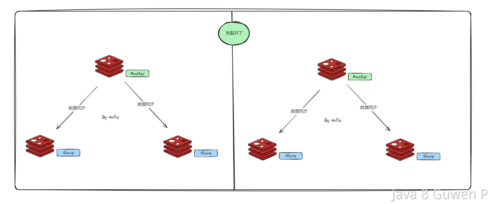

# ✅介绍下Redis集群的脑裂问题？

# 典型回答

所谓脑裂，就像他的名字一样，大脑裂开了，一般来说就是指一个分布式系统中有两个子集，然后每个子集都有一个自己的大脑(Leader/Master)。那么整个分布式系统中就会存在多个大脑了，而且每个自己都认为自己是正常的，从而导致数据不一致或重复写入等问题。

### 脑裂的发生

**Redis的脑裂问题可能发生在网络分区或者主节点出现问题的时候**：

- **网络分区**：网络故障或分区导致了不同子集之间的通信中断。
   - Master节点，哨兵和Slave节点被分割为了两个网络，Master处在一个网络中，Slave库和哨兵在另外一个网络中，此时哨兵发现和Master连不上了，就会发起主从切换，选一个新的Master，这时候就会出现两个主节点的情况。
- **主节点问题**：集群中的主节点之间出现问题，导致不同的子集认为它们是正常的主节点。
   - Master节点有问题，哨兵就会开始选举新的主节点，但是在这个过程中，原来的那个Master节点又恢复了，这时候就可能会导致一部分Slave节点认为他是Master节点，而另一部分Slave新选出了一个Master

### 脑裂的危害
脑裂问题可能导致以下**问题**：

- **数据不一致**：不同子集之间可能对同一数据进行不同的写入，导致数据不一致。
- **重复写入**：在脑裂解决后，不同子集可能尝试将相同的写入操作应用到主节点上，导致数据重复。
- **数据丢失**：新选出来的Master会向所有的实例发送slave of命令，让所有实例重新进行全量同步，而全量同步首先就会将实例上的数据先清空，所以在主从同步期间在原来那个Master上执行的命令将会被清空。

### 

### 如何避免脑裂
那么如何防止脑裂的发生呢？

Redis 已经提供了两个配置项可以帮我们做这个事儿，分别是 `min-slaves-to-write` 和 `min-slaves-max-lag`。

`min-slaves-to-write`：主库能进行数据同步的最少从库数量；
`min-slaves-max-lag`：主从库间进行数据复制时，从库给主库发送 ACK 消息的最大延迟秒数。

这两个配置项必须同时满足，不然主节点拒绝写入。在期间满足min-slaves-to-write和min-slaves-max-lag的要求，那么主节点就会被禁止写入，脑裂造成的数据丢失情况自然也就解决了。

举个例子：

假设我们将 `min-slaves-to-write` 设置为 1，把` min-slaves-max-lag` 设置为 10s。

如果Master节点因为某些原因挂了 12s，导致哨兵判断主库客观下线，开始进行主从切换。

同时，因为原Master宕机了 12s，没有一个（`min-slaves-to-write`）从库能和原主库在 10s（ `min-slaves-max-lag`） 内进行数据复制，这样一来，就因为不满足配置要求，原Master也就再也无法接收客户端请求了。

这样一来，主从切换完成后，也只有新主库能接收请求，这样就没有脑裂的发生了。

### 能彻底解决脑裂吗？

还是刚刚那个场景，假设我们将 `min-slaves-to-write` 设置为 1，把` min-slaves-max-lag` 设置为 10s，并且`down-after-milliseconds`时间为8s，也就是说，如果8秒连不上主节点，哨兵就会进行主从切换。

但是，如果主从切换的过程需要5s时间的话，就会有问题。

Master节点宕机8s时，哨兵判断主节点客观下线，开始进行主从切换，但是这个过程一共需要5s。那如果主从切换过程中，主节点有恢复运行，即第9秒Master恢复了，而min-slaves-max-lag设置为10s那么主节点还是可写的。

那么就会导致9s~12s这期间如果有客户端写入原Master节点，那么这段时间的数据会等新的Master选出来之后，执行了slaveof之后导致丢失。

Redis脑裂可以采用min-slaves-to-write和min-slaves-max-lag合理配置尽量规避，但**无法彻底解决**，

> 原文: <https://www.yuque.com/hollis666/dr9x5m/zt94705fhgxs5aa0>