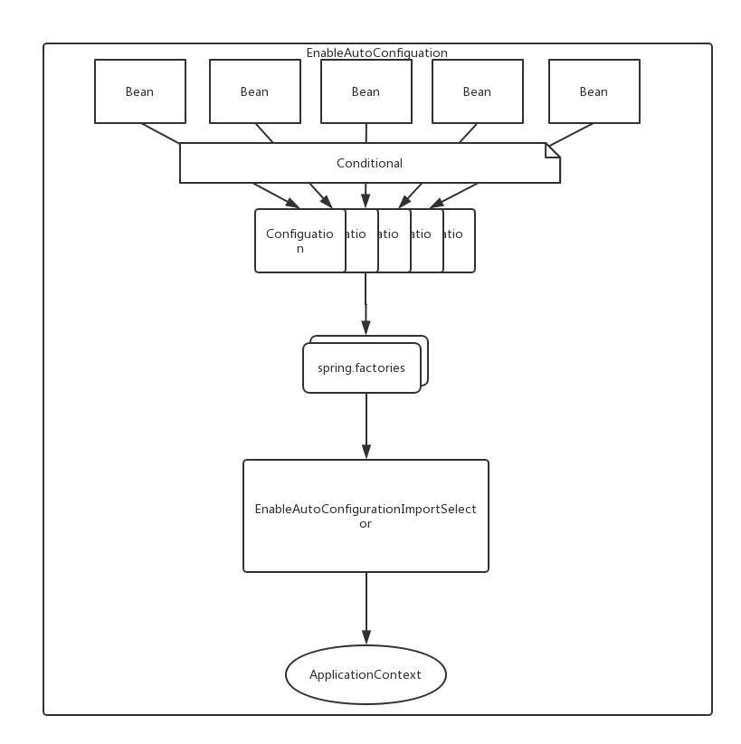

# ✅Springboot是如何实现自动配置的？


# 典型回答
Spring Boot会根据类路径中的jar包、类，为jar包里的类自动配置，这样可以极大的减少配置的数量。简单点说就是它会根据定义在classpath下的类，自动的给你生成一些Bean，并加载到Spring的Context中。

SpringBoot通过Spring 的条件配置决定哪些bean可以被配置，将这些条件定义成具体的Configuration，然后将这些Configuration配置到spring.factories文件中（这种方式Springboot 2.7.0版本已不建议使用，最新的方式是使用 /META-INF/spring/org.springframework.boot.autoconfigure.AutoConfiguration.imports ）

作为key: org.springframework.boot.autoconfigure.EnableAutoConfiguration的值

这时候，容器在启动的时候，由于使用了EnableAutoConfiguration注解，该注解Import的EnableAutoConfigurationImportSelector会去扫描classpath下的所有spring.factories文件，然后进行bean的自动化配置：



# 扩展知识


## 条件化配置

假设你希望一个或多个bean只有在某种特殊的情况下才需要被创建，比如，一个应用同时服务于中美用户，要在中美部署，有的服务在美国集群中需要提供，在中国集群中就不需要提供。在Spring 4之前，要实现这种级别的条件化配置是比较复杂的，但是，Spring 4引入了一个新的`@Conditional`注解可以有效的解决这类问题。

```
@Bean
@Conditional(ChinaEnvironmentCondition.class)
public ServiceBean serviceBean(){
    return new ServiceBean();
}
```

当`@Conditional(ChinaEnvironmentCondition.class)`条件的值为true的时候，该`ServiceBean`才会被创建，否则该bean就会被忽略。

`@Conditional`指定了一个条件。他的条件的实现是一个Java类——`ChinaEnvironmentCondition`，要实现以上功能就要定义`ChinaEnvironmentCondition`类，并继承`Condition`接口并重写其中的`matches`方法。

```
class ChinaEnvironmentCondition implements Condition{
    public final boolean matches(ConditionContext context, AnnotatedTypeMetadata metadata) {

        Environment env = context.getEnvironment();
        return env.containProperty("ENV_CN");
    }
}
```

在上面的代码中，matches方法的内容比较简单，他通过给定的`ConditionContext`对象进而获取`Environment`对象，然后使用该对象检查环境中是否存在`ENV_CN`属性。如果存在该方法则直接返回true，反之返回false。当该方法返回true的时候，就符合了`@Conditional`指定的条件，那么`ServiceBean`就会被创建。反之，如果环境中没有这个属性，那么这个`ServiceBean`就不会被创建。

除了可以自定义一些条件之外，Spring 4本身提供了很多已有的条件供直接使用，如：

```
@ConditionalOnBean
@ConditionalOnClass
@ConditionalOnExpression
@ConditionalOnMissingBean
@ConditionalOnMissingClass
@ConditionalOnNotWebApplication
```

---


## Spring Boot应用的启动入口

自动配置充分的利用了spring 4.0的条件化配置特性，那么，Spring Boot是如何实现自动配置的？Spring 4中的条件化配置又是怎么运用到Spring Boot中的呢？这要从Spring Boot的启动类说起。Spring Boot应用通常有一个名为`*Application`的入口类，入口类中有一个`main`方法，这个方法其实就是一个标准的Java应用的入口方法。一般在`main`方法中使用`SpringApplication.run()`来启动整个应用。值得注意的是，这个入口类要使用`@SpringBootApplication`注解声明。`@SpringBootApplication`是Spring Boot的核心注解，他是一个组合注解。

```
@Target({ElementType.TYPE})
@Retention(RetentionPolicy.RUNTIME)
@Documented
@Inherited
@SpringBootConfiguration
@EnableAutoConfiguration
@ComponentScan(
    excludeFilters = {@Filter(
    type = FilterType.CUSTOM,
    classes = {TypeExcludeFilter.class}
), @Filter(
    type = FilterType.CUSTOM,
    classes = {AutoConfigurationExcludeFilter.class}
)}
)
public @interface SpringBootApplication {
    // 略
}
```

`@SpringBootApplication`是一个组合注解，它主要包含`@SpringBootConfiguration`、`@EnableAutoConfiguration`等几个注解。也就是说可以直接在启动类中使用这些注解来代替`@ SpringBootApplication`注解。 关于Spring Boot中的Spring自动化配置主要是`@EnableAutoConfiguration`的功劳。该注解可以让Spring Boot根据类路径中的jar包依赖为当前项目进行自动配置。

至此，我们知道，Spring Boot的自动化配置主要是通过`@EnableAutoConfiguration`来实现的，因为我们在程序的启动入口使用了`@SpringBootApplication`注解，而该注解中组合了`@EnableAutoConfiguration`注解。所以，在启动类上使用`@EnableAutoConfiguration`注解，就会开启自动配置。

那么，本着刨根问底的原则，当然要知道`@EnableAutoConfiguration`又是如何实现自动化配置的，因为目前为止，我们还没有发现Spring 4中条件化配置的影子。


## EnableAutoConfiguration

其实Spring框架本身也提供了几个名字为`@Enable`开头的Annotation定义。比如`@EnableScheduling`、`@EnableCaching`、`@EnableMBeanExport`等，`@EnableAutoConfiguration`的理念和这些注解其实是一脉相承的。

> `@EnableScheduling`是通过`@Import`将Spring调度框架相关的bean定义都加载到IoC容器。
>  
> `@EnableMBeanExport`是通过`@Import`将JMX相关的bean定义加载到IoC容器。
>  
> `@EnableAutoConfiguration`也是借助`@Import`的帮助，将所有符合自动配置条件的bean定义加载到IoC容器。


下面是`EnableAutoConfiguration`注解的源码：

```
@Target({ElementType.TYPE})
@Retention(RetentionPolicy.RUNTIME)
@Documented
@Inherited
@AutoConfigurationPackage
@Import({EnableAutoConfigurationImportSelector.class})
public @interface EnableAutoConfiguration {
    //略
}
```

观察`@EnableAutoConfiguration`可以发现，这里**Import**了`EnableAutoConfigurationImportSelector`，这就是Spring Boot自动化配置的“始作俑者”。

至此，我们知道，由于我们在Spring Boot的启动类上使用了`@SpringBootApplication`注解，而该注解组合了`@EnableAutoConfiguration`注解，`@EnableAutoConfiguration`是自动化配置的“始作俑者”，而`@EnableAutoConfiguration`中Import了`EnableAutoConfigurationImportSelector`类，该注解的内部实现已经很接近我们要找的“真相”了。


## EnableAutoConfigurationImportSelector

`EnableAutoConfigurationImportSelector`的源码在这里就不贴了，感兴趣的可以直接去看一下，其实实现也比较简单，主要就是使用Spring 4 提供的的`SpringFactoriesLoader`工具类。通过`SpringFactoriesLoader.loadFactoryNames()`读取了ClassPath下面的`META-INF/spring.factories`文件。

> 这里要简单提一下`spring.factories`文件，它是一个典型的java properties文件，配置的格式为`**Key = Value**`形式。


`EnableAutoConfigurationImportSelector`通过读取`spring.factories`中的key为`org.springframework.boot.autoconfigure.EnableAutoConfiguration`的值。如`spring-boot-autoconfigure-1.5.1.RELEASE.jar`中的`spring.factories`文件包含以下内容：

```
# Auto Configure
org.springframework.boot.autoconfigure.EnableAutoConfiguration=\
org.springframework.boot.autoconfigure.admin.SpringApplicationAdminJmxAutoConfiguration,\
org.springframework.boot.autoconfigure.aop.AopAutoConfiguration,\
org.springframework.boot.autoconfigure.amqp.RabbitAutoConfiguration,\
org.springframework.boot.autoconfigure.batch.BatchAutoConfiguration,\
org.springframework.boot.autoconfigure.cache.CacheAutoConfiguration,\
org.springframework.boot.autoconfigure.cassandra.CassandraAutoConfiguration,\
org.springframework.boot.autoconfigure.cloud.CloudAutoConfiguration,\
......
org.springframework.boot.autoconfigure.webservices.WebServicesAutoConfiguration
```

上面的`EnableAutoConfiguration`配置了多个类，这些都是Spring Boot中的自动配置相关类；在启动过程中会解析对应类配置信息。每个Configuration都定义了相关bean的实例化配置。都说明了哪些bean可以被自动配置，什么条件下可以自动配置，并把这些bean实例化出来。

> 如果我们新定义了一个starter的话，也要在该starter的jar包中提供 `spring.factories`文件，并且为其配置`org.springframework.boot.autoconfigure.EnableAutoConfiguration`对应的配置类。


## Configuration

我们从`spring-boot-autoconfigure-1.5.1.RELEASE.jar`中的`spring.factories`文件随便找一个Configuration，看看他是如何自动加载bean的。

```
@Configuration
@AutoConfigureAfter({JmxAutoConfiguration.class})
@ConditionalOnProperty(
    prefix = "spring.application.admin",
    value = {"enabled"},
    havingValue = "true",
    matchIfMissing = false
)
public class SpringApplicationAdminJmxAutoConfiguration {
    @Bean
    @ConditionalOnMissingBean
    public SpringApplicationAdminMXBeanRegistrar springApplicationAdminRegistrar() throws MalformedObjectNameException {
        String jmxName = this.environment.getProperty("spring.application.admin.jmx-name", "org.springframework.boot:type=Admin,name=SpringApplication");
        if(this.mbeanExporter != null) {
            this.mbeanExporter.addExcludedBean(jmxName);
        }

        return new SpringApplicationAdminMXBeanRegistrar(jmxName);
    }
}
```

看到上面的代码，终于找到了我们要找的东西——Spring 4的条件化配置。上面`SpringApplicationAdminJmxAutoConfiguration`在决定对哪些bean进行自动化配置的时候，使用了两个条件注解：`ConditionalOnProperty`和`ConditionalOnMissingBean`。只有满足这种条件的时候，对应的bean才会被创建。这样做的好处是什么？这样可以保证某些bean在没满足特定条件的情况下就可以不必初始化，避免在bean初始化过程中由于条件不足，导致应用启动失败。


> 原文: <https://www.yuque.com/hollis666/dr9x5m/pe3y9ym4h8hyds3n>