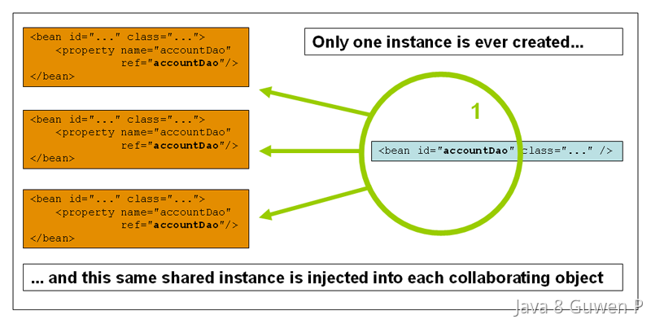
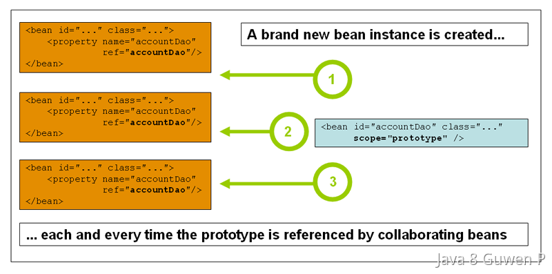

# ✅Spring 中的 Bean 作用域有哪些？


# 典型回答

所谓作用域，其实就是说这个东西哪个范围内可以被使用。如我们定义类的成员变量的时候使用的public、private等这些也是作用域的概念。

Spring的Bean的作用域，描述的就是这个Bean在哪个范围内可以被使用。不同的作用域决定了了 Bean 的创建、管理和销毁的方式。

常见的作用域有**Singleton、Prototype、Request、Session、Application**这五种。我们在代码中，可以在定义一个Bean的时候，通过@Scope 注解来指定他的作用域：

```java
@Service
@Scope("prototype")
public class HollisTestService{
    
}
```

这五种作用域的解释如下：

1. **单例（Singleton）**：
   - 默认作用域。
   - 对于每个 Spring IoC 容器，只创建一个 Bean 实例。
   - 适用于全局共享的状态。
2. **原型（Prototype）**：
   - 每次请求都会创建一个新的 Bean 实例。
   - 适用于所有状态都是非共享的情况。
3. **请求（Request）**：
   - 仅在 Web 应用程序中有效。
   - 每个 HTTP 请求都会创建一个新的 Bean 实例。
   - 用于请求级别的数据存储和处理。
4. **会话（Session）**：
   - 仅在 Web 应用程序中有效。
   - 每个 HTTP 会话都会创建一个新的 Bean 实例。
   - 适用于会话级别的数据存储和处理。
5. **应用（Application）**：
   - 仅在 Web 应用程序中有效。
   - 在 ServletContext 的生命周期内，只创建一个 Bean 实例。
   - 适用于全应用程序级别的共享数据。
6. **Websocket**：
   - 仅在 Web 应用程序中有效。
   - 在 Websocket 的生命周期内，只创建一个 Bean 实例。
   - 适用于websocket级别的共享数据。


一般来说我们都是使用Singleton的作用域，有的时候也会用Prototype，其他几个用得不多。

以下两张图是Spring官方给的关于singleton和prototype的区别。其实就是会创建一个Bean还是多个Bean的区别：






# 扩展知识


## 作用域与循环依赖

Spring在解决循环依赖时，只解决了单例作用域的，别的作用域没有解决：

[✅什么是Spring的循环依赖问题？](https://www.yuque.com/hollis666/dr9x5m/xgbtp0?view=doc_embed&inner=m0U0D)


## 自定义作用域

除了Spring官方提供的这些作用域以外，我们还可以自定义我们自己的作用域，Spring提供了这方面的支持。

要自定义一个 Spring 的作用域，需要实现 `org.springframework.beans.factory.config.Scope` 接口。这个接口要求实现几个关键方法来管理 Bean 的生命周期。

```java
public interface Scope {

	Object get(String name, ObjectFactory<?> objectFactory);

	@Nullable
	Object remove(String name);

	void registerDestructionCallback(String name, Runnable callback);

	@Nullable
	Object resolveContextualObject(String key);


	@Nullable
	String getConversationId();
}
```

接下来，我们需要实现接口的方法，例如 get（创建或检索 Bean 实例）、remove（销毁 Bean 实例）等。

```java
import org.springframework.beans.factory.ObjectFactory;
import org.springframework.beans.factory.config.Scope;

public class MyCustomScope implements Scope {

    @Override
    public Object get(String name, ObjectFactory<?> objectFactory) {
        // 实现获取 Bean 的逻辑
        return objectFactory.getObject();
    }

    @Override
    public Object remove(String name) {
        // 实现移除 Bean 的逻辑
        return null;
    }

    @Override
    public void registerDestructionCallback(String name, Runnable callback) {
        // 注册 Bean 销毁时的回调
    }

    @Override
    public Object resolveContextualObject(String key) {
        // 用于解析相关上下文数据
        return null;
    }

    @Override
    public String getConversationId() {
        // 返回当前会话的 ID
        return null;
    }
}

```

接下来，我们需要 Spring 配置中注册这个自定义的作用域。这可以通过 `ConfigurableBeanFactory.registerScope` 方法实现。

```java
import org.springframework.beans.factory.config.ConfigurableBeanFactory;
import org.springframework.context.annotation.Bean;
import org.springframework.context.annotation.Configuration;

@Configuration
public class AppConfig {

    @Bean
    public MyCustomScope myCustomScope(ConfigurableBeanFactory beanFactory) {
        MyCustomScope scope = new MyCustomScope();
        beanFactory.registerScope("myCustomScope", scope);
        return scope;
    }
}

```

在 Bean 定义中使用自定义的作用域的名称。Spring 容器将会根据你的自定义逻辑来创建和管理这些 Bean。

```java
@Component
@Scope("myCustomScope")
public class MyScopedBean {
    // ...
}
```


> 原文: <https://www.yuque.com/hollis666/dr9x5m/se3lrm1ib8an3oem>