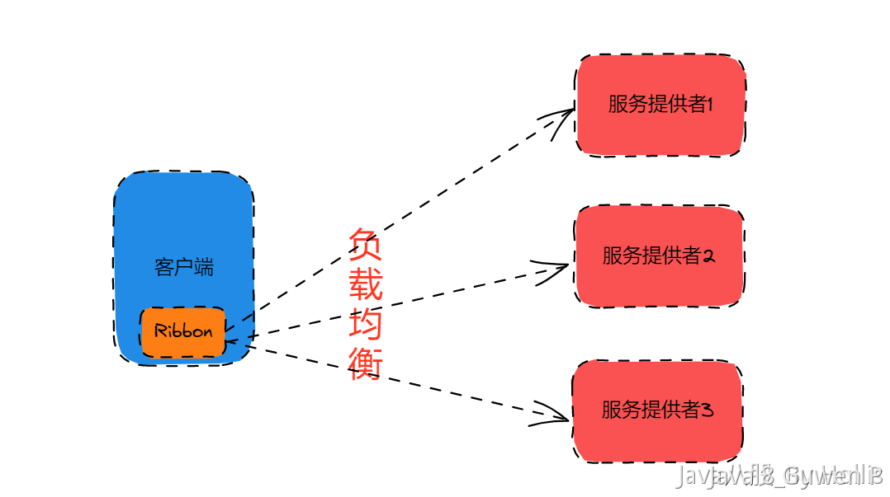
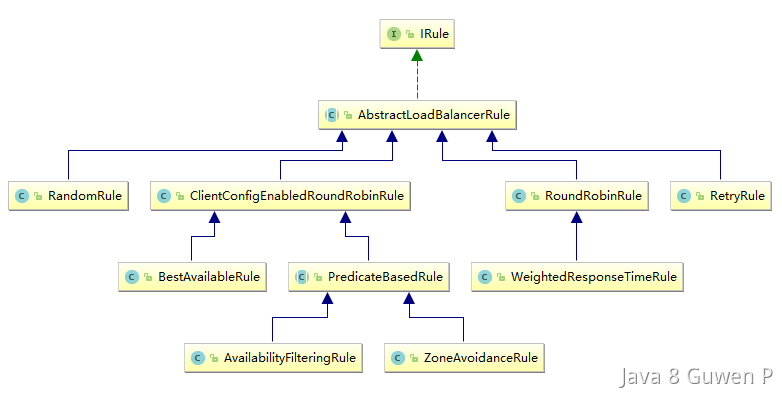
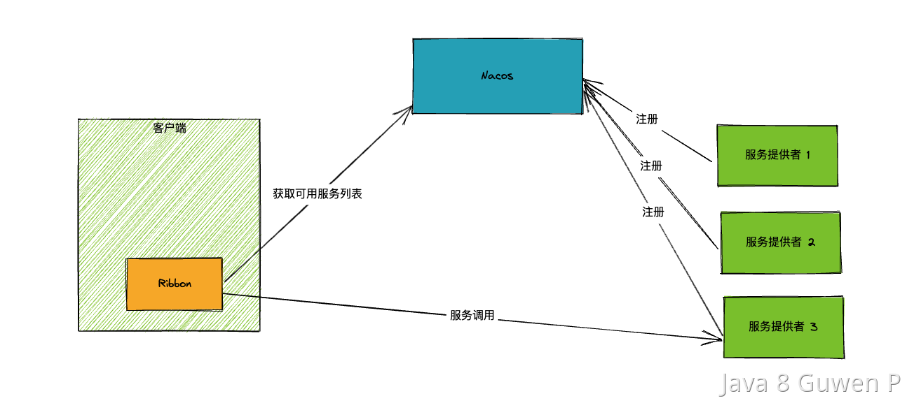

# ✅Ribbon是怎么做负载均衡的？


# 典型回答

**Ribbon是一种客户端负载均衡的解决方案，**它通常与Spring Cloud一起使用，以在微服务架构中实现负载均衡。

客户端负载均衡器的实现原理是通过注册中心，如 Nacos，将可用的服务列表拉取到本地（客户端），再通过客户端负载均衡器（设置的负载均衡策略）获取到某个服务器的具体 ip 和端口，然后再通过 Http 框架请求服务并得到结果。



Ribbon通过在客户端中添加拦截器来实现负载均衡。当客户端发出请求时，拦截器会根据一组预定义的规则选择一个服务实例来处理请求。这些规则可以基于多个因素进行选择，包括服务实例的可用性、响应时间、负载等级等。

Ribbon的核心是**负载均衡算法**，它决定了如何选择服务实例。Ribbon提供了多种负载均衡算法，包括轮询、随机、加权随机、加权轮询、最少连接数等，他们的具体实现是实现了IRule接口，继承自AbstractLoadBalanceRule实现的：



- 轮询策略：RoundRobinRule
   - 按照一定的顺序依次调用服务实例。比如一共有 3 个服务，依次调用服务 1、服务 2、服务3
- 权重策略：WeightedResponseTimeRule
   - 每个服务提供者的响应时间分配一个权重，响应时间越长，权重越小。 它的实现原理是，刚开始使用轮询策略并开启一个计时器，每一段时间收集一次所有服务提供者的平均响应时间，然后再给每个服务提供者附上一个权重，权重越高被选中的概率也越大。
- 随机策略：RandomRule
   - 这种实现很简单，从服务提供者的列表中随机选择一个服务实例。
- 最小连接数策略：BestAvailableRule
   - 遍历服务提供者列表，选取连接数最小的⼀个服务实例。如果有相同的最小连接数，那么会调用轮询策略进行选取。
- 重试策略：RetryRule
   - 按照轮询策略来获取服务，如果获取的服务实例为 null 或已经失效，则在指定的时间之内不断地进行重试来获取服务，如果超过指定时间依然没获取到服务实例则返回 null。
- 可用敏感性策略：AvailabilityFilteringRule
   - 先过滤掉非健康的服务实例，然后再选择连接数较小的服务实例。
- 区域敏感策略：ZoneAvoidanceRule
   - 根据服务所在区域（zone）的性能和服务的可用性来选择服务实例，在没有区域的环境下，该策略和轮询策略类似。


Ribbon还提供了一些高级功能，如服务列表的动态刷新、失败重试、请求重试、请求超时控制等。这些功能可以帮助客户端更好地适应动态的服务拓扑，并提高系统的可用性和容错性。


# 扩展知识


## Ribbon结合Nacos使用

但是需要注意的是，Nacos 2021 移除了Ribbon的支持，取而代之的是spring-cloud-loadbalancer

1、POM依赖增加对Nacos和Ribbon的依赖：

```
<dependency>
    <groupId>com.alibaba.cloud</groupId>
    <artifactId>spring-cloud-starter-alibaba-nacos-discovery</artifactId>
    <version>2.2.5.RELEASE</version>
</dependency>
<dependency>
    <groupId>org.springframework.cloud</groupId>
    <artifactId>spring-cloud-starter-netflix-ribbon</artifactId>
    <version>2.2.10.RELEASE</version>
</dependency>

```

在Spring Boot应用程序中配置Nacos注册中心：

```
spring:
  cloud:
    nacos:
      discovery:
        server-addr: ${NACOS_SERVER_ADDR:localhost:8848}

```

在需要调用远程服务的类中注入Ribbon Client：

```
@RestController
public class MyController {

    @Autowired
    private RestTemplate restTemplate;

    @GetMapping("/invoke")
    public String invoke() {
        // 发送请求并获取响应
        String response = restTemplate.getForObject("http://my-service/my-api", String.class);
        return response;
    }
}
```

在应用程序启动类中配置Ribbon Client：

```
@Configuration
public class RibbonConfig {

    @Bean
    public IRule ribbonRule() {
        // 使用随机算法选择服务实例
        return new RandomRule();
    }

    @Bean
    @LoadBalanced	//使用@LoadBalanced注解来启用负载均衡功能。
    public RestTemplate restTemplate(RestTemplateBuilder builder) {
        return builder.build();
    }
}

```


## Ribbon工作流程
Ribbon的工作流程大致如下：

1. 服务提供者先将自己注册到Nacos、Eureka等注册中心中。
2. 客户端向Ribbon发送请求。Ribbon将请求的目标服务名称和API路径解析出来。
3. Ribbon根据服务名称去注册中心（如Eureka、Consul、Nacos等）获取可用的服务实例列表。
4. Ribbon通过负载均衡算法（如轮询、随机、加权随机、最少活跃数等）从实例列表中选择一台目标服务器，将请求转发给目标服务器。
5. 目标服务器处理请求并返回响应给客户端。
6. 客户端接收到响应后进行处理。





> 原文: <https://www.yuque.com/hollis666/dr9x5m/umf7fkgc9purm9qb>