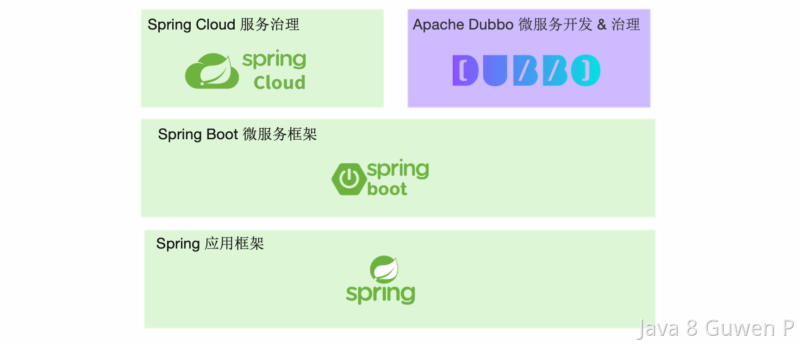

# ✅SpringCloud和Dubbo有什么区别？

# 典型回答

Spring Cloud和Dubbo都是为了简化分布式系统开发而设计的开源框架，Dubbo 和 Spring Cloud 都侧重在对分布式系统中常见问题模式的抽象（如服务发现、负载均衡、动态配置等）

它们之间有以下几个区别：

1. **底层技术不同**：Spring Cloud是基于Spring Boot和Spring Framework构建的，编程模型与通信协议绑定 HTTP，而Dubbo则是基于Java的RPC框架实现的（Dubbo也支持HTTP协议，但是主要还是以Dubbo协议为主）。

2. **主要的用途不同**：Spring Cloud是一个完整的微服务框架，它提供了服务注册与发现、负载均衡、熔断器、配置管理等功能。而Dubbo是一个RPC框架，它主要解决分布式服务之间的调用问题，如服务注册与发现、负载均衡、协议转换、服务治理等。

在SpringCloud中，服务注册与发现主要通过Eureka、负载均衡主要通过Ribbon、限流降级这些操作主要通过Hystrix，网关服务主要依赖于Zuul。

3. **社区生态不同**：Spring Cloud是由Spring社区维护的，拥有庞大的社区和丰富的生态系统，能够支持多种云平台。而Dubbo则是由阿里巴巴开发和维护的（后来捐给了Apache），虽然拥有较为活跃的社区和强大的阿里巴巴技术支持，但生态系统相对较小。

4. **语言支持不同**：Spring Cloud是基于Java语言实现的，同时也支持其他语言的开发，如Kotlin、Groovy、Scala等。而Dubbo则是一个纯Java实现的RPC框架，只支持Java语言开发（Dubbo-go框架支持go语言）。

 

# 扩展知识

## 如何选择

如果你需要将应用部署到云平台上，Spring Cloud提供了更多的云原生支持，包括对Kubernetes和Istio的支持。

如果你的项目需要强大的服务治理能力，例如多协议支持、多注册中心支持等，那么选择Dubbo可能更适合。Dubbo提供了强大的服务治理能力，可以满足各种不同的需求。

> 原文: <https://www.yuque.com/hollis666/dr9x5m/htrdnuwky10m81br>