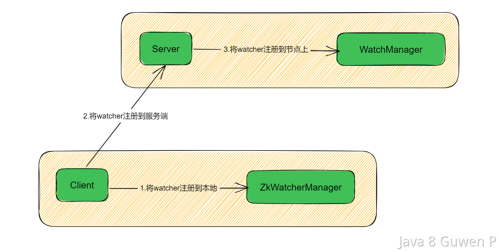
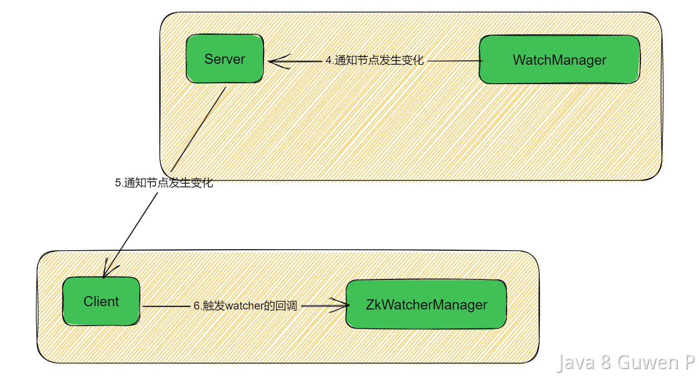

# ✅Zookeeper的watch机制是如何工作的？

# 典型回答

在Zookeeper中，watch机制是一种非常重要的特性，它能够让应用程序监听Zookeeper上节点的变化，从而及时做出响应。

Zookeeper的watch机制实现中，涉及到多个概念，首先是客户端和服务端，这个好理解，Zookeeper的集群就是服务端，调用ZK服务的机器就是客户端。

还有两个模块，**分别叫做WatchManager和ZkWatcherManager。**

WatchManager是Zookeeper服务端内部的一个模块，用于管理所有watcher的相关操作，包括watcher的注册、注销、触发等。

而ZkWatcherManager是Zookeeper客户端中的一个模块，用于管理客户端中watcher的相关操作，包括创建watcher、注册watcher、处理watcher事件等。

（PS：这俩模块所处的位置和职责都不一样，网上很多文章都搞混了，甚至只介绍了其中一个，或者干脆不介绍，所以很多人看完都不懂）

了解了这几个概念之后，再来说一下ZK的watch机制是如何工作的：

1. 客户端连接到Zookeeper服务端，客户端创建一个ZkWatcherManager实例，用于管理客户端中所有的watcher。

2. 当客户端想要监控某个znode节点时，它可以调用ZkWatcherManager中的方法创建watcher并将其注册到客户端中。客户端将watcher的信息发送到Zookeeper服务端。

3. Zookeeper服务端接收到客户端发送的watcher信息后，会将该watcher信息交给WatchManager处理。WatchManager会将该watcher注册到相应的znode节点上，并将watcher相关的信息保存在内存中。

4. 当znode节点发生变化时，WatchManager会通知Zookeeper Server

5. Zookeeper Server会根据变化类型通知相应的客户端，告知它们发生了哪些变化。

6. 当客户端接收到Zookeeper Server的通知后，ZkWatcherManager会根据watcher的类型（data watcher或child watcher）来触发相应的事件处理方法，例如data watcher会触发processDataChanged()方法，child watcher会触发processChildChanged()方法等。

> 原文: <https://www.yuque.com/hollis666/dr9x5m/zg9dr53s87a4knim>