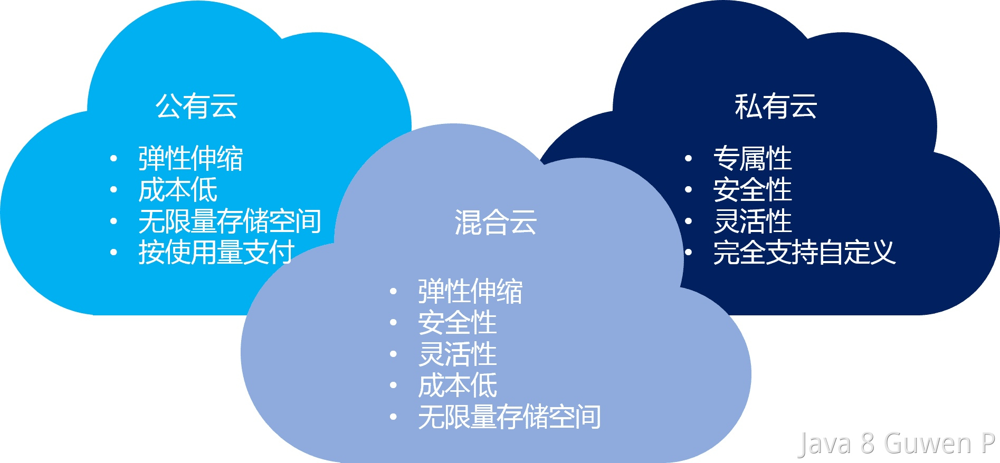

# ✅什么是公有云、私有云、混合云？

### 公有云

**公有云是为广大用户、个人或企业提供的云基础设施。公有云就是第三方的公有云供应商为用户提供可通过互联网访问的虚拟环境中的服务器空间。然后，用户可以通过购买云服务器、数据存储和其他与云相关的服务等公有云服务来访问这些服务器。**

在公有云中，所有硬件、软件和其他支持性基础结构均为云提供商所拥有和管理。

在公有云中，你与其他组织或云“租户”共享相同的硬件、存储和网络设备。 你可以使用 Web 浏览器访问服务和管理帐户。

公有云部署通常用于提供基于 Web 的电子邮件、网上办公应用、存储以及测试和开发环境。

如果拿租房子来举例，**公有云就像是合租公寓，设施都是共用的，各个房间之间也都是通过虚拟化等方案进行隔离的。并且费用也是相对比较低的。**

公有云非常适合计算能力需求有波动的企业或专门面向公众的应用程序，如Dropbox、Evernote和Netflix。

- 公有云优势：
   - 成本更低 — 无需购买硬件或软件，仅对使用的服务付费。
   - 无需维护 — 维护由服务提供商提供。
   - 近乎无限制的缩放性 — 提供按需资源，可满足业务需求。
   - 高可靠性 — 具备众多服务器，确保免受故障影响。

但是同时，很多人担心公有云的安全性、私密性等问题。于是就有了私有云。

### 私有云
**私有云是云计算的另一种形式。它为一个企业或组织提供专用的云环境。私有云可以由企业或组织内部的IT团队在该组织的防火墙后面进行内部操作，因此组织可以更好地控制其计算资源。私有云主要由企业使用，因此它也被视为一种企业云。**

私有云可在物理上位于组织的现场数据中心，也可由第三方服务提供商托管。

在私有云中，服务和基础结构始终在私有网络上进行维护，硬件和软件专供组织使用。

私有云可使组织更加方便地自定义资源，从而满足特定的 IT 需求。

私有云的使用对象通常为政府机构、金融机构以及其他具备业务关键性运营且希望对环境拥有更大控制权的中型到大型组织。

如果拿租房子来举例，**私有云就像是套房整租，资源独享不需要和他人共用，有很高的自由性。**

- 私有云优势：
   - 灵活性更高 — 组织可自定义云环境以满足特定业务需求。
   - 安全性更高 — 资源不与其他组织共享，从而可实现更高控制性和安全性级别。
   - 缩放性更高 — 私有云仍然具有公有云的缩放性和效率。

但是私有云的费用相对较高， 并且维护成本也不低。于是有的厂商结合了公有云和私有云推出了混合云。

### 混合云
**混合云是一种云计算模型，它通过安全连接（如VPN连接或租用线路）组合一个或多个公有云和私有云环境，从而允许在不同云环境之间共享数据和应用程序。当在私有云上运行的应用程序遇到使用高峰时，它们可以自动“突发”到公有云环境以获得额外的按需容量。这被称为“云爆发”。由于额外的需求将在公有云上，因此无需担心提前配置硬件以满足高峰需求。连接公有云和私有云有两种方法：VPN和点对点专用连接。**

混合云通常被认为是“两全其美”，它将本地基础架构或私有云与公有云相结合，组织可利用这两者的优势。

在混合云中，数据和应用程序可在私有云和公有云之间移动，从而可提供更大灵活性和更多部署选项。

如果拿租房子来举例，**混合云就像是更加灵活的整租+单租自动调节。可以在价格、安全性、灵活性等方面做一个平衡。**

- 混合云优势：
   - 控制性 — 组织可针对敏感资产维持私有基础结构。
   - 灵活性 — 需要时可利用公有云中的其他资源。
   - 成本效益 — 具备扩展至公有云的能力，因此可仅在需要时支付额外的计算能力。
   - 容易轻松 — 无需费时费力即可转换至云，因为可根据时间按工作负荷逐步迁移。

混合云整合了公有云和公有云的优势。它提供高可扩展性，几乎无限的存储空间，灵活的支付模式，并且与公有云一样具有成本效益。混合云也非常安全；它为您提供了更多的灵活性和对云资源的控制。

但是目前支持混合云的服务厂商并不是很多，并且这种方案目前也不是很成熟。

> 原文: <https://www.yuque.com/hollis666/dr9x5m/aloiv3ha6tyb1awk>