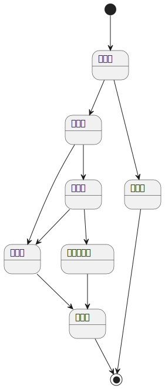

# ✅什么是状态机，能描述一下状态机的实现原理吗？


# 典型回答

状态机用于描述一个系统在不同状态之间的转换和行为，是状态模式的一种具体应用。状态机是一种抽象的计算模型，它包含有限个状态和转换规则，用于描述系统在不同状态下如何响应输入以及在不同输入下如何进行状态转换。

在我们日常开发中，我们提到的状态机基本都是**有限状态机**，用于解决状态相关的问题。有限状态机可以通过状态转换和事件触发来描述程序的行为和状态迁移。

[✅什么是状态模式，有哪些应用？](https://www.yuque.com/hollis666/dr9x5m/ge6p4e?view=doc_embed)

一个状态机通常包含以下几个要素：

1. 状态（States）：代表系统可能处于的各种状态，例如 "已下单"、"已支付"、"已发货" 等。
2. 事件（Events）：触发状态转换的事件，例如 "下单"、"支付"、"发货" 等。
3. 转换（Transitions）：定义状态之间的转换规则，即在某个事件发生时，系统从一个状态转换到另一个状态的规则。
4. 动作（Actions）：在状态转换发生时执行的操作或行为。

一般我们在工作中，我们的主要的业务单据都会有一个状态的设计，我们会通过状态图画出他的状态流转情况，而控制这些状态如何流转，就是状态机干的事儿。


状态机的实现，有很多种方式，可以用一些状态机的框架，如Spring StateMachine，也可以用状态模式，也可以自己封装一个工具类都行。

如果没有一个严格的状态机控制的话，我们是可以随便修改订单的状态的，我们可以在`已下单`状态直接推进到`已发货`状态，这显然是不对的。

而状态机就是来控制这个状态的流转的他的目的都是把状态、事件、转换以及动作封装在一起的，他把这些东西内聚在一起了。有了它，一个`已下单`状态的订单，只能通过`支付`事件来驱动，并且还会有一些其他的约束，比如`支付金额>0`（转移条件）等，然后他的下一个状态只能是`已支付`这样的。

如以下，是我们自己简单实现的一个状态机：

先定义订单状态的枚举：

```java
public enum OrderState {
    PLACED,
    PAID,
    SHIPPED,
    REFUNDED,
    CANCELED,
    CONFIRMED
}

```

然后，定义一个枚举来表示状态转换的事件。

```java
public enum OrderEvent {
    PAY,
    CONFIRM,
    SHIP,
    CANCEL,
    REFUND,
    CANCEL
}

```

创建一个状态机类，该类包含当前状态和处理状态转换的方法:

```java
public class StateMachine {
    private State currentState;

    public StateMachine() {
        // 初始化状态机的初始状态
        currentState = State.PLACED;
    }

    public State getCurrentState() {
        return currentState;
    }

    // 处理事件，进行状态转换
    public void handleEvent(Event event) {
        switch (currentState) {
            case PLACED:
                if (event == Event.PAY) {
                    currentState = State.PAID;
                } else if (event == Event.CANCEL) {
                    currentState = State.CANCELED;
                }else{
                    throw new StateHandleException(");
                }
                break;
            case PAID:
                if (event == Event.SHIP) {
                    currentState = State.SHIPPED;
                }else if (event == Event.REFUND) {
                    currentState = State.REFUNDED;
                }else{
                    throw new StateHandleException(");
                }
                break;
            case SHIPPED:
                if (event == Event.CONFIRM) {
                    currentState = State.CONFIRMED;
                }else if (event == Event.REFUND) {
                    currentState = State.REFUNDED;
                }else{
                    throw new StateHandleException(");
                }
                break;
        	// 省略部分代码...
            default:
                break;
        }
    }
}

```

有了这个类之后，我们只需要通过handleEvent方法，传入event，就能获取下一个状态了。所有状态内部的变化都在这个类中封装好了。

```java
public class Main {
    public static void main(String[] args) {
        StateMachine stateMachine = new StateMachine();

        System.out.println("Current State: " + stateMachine.getCurrentState());

        stateMachine.handleEvent(Event.PAY);
        
        System.out.println("Current State: " + stateMachine.getCurrentState());
    }
}

```


# 扩展知识


## Spring StateMachine

Spring State Machine（简称 Spring SM）是 Spring Framework 的一个模块，它提供了一个用于构建有限状态机的框架。

Spring State Machine 模块为开发者提供了一个简单、灵活和强大的方式来构建和管理状态机。它可以用于解决各种状态相关的问题，例如工作流管理、业务流程控制、状态转换处理等。

```java
@Configuration
@EnableStateMachine
public class StateMachineConfig extends StateMachineConfigurerAdapter<States, Events> {
    
    @Override
    public void configure(StateMachineStateConfigurer<States, Events> states) throws Exception {
        states
            .withStates()
            .initial(States.STATE_A)
            .states(EnumSet.allOf(States.class));
    }
    
    @Override
    public void configure(StateMachineTransitionConfigurer<States, Events> transitions) throws Exception {
        transitions
            .withExternal()
            .source(States.STATE_A).target(States.STATE_B).event(Events.EVENT_X)
            .and()
            .withExternal()
            .source(States.STATE_B).target(States.STATE_A).event(Events.EVENT_Y);
    }
}

```

上面的代码定义了一个简单的状态机，有两个状态（STATE_A 和 STATE_B）以及两个事件（EVENT_X 和 EVENT_Y）。当收到 EVENT_X 事件时，状态从 STATE_A 转换到 STATE_B；当收到 EVENT_Y 事件时，状态从 STATE_B 转换回 STATE_A。

Spring State Machine 提供了更多功能和配置选项，我们可以构建更复杂的状态机，以满足实际的业务需求。对于更多详细信息和使用示例，请参阅 Spring State Machine 的官方文档和示例代码。

[https://spring.io/projects/spring-statemachine/](https://spring.io/projects/spring-statemachine/)


> 原文: <https://www.yuque.com/hollis666/dr9x5m/cg7ymuivx7lyubcb>