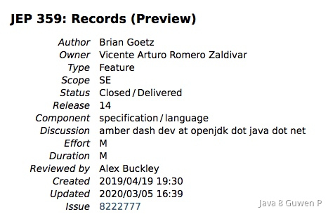

# 为啥我觉得应该谨慎使用Lombok

Lombok是一款非常实用Java工具，可用来帮助开发人员消除Java的冗长代码，尤其是对于简单的Java对象（POJO）。它通过注释实现这一目的。

如果大家对于Lombok比较了解的话，可以先跳过这一段，直接往后看，如果不是很熟悉的话，可以简单了解一下。

想在项目中使用Lombok，需要三个步骤：

**一、IDE中安装Lombok插件**

目前Lombok支持多种IDE，其中包括主流的Eclips、Intellji IDEA、Myeclipse等都是支持的。
在IDEA中安装方式如下:


**二、导入相关依赖**

Lombok 支持使用多重构建工具进行导入依赖，目前主要支持maven、gardle、ant等均支持。
如使用maven导入方式如下：
```
<dependency>
    <groupId>org.projectlombok</groupId>
    <artifactId>lombok</artifactId>
    <version>1.18.12</version>
    <scope>provided</scope>
</dependency>
```

**三、代码中使用注解**
Lombok精简代码的方式主要是通过注解来实现，其中常用的有@Data、@Getter/@Setter、@Builder、@NonNull等。
如使用@Data注解，即可简单的定义一个Java Bean：
```
import lombok.Data;
@Data
public class Menu {
    private String shopId;
    private String skuMenuId;
    private String skuName;
}
```

使用@Data注解在类上，相当于同时使用了@ToString、@EqualsAndHashCode、@Getter、@Setter和@RequiredArgsConstrutor这些注解，对于POJO类十分有用。

即自动帮忙给例子中的Menu类中定义了toString、Getter、Setter等方法。

通过上面的例子，大家可以发现，我们是好用@Data注解大大减少了代码量，使代码非常简洁。这也是很多开发者热衷于使用Lombok的主要原因。

**另外，关于Lombok的使用，不同人有不同的看法，因为很多人都使用过Lombok，对于他的优点都比较了解，所以接下来我们重点说一下Lombok的使用会带来哪些问题。**

### Lombok有什么坏处？

#### 强X队友
因为Lombok的使用要求开发者一定要在IDE中安装对应的插件。

如果未安装插件的话，使用IDE打开一个基于Lombok的项目的话会提示找不到方法等错误。导致项目编译失败。

也就是说，如果项目组中有一个人使用了Lombok，那么其他人就必须也要安装IDE插件。否则就没办法协同开发。

更重要的是，如果我们定义的一个jar包中使用了Lombok，那么就要求所有依赖这个jar包的所有应用都必须安装插件，这种侵入性是很高的。


#### 代码可读性，可调试性低

在代码中使用了Lombok，确实可以帮忙减少很多代码，因为Lombok会帮忙自动生成很多代码。

但是这些代码是要在编译阶段才会生成的，所以在开发的过程中，其实很多代码其实是缺失的。

在代码中大量使用Lombok，就导致代码的可读性会低很多，而且也会给代码调试带来一定的问题。

比如，我们想要知道某个类中的某个属性的getter方法都被哪些类引用的话，就没那么简单了。


#### 有坑
因为Lombok使代码开发非常简便，这就使得部分开发者对其产生过度依赖。

在使用Lombok过程中，如果对于各种注解的底层原理不理解的话，很容易产生意想不到的结果。

举一个简单的例子，我们知道，当我们使用@Data定义一个类的时候，会自动帮我们生成equals()方法 。

但是如果只使用了@Data，而不使用@EqualsAndHashCode(callSuper=true)的话，会默认是
@EqualsAndHashCode(callSuper=false),这时候生成的equals()方法只会比较子类的属性，不会考虑从父类继承的属性，无论父类属性访问权限是否开放。

这就可能得到意想不到的结果。


#### 影响升级

因为Lombok对于代码有很强的侵入性，就可能带来一个比较大的问题，那就是会影响我们对JDK的升级。

按照如今JDK的升级频率，每半年都会推出一个新的版本，但是Lombok作为一个第三方工具，并且是由开源团队维护的，那么他的迭代速度是无法保证的。

所以，如果我们需要升级到某个新版本的JDK的时候，若其中的特性在Lombok中不支持的话就会受到影响。
还有一个可能带来的问题，就是Lombok自身的升级也会受到限制。

因为一个应用可能依赖了多个jar包，而每个jar包可能又要依赖不同版本的Lombok，这就导致在应用中需要做版本仲裁，而我们知道，jar包版本仲裁是没那么容易的，而且发生问题的概率也很高。


#### 破坏封装性
以上几个问题，我认为都是有办法可以避免的。但是有些人排斥使用Lombok还有一个重要的原因，那就是他会破坏封装性。

众所周知，Java的三大特性包括封装性、继承性和多态性。

如果我们在代码中直接使用Lombok，那么他会自动帮我们生成getter、setter 等方法，这就意味着，一个类中的所有参数都自动提供了设置和读取方法。

举个简单的例子，我们定义一个购物车类：
```
@Data
public class ShoppingCart { 
    //商品数目
    private int itemsCount; 
    //总价格
    private double totalPrice; 
    //商品明细
    private List items = new ArrayList<>();
}
//例子来源于《极客时间-设计模式之美》
```
我们知道，购物车中商品数目、商品明细以及总价格三者之前其实是有关联关系的，如果需要修改的话是要一起修改的。

但是，我们使用了Lombok的@Data注解，对于itemsCount 和 totalPrice这两个属性。虽然我们将它们定义成 private 类型，但是提供了 public 的 getter、setter 方法。

外部可以通过 setter 方法随意地修改这两个属性的值。我们可以随意调用 setter 方法，来重新设置 itemsCount、totalPrice 属性的值，这也会导致其跟 items 属性的值不一致。

而面向对象封装的定义是：通过访问权限控制，隐藏内部数据，外部仅能通过类提供的有限的接口访问、修改内部数据。所以，暴露不应该暴露的 setter 方法，明显违反了面向对象的封装特性。

好的做法应该是不提供getter/setter，而是只提供一个public的addItem方法，同时去修改itemsCount、totalPrice以及items三个属性。


### 总结

本文总结了常用的Java开发工具Lombok的优缺点。

优点是使用注解即可帮忙自动生成代码，大大减少了代码量，使代码非常简洁。

但是并不意味着Lombok的使用没有任何问题，在使用Lombok的过程中，还可能存在对队友不友好、对代码不友好、对调试不友好、对升级不友好等问题。

最重要的是，使用Lombok还会导致破坏封装性的问题。

虽然使用Lombok存在着很多方便，但是也带来了一些问题。

**但是到底建不建议在日常开发中使用，我其实保持一个中立的态度，不建议大家过度依赖，也不要求大家一定要彻底不用。**

只要大家在使用的过程中，或者评估要不要在代码中引入Lombok之前，在想到他的优点的同时，能够考虑到他给代码带来的问题的，那么本文的目的也就达到了！


### Java出手

其实，lombok主要是帮我们生成Java Bean中的模板代码，在JDK 14中，其实官方自己新出了一个类型，来帮我们定义一个简单的Java Bean

大神Brian Goetz提出了使用record定义一个纯数据载体的想法，于是，Java 14 中便包含了一个新特性：EP 359: Records 



Records的目标是扩展Java语言语法，Records为声明类提供了一种紧凑的语法，用于创建一种类中是“字段，只是字段，除了字段什么都没有”的类。通过对类做这样的声明，编译器可以通过自动创建所有方法并让所有字段参与hashCode()等方法。

```cpp
record Person (String firstName, String lastName) {}
```

如前所述，Record只是一个类，其目的是保存和公开数据。让我们看看进行反编译，将会得到以下代码:

```cpp
public final class Person extends java.lang.Record {  
  private final String firstName;
  private final String lastName;
  public Person(java.lang.String, java.lang.String);
  public java.lang.String toString();
  public final int hashCode();
  public final boolean equals(java.lang.Object);
  public java.lang.String firstName();
  public java.lang.String lastName();
 }
```


> 原文: <https://www.yuque.com/hollis666/dr9x5m/okuny3u1wdx86a5h>