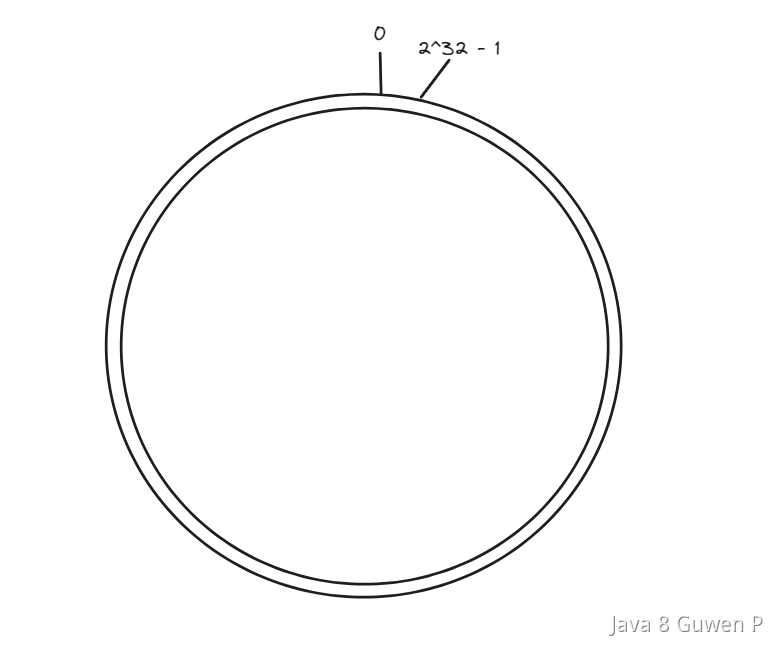
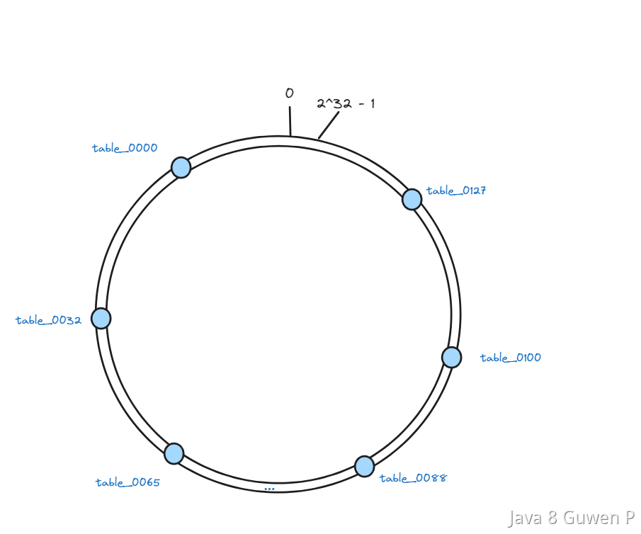
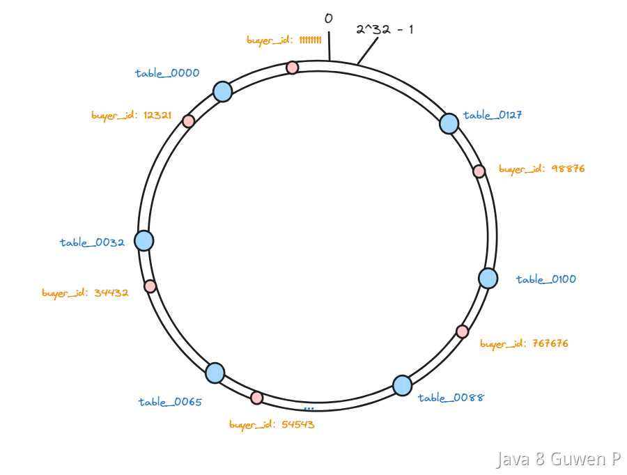
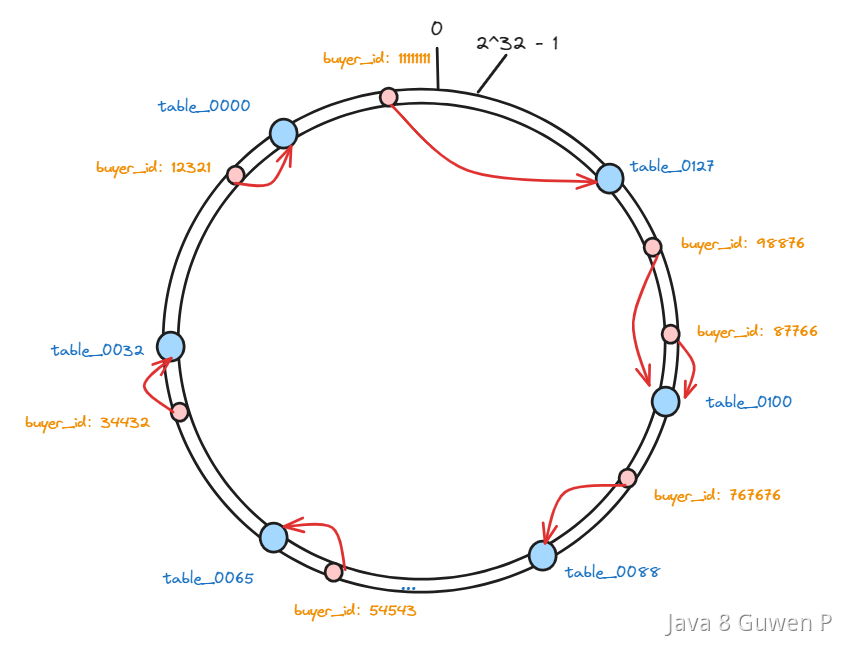
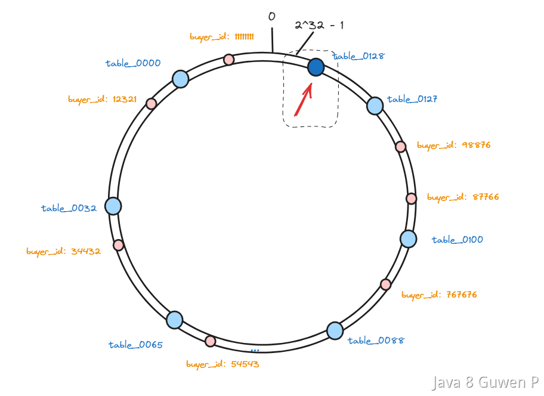
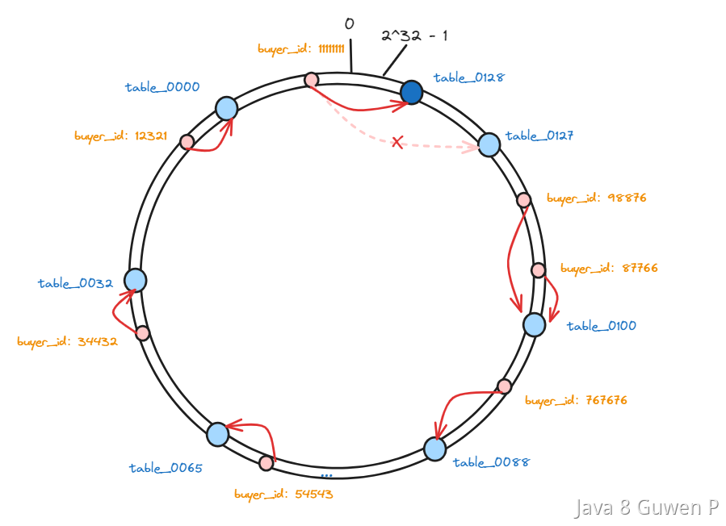

# ✅什么是一致性哈希？

# 典型回答
哈希算法大家都不陌生，经常被用在负载均衡、分库分表等场景中，比如说我们在做分库分表的时候，最开始我们根据业务预估，把数据库分成了128张表，这时候要插入或者查询一条记录的时候，我们就会先把分表键，如buyer_id进行hash运算，然后再对128取模，得到0-127之间的数字，这样就可以唯一定位到一个分表。

但是随着业务得突飞猛进，128张表，已经不够用了，这时候就需要重新分表，比如增加一张新的表。这时候如果采用hash或者取模的方式，就会导致128+1张表的数据都需要重新分配，成本巨高。

而一致性hash算法， 就能有效的解决这种分布式系统中增加或者删除节点时的失效问题。

**一致性哈希（Consistent Hashing）是一种用于分布式系统中数据分片和负载均衡的算法。它的目标是在节点的动态增加或删除时，尽可能地减少数据迁移和重新分布的成本。**

实现一致性哈希算法首先需要构造一个哈希环，然后把他划分为固定数量的虚拟节点，如2^32。那么他的节点编号就是 0-2^32-1：

接下来， 我们把128张表作为节点映射到这些虚拟节点上，每个节点在哈希空间上都有一个对应的虚拟节点：

hash(table_0000)%2^32、hash(table_0001)%2^32、hash(table_0002)%2^32 .... hash(table_0127)%2^32

再把这些表做好hash映射之后，我们就需要存储数据了，现在我们要把一些需要分表的数据也根据同样的算法进行hash，并且也将其映射哈希环上。

hash(buyer_id)%2^32：
hash(12321)%2^32、hash(34432)%2^32、hash(54543)%2^32 .... hash(767676)%2^32

这样，这个hash环上的虚拟节点就包含两部分数据的映射了，一部分是存储数据的分表的映射，一部分是真实要存储的数据的映射。

那么， 我们最终还是要把这些数据存储到数据库分表中，那么做好哈希之后，这些数据又要保存在哪个数据库表节点中呢？

其实很简单，只需要按照数据的位置，沿着顺时针方向查找，找到的第一个分表节点就是数据应该存放的节点：

因为要存储的数据，以及存储这些数据的数据库分表，hash后的值都是固定的，所以在数据库数量不变的情况下，下次想要查询数据的时候，只需要按照同样的算法计算一次就能找到对应的分表了。

以上，就是一致性hash算法的原理，那么，再回到我们开头的问题，如果我要增加一个分表怎么办呢？

我们首先要将新增加的表通过一致性hash算法映射到哈希环的虚拟节点中：

这样，会有一部分数据，因为节点数量发生变化，那么他顺时针遇到的第一个分表可能就变了。

相比于普通hash算法，在增加服务器之后，影响的范围非常小，只影响到一部分数据，其他的数据是不需要调整的。

所以，**在总结一下。一致性哈希算法将整个哈希空间视为一个环状结构，将节点和数据都映射到这个环上。每个节点通过计算一个哈希值，将节点映射到环上的一个位置。而数据也通过计算一个哈希值，将数据映射到环上的一个位置。**

**当有新的数据需要存储时，首先计算数据的哈希值，然后顺时针或逆时针在环上找到最近的节点，将数据存储在这个节点上。当需要查找数据时，同样计算数据的哈希值，然后顺时针或逆时针在环上找到最近的节点，从该节点获取数据。**

优点：

1. **数据均衡**：在增加或删除节点时，一致性哈希算法只会影响到少量的数据迁移，保持了数据的均衡性。
2. **高扩展性**：当节点数发生变化时，对于已经存在的数据，只有部分数据需要重新分布，不会影响到整体的数据结构。

但是，他也不是没有缺点的：

1. **hash倾斜**：在节点数较少的情况下，由于哈希空间是有限的，节点的分布可能不够均匀，导致数据倾斜。
2. **节点的频繁变更**：如果频繁添加或删除节点，可能导致大量的数据迁移，造成系统压力。

# 扩展知识

## hash倾斜

其实，hash倾斜带来的主要问题就是如果数据过于集中的话，就会使得节点数量发生变化时，数据的迁移成本过高。

那么想要解决这个问题，比较好的办法就是增加服务器节点，这样节点就会尽可能的分散了。

但是如果没有那么多服务器，我们也可以引入一些虚拟节点，把一个服务器节点，拆分成多个虚拟节点，然后数据在映射的时候先映射到虚拟节点，然后虚拟节点在找到对应的物理节点进行存储和读取就行了。

这时候，因为有虚拟节点的引入，数据就会比较分散，在增加或者减少服务器数量的时候，影响的数据就不会有那么多了。

> 原文: <https://www.yuque.com/hollis666/dr9x5m/hgx0twgg4t7nqg6v>