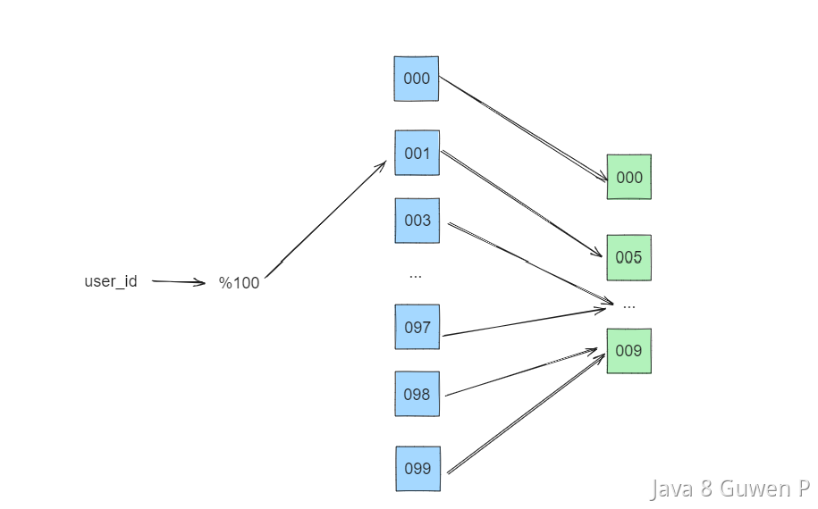

# ✅分库分表的取模算法策略如何避免数据倾斜

# 典型回答

[✅什么是数据倾斜，会带来哪些问题？如何解决？](https://www.yuque.com/hollis666/dr9x5m/fue0vmwupk5zps37?view=doc_embed)

在上文中，我们介绍了什么是数据倾斜， 以及发生后如何解决。

分库分表时使用取模算法是一种常见的数据分片策略，它通过对某个字段的值进行取模运算来决定数据存储的目标库或表。然而，如果数据分布不均匀，简单的取模算法可能会导致某些数据库或表的负载明显高于其他，即数据倾斜问题。

但是，我们是不是可以在前期就想办法避免数据倾斜的问题呢？也是有办法的，可以采取以下几种策略：

### 选择合适分片键

选择合适的分片（分表）键是避免数据倾斜的关键。分片键应该是高度散列的，并且在业务操作中经常被用作查询条件。

例如，用户ID通常是一个好的分片键，因为它通常能保证数据分布的均匀性。但是当做分表的时候，买家ID肯定比卖家ID分片会出现倾斜的概率要低得多。毕竟一个买家的订单肯定不会有卖家的订单多。

### 复合分片

复合分片策略结合了多个分片键和/或多种分片方法。例如，可以先基于第一个分片键进行粗略分片，然后在每个粗略分片内部再根据第二个分片键进行细分。这种方法可以进一步细化数据分布，减少倾斜的风险。

例如说，对于支付单的表，按照付款方分片之后，发现有的付款方式企业账号，他的数据量很大，就会出现数据倾斜。

那么就可以针对付款方类型是企业的，再把"付款方ID+下单日期"组合在一起做一次分片。当然，这也会带来一个问题，就是下次查询的时候需要带上下单日期才行。但是我们前面的几篇分库分表的文章中讲过，我们可以通过基因法把分表结果组装到支付单号中，后续查询基于支付单号。

### 虚拟分片

虚拟分片意味着实际的物理分片数量远少于虚拟分片的数量。首先，基于一个较大的取模基数进行分片，将数据均匀分布到多个虚拟分片中，然后再将这些虚拟分片映射到实际的物理分片上。这种方法可以在一定程度上缓解数据倾斜的问题，因为即使某些键值分布不均，通过虚拟分片和映射也能实现较均匀的数据分布。

假设有100个虚拟分片，但实际只有10个物理分片。那么就是每个物理分片包含10个虚拟分片。

当一个数据项需要被存储时，我们首先根据某个键（比如用户ID）对100取模，决定将这个数据项放到哪个虚拟分片中。然后，这个虚拟分片会根据预先定义的映射关系被映射到一个物理分片上。这样，即使某些用户ID段的数据特别多，通过虚拟分片和映射也能较均匀地分布到所有的物理分片上。

### 

### 

> 原文: <https://www.yuque.com/hollis666/dr9x5m/arrlqs56tmxywy2h>