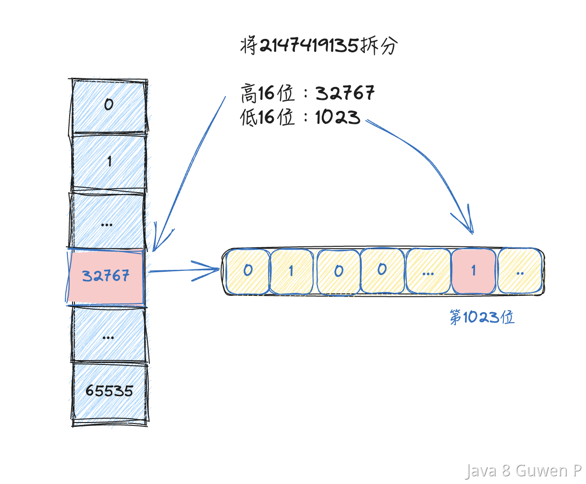

# ✅在100M内存下存储一亿个整数，其范围在１到2亿，如何快速判断给定到一个整数值是否存在？

# 典型回答

这是一个比较典型的海量数据处理的问题，在优先内存情况下进行数据排序、判断是否存在等。

主要考察面试者对大数据量计算的经验和思考方式。同时也考察面试者是否有对一些数据库、数据处理中间件原理有过深入的了解。

一般来说有以下几个方案：

### 方案一（内存不够）

使用Java的list、hashSet提供的方法：`list.contains()` 、`set.contains()`

时间复杂度分析：

1. list的contains方法底层是通过遍历整个list，挨个元素进行比对，找出期望值，其时间复杂度为O(n)
2. hashSet底层本质是个hashMap，在进行add时，将值存入hashMap的key中，contains时对值进行hash后查找，其时间复杂度为O(1)

内存空间占用分析：

1. 整数范围在Integer.MAX_VALUE之内，占4个字节
2. list和set都要存储所有元素
3. list的空间计算：100,000,000（整数数量） × 4（字节 / 整数） = 400,000,000（字节）

> 需要注意的是，这只是粗略的估计。实际的内存占用可能会受到 Java 虚拟机的优化和内存管理策略的影响。此外，还要考虑 List 对象本身的内存开销，以及其他可能的因素（如对象引用、空间对齐等）对内存占用的影响。因此，实际内存占用可能会略高于这个估算值。

hashSet的空间计算：100,000,000（整数数量） × 8（字节 / 整数） = 800,000,000（字节）

由于 hashSet 使用了hashMap数据结构，还需要考虑额外的内存开销用于存储散列桶、链表或红黑树等信息。这个开销通常是每个元素 3~4 倍左右，取决于具体实现和负载因子等因素。 假设每个元素的额外开销为 2 倍，那么每个整数占用的内存空间为：4 字节 × 2 = 8 字节。

显然时间复杂度只有hashSet能胜任，对于内存空间早已超出给定的100M限制。

### 方案2（可行）

**使用bitmap算法降低内存空间，且时间复杂度为O(1)**

[✅什么是BitMap？有什么用？](https://www.yuque.com/hollis666/dr9x5m/ntqpq5vzps1bs55z?view=doc_embed)

`java.util.BitSet`是java中bitmap算法的实现，可以初始化一个2亿的BitSet，并把1到2亿通过`bitSet.set()`方法设置进去，并通过`bitSet.get()`方法判断期望值是否存在。

内存空间占用分析：2,0000,0000（位） ÷ 8（位 / 字节） ÷ 1024（字节 / KB） ÷ 1024（KB/MB） ≈ 23.84 MB

显然bitmap在时间复杂度和空间占用上都完全满足需求。

## 扩展知识

上述方案2中，存在一个问题：我们要初始化2个亿的bit数组去承载1个亿的数据需求，有点高射炮打蚊子的感觉。
工作中我们并不能百分之百确定一个长期运营的产品用户产生的数据量有多大，同时业务需求也不会只是在海量数据里找出一个值那么简单。通常会有如下几个场景：

1. 用户画像系统：用户行为数据、基础数据等信息散落在不同数据库中（ES、MySQL、Doris等）。去不同数据库中查数据，然后通过long类型的uid灌入bitMap，求交集、并集、差集，找出满足复杂查询条件的用户。
2. 推荐系统中，精准记录某个用户是否已读。为每个用户分配一个bitMap，将已读的文章id放入bitMap中，已读过不再进行推荐。

上面的3个业务场景中，**在使用bitMap除了要初始化一个较大的数组外，还存在一个致命的硬伤：由于id为稀疏整数，会浪费内存空间，效率非常低。**

> 稀疏整数，即向bitMap的数组中存放不连续的整数，如：1，50001，20，910321。如果这四个数字使用bitMap存储，我们要初始化至少910321个bit数组元素，只有这四个位为1，其他位为0，空间被白白浪费。

解决这种问题的一个很好的思路是，尝试对数据集中的整数进行压缩，比如将32位整数拆分成高16位和低16位，将高16位相同的数字放在一起（一个container），低16位形成一个bitmap（本质上也是个bit数组可称作bucket）。

可以简单理解成一个hashmap下挂了bitmap，这样对32位整形进一步压缩。对于稀疏的数据集，大幅度降低内存占用。	

这样的基本思路已经有了现成的实现，即`RoaringBitmap`，其开源实现不止局限于java，也有C++、go等多种语言。官网地址：https://roaringbitmap.org。

**他主要有以下优点：**

1. 支持32位和64位数据集的聚合运算
2. 位运算速度非常快，基本都是O(1)时间复杂度，且内部实现大多使用数组，对CPU L1缓存非常友好
3. 便捷的使用方式，与`java.lang.BitSet`接口相同，简单明了，同时功能比`BitSet`多
4. 具有强大的社区，ElasticSearch、kylin、Hive、InfluxDB都用了这套算法，开源社区也很活跃
5. 提供多种container，针对运行时的数据量级、稀疏程度自动平衡转换

**当然，他也有缺点：**

每个container算法实现不同，如果想深入钻进去看源码或官方的论文，还是比较难理解的。

> 原文: <https://www.yuque.com/hollis666/dr9x5m/oko78h59yxecv82b>