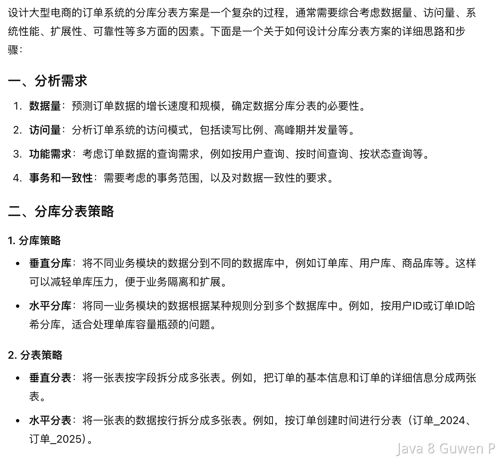
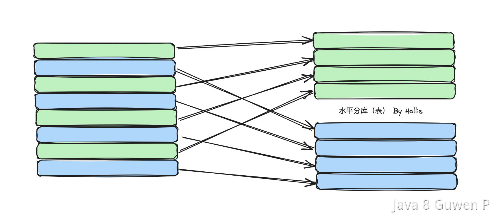
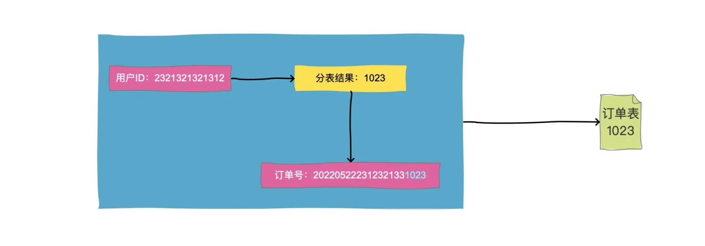

# ✅大型电商的订单系统，如何设计分库分表方案？

# 典型回答

这是一个关于分库分表的场景题，其实涉及到的知识点在我们的分库分表的模块中都能知道，按照这个问题的解题思路，分析下该如何回答。

订单系统的分库分表，主要考虑的就是分表数量、分表字段、分表算法这几个方面，至于其他的什么分布式 ID、跨表查询这些可以先不用提，面试官问到了再进一步回答就好了。

> 题外话，最近不是也有很多其他在卖八股文么，然后好几个人跟我反馈过说在别人那里看到的就像是 GPT 生成的，于是我再写这个问题之前，我好奇的去问一下 GPT，看看他给出的答案是啥样的：
> 
> 嗯，讲的有道理，但是都是一堆没用的废话。如果你这么给面试官说，那只能让你回去等通知了。

言归正传。我们接下来按照以下流程介绍这个问题的关键点。

### 分库还是分表

在让你设计分库分表的时候，一定要知道，**分库、分表、分库分表他是三件事**儿，不是一件事儿。所以首先你要说的就是我们需要考虑是否需要分库、是否需要分表。

如果说做这个方案的目的是为了解决单表数据量太大，查询效率慢的问题，那分表就够了，把这些数据分散到不同的表中，让每一张单表的数据量变小，那就可以了。

如果说，做这个方案的目的，是为了解决并发量太高，数据库连接数不够、数据库的资源性能（内存、CPU、磁盘）不够的问题，那就需要做分库，用更多的数据库实例来抗更高的并发。

所以说，**分表解决的是大数据量的问题，分库解决的是高并发的问题**。但一般来说，高并发往往伴随着大数据量，所以很多时候分库分表是一起做的。但是也不绝对。有些系统就是并发不高，但是年头很多了，数据量很大。

### 分表方式

确定了分库还是分表、还是直接做分库分表之后，就需要考虑分库、分表的方式、一般来说就两种，**垂直分和水平分**。

[✅什么是分库？分表？分库分表？](https://www.yuque.com/hollis666/dr9x5m/wpus0g?view=doc_embed&inner=XqsDb)

所谓**垂直分库**，就是把不同的业务的库拆分开，比如一个电商库，拆分成订单库、库存库、商品库。但是因为我们这个问题的前提已经限定了订单系统，所以不太涉及到垂直分库。

**垂直分表**，就是把一张大表，比如有100个字段，拆分成多张表，比如2张表，每张表各50个字段。这种在订单中是可行的，比如拆分成订单的主表以及扩展表，把一些订单的扩展信息单独拆分出去也是可以的。减少表中的字段数，也能降低存储量，提升查询效率。

**水平分库（分表）**，就是把一个库（表）中包含所有数据，水平的分散到不同的库（表）中，比如原来单库（表）中有1000万数据，那么我们分成5分，每一份库（表）中就只有200万数据了。

一般来说，**在订单系统中，垂直分表、水平分库、水平分表都是会做的。**

### 分表数量

然后就是要考虑一下分表数量了，一个表，拆分成多个表，拆多少张合适呢？

这个一般是结合订单存量数据，以及增量数据的情况来看要分多少张表。我给一个公式（如有雷同，纯属抄袭）：

`分表数量=  (订单存量总数 + 预计年增长量 * 保留年限)/2000万  => 向上取最接近的2的幂`

假设存量数据已经有2000万了，预计每年增长500万，我们需要保留10年，那么就得出：

(2000 + 500 * 10) / 2000 = 3.5  => 4

所以，在做分库分表的时候，可以根据这个公式，大致计算一下需要分多少张表，然后再根据并发的情况，大致算一下需要分多少个库，库的数量和表的数量之间没有必然联系，但是需要有倍数关系，如果你实在是不太好根据并发去预估库的数量，那么我给你个经验值的公式（如有雷同，纯属抄袭）：

`分库数量 = 分表数量 / 8`

比如我们常用的分库分表数量：

128库，1024张表
64库，512张表
16库，128张表
8库，64张表

当然，如果你分表数量本身是小于8的，那要么是2，要么是4，那么我建议你就直接`分库数量=分表数量`即可。

### 分表字段

接下来就是分库分表中最重要的分表字段了。

我建议有两种方案：按照时间分、按照买家 ID 分。

[✅分表字段如何选择？](https://www.yuque.com/hollis666/dr9x5m/mec4ust5rpfob78r?view=doc_embed)

#### 按照时间分表

订单的分库分表中，比较常见的就是按照订单时间去分表，或者按照确认收货时间去分表，总之就是按照时间字段来分。这个时间可以是固定时间，也可以是相对时间。比如说我可以按照年份，2022年、2023年、2024年每年一张分表，这就是固定时间分表。你也可以分成 2年前的订单、6个月前的订单、最近6个月内的订单 这样的方式去分表。

后面这种方式其实也是一种冷热数据分离的方案，因为一般6个月以前的订单，修改是肯定不会了，最多会有一些低频的查询而已。

按照时间分表最大的好处就是简单，逻辑是固定的。按照时间的查询比较快。方便做数据归档以及备份。

但是缺点就是如果查询条件没有带时间，就需要跨表扫描，因为你不知道具体在哪张表，所以就需要逐一去查询。而且最近的订单会查询和修改比较频繁，所以也会存在热点问题。还有就是如果某个月比如双十一这个月，订单量很大，会导致严重的数据倾斜。

所以，一般在订单系统中，按照时间分表会做的，但是也都是把他用来做历史表或者做数据归档。但是分表这里还是要配合使用业务单号来分。

#### 按照买家 ID 分表

在电商系统中，一个订单最重要的三个字段，买家 id，卖家 id 以及订单号。

我们**选择买家 id的主要原因是避免数据倾斜**，因为如果按照卖家 id 分表的话，会有很多大卖家的数据量很大，那么他的数据还是会落到单表中，导致这个单表数据量大，查询速度还是很慢。

所以，为了避免卖家分表数据量倾斜的问题，电商系统基本都是按照买家 id 进行分表的。

但是方案如果要这么简单那就不需要我来讲了，其实这里面按照买家 id 分表之后，还有两个问题要解决：

1、卖家查询自己的订单怎么办
2、按照订单号查询怎么办

因为你按照买家 id 分表了，那么如果查询中没有买家 id，那么就不知道去哪张表查询了，就会需要扫全表，这效率就很低了。尤其是上面两个常见的查询场景。

那么怎么办呢？

首先第一个方案就是**同步一张卖家表**。

比如说我的所有的业务逻辑的操作都是操作按照买家 Id 分表的这个库（也可能是多库），然后同时，为了解决卖家查询的问题，我基于 binlog 监听买家库的变更，同时把数据同步到另外一个库（也可能是多库），这个库的分表逻辑是按照卖家 id 进行的，同步的过程中就会基于卖家 id 再重新计算一次分到哪张表中。

这样，当卖家查询自己的订单的时候，我就可以直接去卖家库查询就可以了。因为卖家的查询一定是有卖家 id 这个分表字段的，则不需要全表扫，直接就可以根据分表算法算出去哪张表查询。

> 如果有大卖家，还是会数据倾斜怎么办？
> 
> 通常来说，卖家库即使倾斜影响不大，他只用于一些非高频的查询而已。
> 好一点的话就是可以在卖家分表算法中做特殊处理，针对热点卖家再做拆分。

这里面需要注意的是，卖家库只用于数据同步，不做任何的更新操作。所有的订单的修改，都基于买家库。即使是卖家的操作也一样，因为操作的时候一定是知道订单号的。那么就带着订单号去操作就行了。那么订单号是如何实现分表的呢？

订单号的分表逻辑一般都是采用**基因法**来实现，所谓基因法就是我们在生成订单号的时候，就把分表结果给他编码到订单号中。如下图

我们只需要把分表结果放到订单号的固定位置上，这样按照订单号查询的时候，解析出这段数字，直接去对应分表查询就好了。

在大型的电商系统中，买家 ID分表，同步卖家表，基因法生成订单号，再加上历史订单数据归档，是比较常见的组合拳。

### 分表算法

分表算法放到了最后，但其实往往它是非常简单的。

[✅分表算法都有哪些？](https://www.yuque.com/hollis666/dr9x5m/anpg4kfcb8p7egag?view=doc_embed)

因为分表算法不需要太精密，太复杂，只需要能实现均分分配就行了。你弄得太复杂的算法，反而算不明白，我拿到一个买家 id，我肉眼算不出来，这不是很麻烦么。

所以一般就是取模算法。针对买家 id 进行取模，对谁取模呢，对分表数量。

如买家 id 是12345，分4张表，则分表结果是 `12345 % 4 `

如果买家 id 不是数字，而是字符串，那就先哈希，再取模即可。

还有人说用一致性hash，这种也有，但是我只能说用的比较少，虽然他能降低数据迁移的的成本，但是，一般分库分表都会考虑一步到位，尽可能多分，然后通过数据归档来处理。

> 原文: <https://www.yuque.com/hollis666/dr9x5m/rqes81qfla7nyuxb>