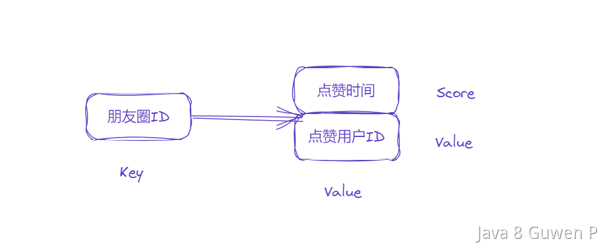

# ✅如何用Redis实现朋友圈点赞功能？


# 典型回答

首先我们需要分析下朋友圈点赞需要有哪些功能，首先记录某个朋友圈的点赞数量，并且支持点赞数数量的查看，支持点赞和取消点赞操作。并且支持查看哪些人点过赞，并且点赞的顺序是可以看得到的。



那么，基于以上信息，我们可以这样实现：

在数据结构上，我们可以采用ZSet来实现，KEY就是这个具体的朋友圈的ID，ZSET的value表示点赞用户的ID，score表示点赞时间的时间戳。这样可以方便地按照时间顺序查询点赞信息，并支持对点赞进行去重，

1. 使用字符串存储每篇朋友圈的ID，作为有序集合的KEY。
2. 使用zset存储每篇朋友圈的点赞用户信息，其中value为点赞用户的ID，score为点赞时间的时间戳。
3. 点赞操作：将用户的ID添加到zset中，score为当前时间戳。如果用户已经点过赞，则更新其点赞时间戳。
4. 取消点赞操作：将用户的ID从有序集合中删除。
5. 查询点赞信息：使用有序集合的ZREVRANGEBYSCORE命令，按照score（即时间戳）逆序返回zset的value，即为点赞用户的ID。

以下是代码实现：

```
import redis.clients.jedis.Jedis;
import redis.clients.jedis.Transaction;
import redis.clients.jedis.ZParams;
/**
* @author Hollis
**/
public class RedisLikeDemo {
    private static final String LIKE_PREFIX = "like:";
    private static final String USER_PREFIX = "user:";

  	//点赞
    public static void likePost(String postId, String userId, Jedis jedis) {
        String key = LIKE_PREFIX + postId;
        Long now = System.currentTimeMillis();
        jedis.zadd(key, now.doubleValue(), userId);// 将用户ID及当前时间戳加入有序集合
    }

  	//取消点赞
    public static void unlikePost(String postId, String userId, Jedis jedis) {
        String key = LIKE_PREFIX + postId;
        jedis.zrem(key, userId);// 将用户ID从有序集合中移除
    }

  	//查看点赞列表
    public List<String> getLikes(String postId, Jedis jedis) {
        String key = LIKE_PREFIX + postId;
        ZParams zParams = new ZParams().desc();
        return jedis.zrangeByScoreWithScores(key, "+inf", "-inf", 0, -1, zParams)
                .stream()
                .map(tuple -> {
                    String userId = tuple.getElement();
                    return userId;
                }).collect(Collectors.toList());
    }
}

```

在上述代码中，likePost方法用于点赞，unlikePost方法用于取消点赞，getLikes方法用于查询点赞信息。


> 原文: <https://www.yuque.com/hollis666/dr9x5m/ncskb5a7o5a1nw32>