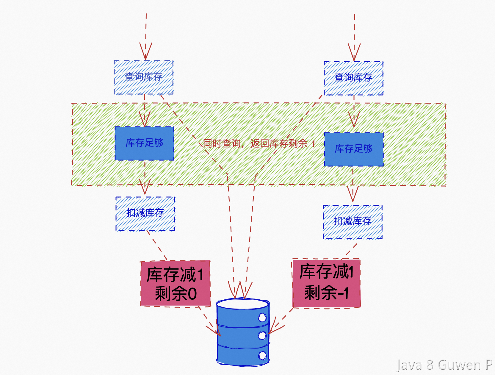

# ✅库存扣减如何避免超卖和少卖？


# 典型回答

所谓"超卖"指的就是商品卖多了，一般我们在商品扣减库存的时候，都会先判断库存够不够，如果够在进行扣减，不够则直接返回下单失败。

但是，如果在高并发场景中，可能存在以下情况：



当有两个并发线程，同时查询库存，这时数据库中库存剩余1，所以两个线程都得到1的库存，然后经过库存校验之后分别开始进行库存扣减，最终导致库存被扣减成负数。

以上，就是一个典型的高并发情况下的超卖问题。

之所以会发生以上问题，主要是因为并发导致的，所以，解决超卖的问题本质上是解决并发问题。以上问题，**最终就是要实现库存扣减过程中的原子性和有序性。**

**原子性**：库存查询、库存判断以及库存扣减动作，作为一个原子操作，过程中不会被打断，也不会有其他线程执行。
**有序性**：多个并发操作需要排队执行。


## 数据库扣减

数据库中进行库存扣减是最容易想到的方案，这个方案实现起来非常简单。

在扣减过程中，想要保证原子性和有序性，我们可以采用加锁的方式，无论是悲观锁、还是乐观锁都可以实现的。

但是，如果使用悲观锁来实现的话，就会导致很多请求被迫阻塞并且排队，那么如果并发请求量很大的话，就可能直接把数据库给拖垮了。

如果是乐观锁的话，可以用版本号的方式来控制有序执行，但是这个问题在于高并发场景中会存在大量的失败，而且高并发场景中也不适合使用乐观锁，因为乐观锁在update的过程中也是需要加行级锁的，也是会出现阻塞的情况。

那么，在库存扣减时，如果不加锁可以吗？

其实是可以的，我们就借助数据库自己执行引擎的顺序执行机制，只要保证库存不要扣减成负数就行了，那么可行的方案是通过SQL语句就能控制，如：

```
update inventory 
set quantity = quantity - #{count} 
where sku_id='123' and quantity >= #{count} 
```

也就是说，如果上述SQL可以执行成功的话，是可以确保库存余量大于等于0的，这就避免了超卖的发生。

但是这个方案好吗？其实是不好的。

因为这个方案本质上和乐观锁的方案缺点是一样的，都是完全依赖数据库，并且高并发情况下，多个线程同时update inventory 的时候会发生阻塞，不仅会很慢，还会把数据库拖垮的。详见：

[✅数据库CPU被打满排查过程](https://www.yuque.com/hollis666/dr9x5m/yhfy70xlf7kegk0s?view=doc_embed)

正常来说，MySQL的热点行更新最多也就抗200-300的并发更新，如果想要抗的更多，要么就是提升硬件水平，要么就是做一些技术改造，比如inventory hint的方式。

[✅MySQL怎么做热点数据高效更新？](https://www.yuque.com/hollis666/dr9x5m/rfqcbz190k9egley?view=doc_embed)

[✅高并发的库存系统，在数据库扣减库存，怎么实现？](https://www.yuque.com/hollis666/dr9x5m/ns5mki19bc5xyg61?view=doc_embed)

那么，不用数据库扣减的话，可以用什么呢？答案是可以借助缓存的扣减。


## Redis扣减

我们可以基于Redis做库存扣减的，借助Redis的单线程执行的特性，再加上Lua脚本执行过程中的原子性保障，我们可以在Redis中通过Lua脚本进行库存扣减。

在Redis中，使用以下Lua脚本：

```
local key = KEYS[1] -- 商品的键名
local amount = tonumber(ARGV[1]) -- 扣减的数量

-- 获取商品当前的库存量
local stock = tonumber(redis.call('get', key))

-- 如果库存足够，则减少库存并返回新的库存量
if stock >= amount then
    redis.call('decrby', key, amount)
    return redis.call('get', key)
else
    return "INSUFFICIENT STOCK"
end

```

先从Redis中取出当前的剩余库存，然后判断是否足够扣减，如果足够的话，就进行扣减，否则就返回库存不足。

因为lua脚本在执行过程中，可以避免被打断，并且redis执行的过程也是单线程的，所以在脚本中进行判断，再扣减，这个过程是可以避免并发的。所以也就可以实现前面我们说的原子性+有序性了。

并且Redis是一个高性能的分布式缓存，使用Lua脚本扣减库存的方案也非常的高效。


# 扩展知识


## 一致性保证

上面我们提到了两个方案，一个是通过数据库进行库存扣减，一个是通过redis实现扣减，一般，在实际应用过程中，这两种方案会结合使用。

也就是说先在Redis中做扣减，利用Redis来抗高并发流量，然后再同步到数据库中，在数据库中做扣减并进行持久化存储，避免Redis挂了导致数据丢失。

一般的做法是，先在Redis中做扣减，然后发送一个MQ消息，消费者在接到消息之后做数据库中库存的真正扣减及业务逻辑操作。


这样做，我们可以保证Redis中的数据和数据库中的数据的一个最终一致性。并且也能避免超卖的发生。

但是，这个方案有个问题，就是可能导致少卖

## 少卖

假设，上面的流程中，第1步执行成功了，Redis中库存成功扣减了，但是后续第2步的消息没有发出去，或者后面的消费过程中消息丢了或者失败了等情况。

就会导致Redis中的库存被扣减了，但是数据库库存没扣减，业务的实际操作没发生。这时候的结果就是Redis中发生了多扣，那么带来的业务问题就是少卖。

那么，想要解决这类问题呢，就需要引入一些对账的机制，做一些准实时的核对，针对这类情况及时发现，如果少卖很多的话，那么就需要再把这些库存加回去。（比如用zset在redis中添加流水记录，然后定时拉一段时间内的所有记录，和数据库比对，发现不一致，则进行补偿处理）

一般在很多成熟的电商公司中，不管前面的方案做的多么完善，这个核对系统都是必不可少的。及时的核对出超卖、少卖等问题。


## 为什么不用分布式锁

[✅为什么不用分布式锁来实现秒杀？](https://www.yuque.com/hollis666/dr9x5m/arab9x0v5n8mfm9y?view=doc_embed)


> 原文: <https://www.yuque.com/hollis666/dr9x5m/qpnna44eczny06z7>