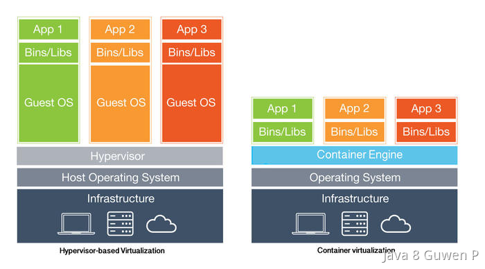
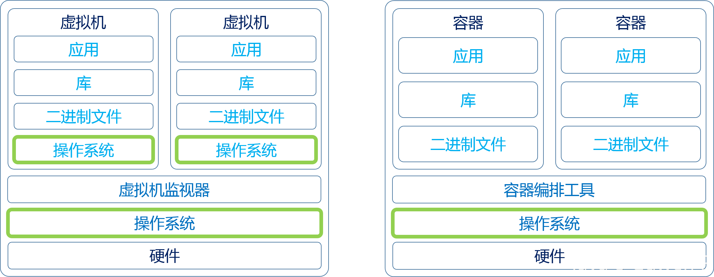

# ✅容器和虚拟机的区别是什么？

# 典型回答
容器和虚拟机是现代 IT 环境中两种常见的虚拟化技术。虚拟机是基于硬体的多个客户操作系统，由虚拟机监视器实现。 容器是应用程序级构造，并模拟共享单个内核的多个虚拟环境。

### 技术架构
每个虚拟机运行在完全虚拟化的硬件上，拥有自己的操作系统。虚拟机由一个物理服务器上的超级管理员（Hypervisor）管理，例如 VMware ESXi、Microsoft Hyper-V。**虚拟机包含操作系统的完整副本，包括内核及所有驱动和应用，因此占用更多的磁盘空间和内存。**

**容器在操作系统层面进行虚拟化，共享宿主机的操作系统内核**。容器由容器引擎（如 Docker）管理，所有容器可以运行在单一的操作系统实例上。容器更为轻量，仅包含运行应用所需的库和依赖，不需要完整的操作系统。

### 启动速度
由于需要完整的操作系统启动，**虚拟机通常启动时间较长。**虚拟机的运行效率相对较低，因为它们需要额外的资源来模拟整个硬件环境及运行完整的操作系统。

**容器启动几乎是即时的，通常在几秒钟内。**容器直接运行在宿主机的操作系统上，不需要额外的操作系统启动，因此性能更高，资源利用率更好。

### 隔离性

**虚拟机提供了高度的隔离性，因为每个虚拟机完全独立于其他虚拟机。**由于完全隔离，虚拟机提供了较高的安全性，适合运行安全级别较高的应用。

**容器之间的隔离性较低，因为它们共享宿主机的操作系统。**虽然现代容器技术（如 Docker 和 Kubernetes）提供了改进的安全功能，但相对于虚拟机，容器的安全性和隔离性较低。

### 管理&维护
虚拟机需要独立的维护和管理，包括操作系统和应用的更新。

容器可以通过容器编排工具（如 Kubernetes）进行集中管理，易于自动化和扩展。容器的无状态性使得更新和维护更简单，可以快速部署和回滚应用。

在维护方面，在更新或修补操作系统时，必须逐个更新传统计算机：必须单独修补每个客户操作系统。而对于容器，只需更新容器主机的操作系统即可。

> 原文: <https://www.yuque.com/hollis666/dr9x5m/sktt6r1oq9raewiu>