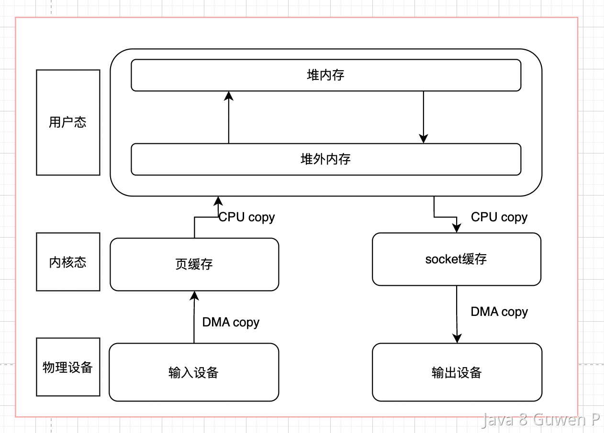
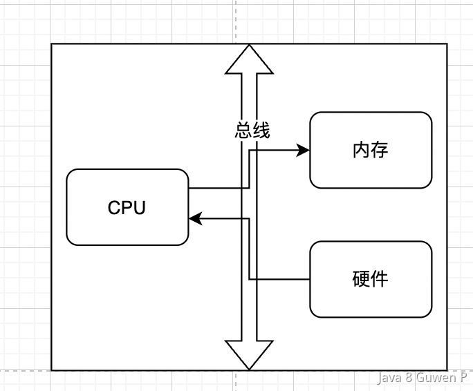
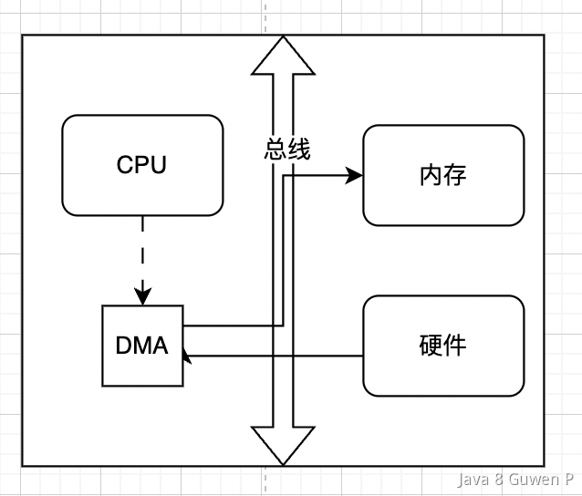
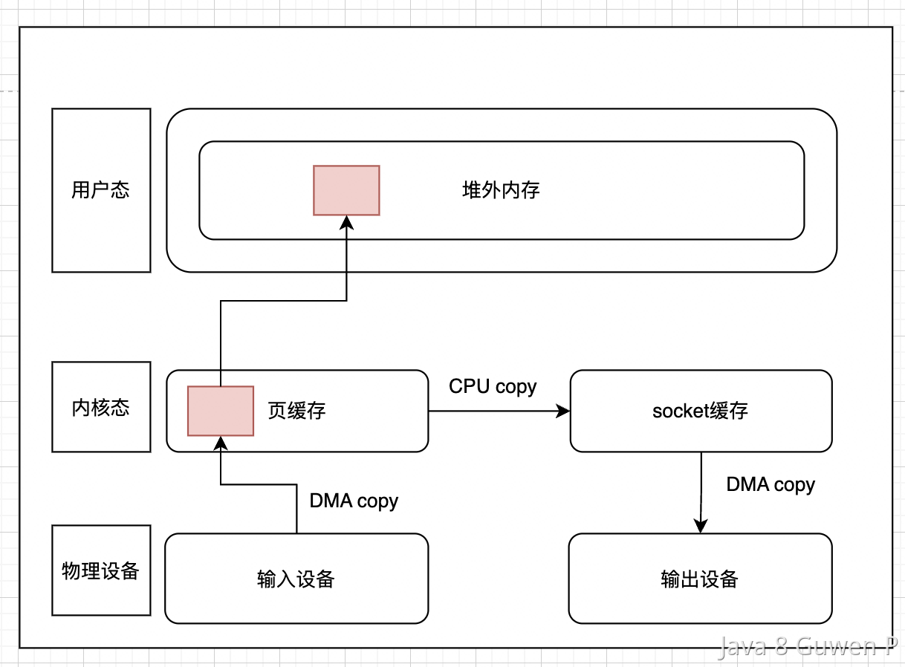
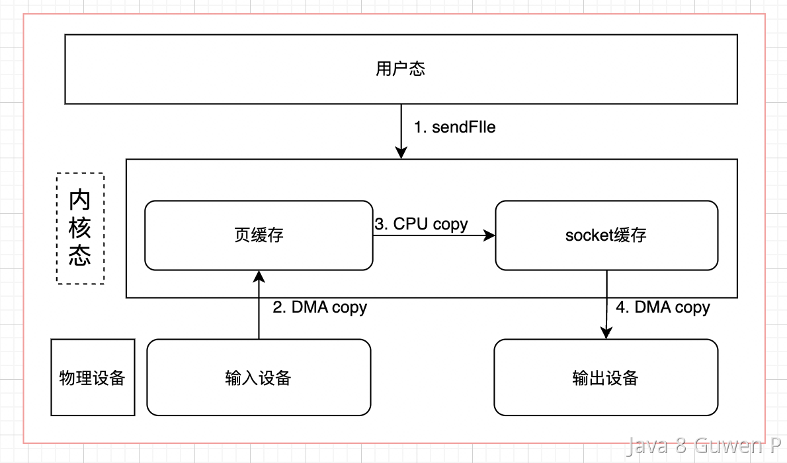
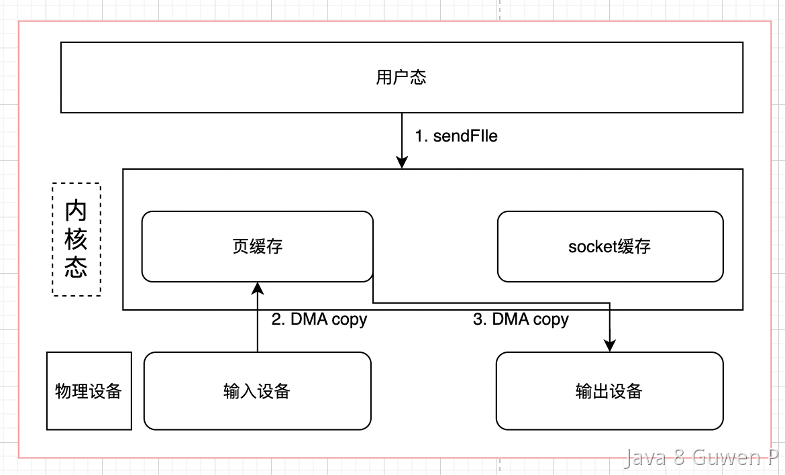

# ✅什么是零拷贝？


# 典型回答
要想理解零拷贝，首先要了解操作系统的IO流程，因为有内核态和用户态的区别，为了保证安全性和缓存，普通的读写流程如下：
（对于Java程序，还会多了一个堆外内存和堆内存之间的copy）

整体的流程如下所示：

1. 用户read发起系统调用，由用户态进入内核态，通过DMA技术**将磁盘中的数据copy到内核缓冲区中**
2. 当DMA完成工作后，会发起一个中断通知CPU数据拷贝完成，然后CPU再**将内核态中的数据copy到用户态中**
3. 内核唤醒对应线程，同时将用户态的数据返回给该线程空间
4. 用户态线程进行业务处理
5. 当服务器对请求进行响应的时候，会发起系统调用，由内核**将用户态的数据copy到内核态中**
6. 复制完毕后，再有网络适配器通过DMA技术**将内核态缓冲区中的数据copy到网卡中**，完成后，内核态会返回到用户态
7. 最后由网卡将数据发送出去

在这个过程中，如果不考虑用户态的内存拷贝和物理设备到驱动的数据拷贝，我们会发现，这其中会涉及4次数据拷贝。同时也会涉及到4次进程上下文的切换。**所谓的零拷贝，作用就是通过各种方式，在特殊情况下，减少数据拷贝的次数/减少CPU参与数据拷贝的次数。**
常见的零拷贝方式有mmap，sendfile，dma，directI/O等。

# 扩展知识

## DMA
正常的IO流程中，不管是物理设备之间的数据拷贝，如磁盘到内存，还是内存之间的数据拷贝，如用户态到内核态，都是需要CPU参与的，如下所示

如果是比较大的文件，这样无意义的copy显然会极大的浪费CPU的效率，所以就诞生了DMA
DMA的全称是Direct  Memory Access，顾名思义，DMA的作用就是直接将IO设备的数据拷贝到内核缓冲区中。使用DMA的好处就是IO设备到内核之间的数据拷贝不需要CPU的参与，CPU只需要给DMA发送copy指令即可，提高了处理器的利用效率，如下所示：


## mmap
上文我们说到，正常的read+write，都会经历至少四次数据拷贝的，其中就包括内核态到用户态的拷贝，它的作用是为了安全和缓存。如果我们能保证安全性，是否就让用户态和内核态共享一个缓冲区呢？这就是mmap的作用。

mmap，全称是memory map，翻译过来就是内存映射，顾名思义，就是将内核态和用户态的内存映射到一起，避免来回拷贝，实现这样的映射关系后，进程就可以采用指针的方式读写操作这一段内存，而系统会自动回写脏页面到对应的文件磁盘上，即完成了对文件的操作而不必再调用 read、write 等系统调用函数。相反，内核空间对这段区域的修改也直接反映用户空间，从而可以实现不同进程间的文件共享。其函数签名如下：
```basic
void *mmap(void *addr, size_t length, int prot, int flags, int fd, off_t offset);
```
一般来讲，mmap会代替read方法，模型如下图所示：

如果这个时候系统进行IO的话，采用mmap + write的方式，内存拷贝的次数会变为3次，上下文切换则依旧是4次。

需要注意的是，mmap采用基于缺页异常的懒加载模式。通过 mmap 申请 1000G 内存可能仅仅占用了 100MB 的虚拟内存空间，甚至没有分配实际的物理内存空间，只有当真正访问的时候，才会通过缺页中断的方式分配内存
**但是mmap不是银弹**，有如下原因：

1. mmap 使用时必须实现指定好内存映射的大小，因此 mmap 并不适合变长文件；
2. 因为mmap在文件更新后会通过OS自动将脏页回写到disk中，所以在随机写很多的情况下，mmap 方式在效率上不一定会比带缓冲区的一般写快；
3. 因为mmap必须要在内存中找到一块连续的地址块，如果在 32-bits 的操作系统上，虚拟内存总大小也就 2GB左右（32位系统的地址空间最大为4G，除去1G系统，用户能使用的内存最多为3G左右（windows内核较大，一般用户只剩下2G可用）。），此时就很难对 4GB 大小的文件完全进行 mmap，所以对于超大文件来讲，mmap并不适合

## sendfile
如果只是传输数据，并不对数据作任何处理，譬如将服务器存储的静态文件，如html，js发送到客户端用于浏览器渲染，在这种场景下，如果依然进行这么多数据拷贝和上下文切换，简直就是丧心病狂有木有！所以我们就可以通过sendfile的方式，只做文件传输，而不通过用户态进行干预：

此时我们发现，数据拷贝变成了3次，上下文切换减少到了2次。
虽然这个时候已经优化了不少，但是我们还有一个问题，为什么内核要拷贝两次（page cache -> socket cache），能不能省略这个步骤？当然可以

### sendfile + DMA Scatter/Gather
DMA gather是LInux2.4新引入的功能，它可以读page cache中的数据描述信息（内存地址和偏移量）记录到socket cache中，由 DMA 根据这些将数据从读缓冲区拷贝到网卡，相比之前版本减少了一次CPU拷贝的过程，如下图所示：


## direct I/O
之前的mmap可以让用户态和内核态共用一个内存空间来减少拷贝，其实还有一个方式，就是硬件数据不经过内核态的空间，直接到用户态的内存中，这种方式就是Direct I/O。换句话说，Direct I/O不会经过内核态，而是用户态和设备的直接交互，用户态的写入就是直接写入到磁盘，不会再经过操作系统刷盘处理。
这样确实拷贝次数减少，读取速度会变快，但是因为操作系统不再负责缓存之类的管理，这就必须交由应用程序自己去做，譬如MySql就是自己通过Direct I/O完成的，同时MySql也有一套自己的缓存系统
同时，虽然direct I/O可以直接将文件写入磁盘中，但是文件相关的元信息还是要通过fsync缓存到内核空间中


> 原文: <https://www.yuque.com/hollis666/dr9x5m/edxez2ggicn8thzq>