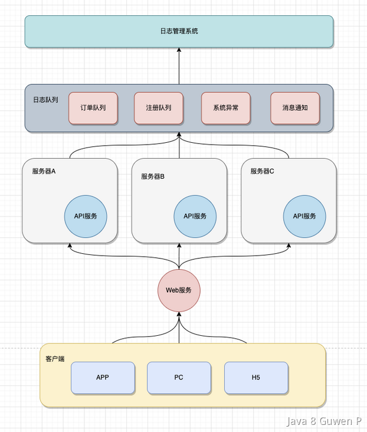
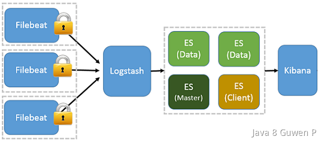

# ✅什么是分布式日志系统？

# 典型回答

现在，很多应用都是集群部署的，一次请求会因为负载均衡而被路由到不同的服务器上面，这就导致一个应用的日志会分散在不同的服务器上面。

当我们要向通过日志做数据分析，问题排查的时候，就需要分别到每台机器上去查看日志，这样就太麻烦了。

于是就有了分布式日志系统，他可以做分布式系统中的日志的统一收集、存储及管理。并且提供好的可用性、扩展性。

一个好的分布式日志系统，应该具备数据采集、数据加工、查询分析、监控报警、日志审计等功能。有了分布式日志系统，我们就可以做集中化的日志管理，（准）实时性的做日志查询及分析，快速的做问题排查，更好的做数据分析及挖掘。

比较主流的这类日志管理系统有ELK、Graylog、Apache Flume，还有很多类似的云产品，如阿里云的SLS。

一般来说，**如果资金够就上SLS，不够就自建ELK。**

# 扩展知识

## ELK

ELK是三个开源软件的缩写，分别表示：Elasticsearch , Logstash, Kibana。

Elasticsearch是个开源分布式搜索引擎，提供分析、存储数据等功能。

Logstash主要是用来日志的搜集、分析、过滤日志的工具，支持大量的数据获取方式。

Kibana也是一个开源和免费的工具，Kibana可以为 Logstash 和 ElasticSearch 提供的日志分析友好的 Web 界面，可以帮助汇总、分析和搜索重要数据日志。

所以，**通常是使用Logstash做日志的采集与过滤，ES做分析和查询，Kibana做图形化界面。**

> 原文: <https://www.yuque.com/hollis666/dr9x5m/uagpapwr3ags4m84>