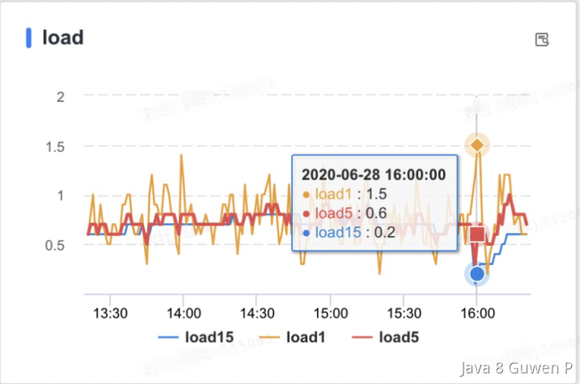

# ✅Load飙高问题排查过程

[✅什么是Load（负载）？](https://www.yuque.com/hollis666/dr9x5m/zmhkxcfgxc5ggz96?view=doc_embed)

### 问题发现

我们有一个应用，平常都好好的，运行的都比较平稳，但是每次应用在发布过程中，刚刚重启好的机器经常会有cpu利用率和load飙高的现象，进而导致我们应用的RT变高，很多调用方反馈有大量超时。 

应用刚刚发布后的几分钟内，CPU飙高到70%，Load飙高到11，并持续几分钟后就好了。

### 问题定位

这个问题的排查过程挺复杂的，刚开始怀疑是应用代码的问题，但是经过多方检查，打印各种堆、栈的dump，分析各种火焰图，都没有看到有什么异常。

后来又怀疑虚拟机、容器、宿主机是不是有问题，前后换了机器配置、docker镜像都没有什么变化。

后来有怀疑JDK的版本、堆内存设置、垃圾收集器等可能有关？但是排查下来也都发现并没有什么特别的问题。

最后，经过多方讨论，定位到和JIT优化有关。

我们知道, Java最开始是一种解释型语言，他的代码需要先通过javac编译成class文件，然后再通过解释器将字节码将其翻译成对应的机器指令, 逐条读入, 逐条解释翻译。

但是这个过程太慢了，于是hotspot提出了JIT优化，JIT优化器会基于热点代码检测，把热点代码直接翻译成机器语言，方便后续直接执行。大大提升了效率。

[✅简单介绍一下JIT优化技术？](https://www.yuque.com/hollis666/dr9x5m/nkr4ge?view=doc_embed)

理解了JIT编译的原理之后，其实可以知道，**JIT优化是在运行期进行的**，并且也不是Java进程刚一启动就能优化的，是需要先执行一段时间的，因为他需要先知道哪些是热点代码。

所以，在JIT优化开始之前，我们的所有请求，都是要经过解释执行的，这个过程就会相对慢一些。

而且，如果你们的应用的请求量比较大的的话，这种问题就会更加明显，在应用启动过程中，会有大量的请求过来，这就会导致解释器持续的在努力工作。

**一旦解释器对CPU资源占用比较大的话，就会间接的导致CPU、LOAD等飙高，导致应用的性能进一步下降。**

**这也是为什么很多应用在发布过程中，会出现刚刚重启好的应用会发生大量的超时问题了。**

而随着请求的不断增多，JIT优化就会被触发，这就是使得后续的热点请求的执行可能就不需要在通过解释执行了，直接运行JIT优化后缓存的机器码就行了。

### 问题解决

解决这个问题主要有两种思路：

1、提升JIT优化的效率

2、降低瞬时请求量

在提升JIT优化效率的设计上，大家可以了解一下阿里研发的JDK——Dragonwell。

这个相比OpenJDK提供了一些专有特性，其中一项叫做**JwarmUp**的技术就是解决JIT优化效率的问题的。

这个技术主要是通过记录Java应用上一次运行时候的编译信息到文件中，在下次应用启动时，读取该文件，从而在流量进来之前，提前完成类的加载、初始化和方法编译，从而跳过解释阶段，直接执行编译好的机器码。

除了针对JDK做优化之外，还可以采用另外一种方式来解决这个问题，那就是做预热。

很多人都听说过缓存预热，其实思想是类似的。

就是说在应用刚刚启动的时候，通过调节负载均衡，不要很快的把大流量分发给他，而是先分给他一小部分流量，通过这部分流量来触发JIT优化，等优化好了之后，再把流量调大。

我们内部有一个配置开关，可以帮助我们开启JwarmUp，配置上之后，就发现问题基本解决了。

> 原文: <https://www.yuque.com/hollis666/dr9x5m/uq7bul>