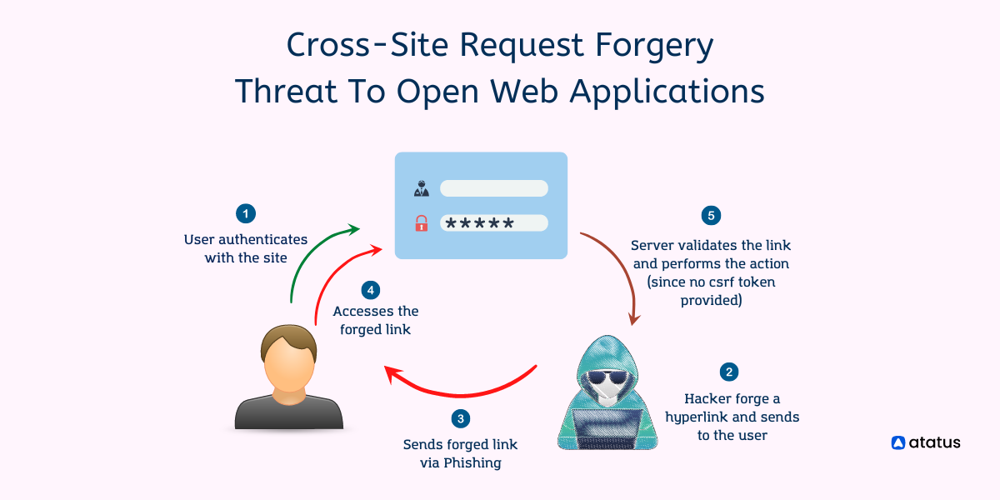

# ✅什么是CSRF攻击？XSS攻击？

## CSRF
**CSRF（Cross-site request forgery跨站请求伪造，也被称为“one click attack”或者session riding，通常缩写为CSRF或者XSRF，是一种对网站的恶意利用。**

你这可以这么理解CSRF攻击：攻击者盗用了你的身份，以你的名义发送恶意请求。CSRF能够做的事情包括：以你名义发送邮件，发消息，盗取你的账号，甚至于购买商品，虚拟货币转账......造成的问题包括：个人隐私泄露以及财产安全。

从上图可以看出，要完成一次CSRF攻击，受害者必须依次完成两个步骤：

1.登录受信任网站A，并在本地生成Cookie。
2.在不登出A的情况下，访问危险网站B。

看到这里，你也许会说：“如果我不满足以上两个条件中的一个，我就不会受到CSRF的攻击”。是的，确实如此，但你不能保证以下情况不会发生：

> 1.你不能保证你登录了一个网站后，不再打开一个tab页面并访问另外的网站。
>  2.你不能保证你关闭浏览器了后，你本地的Cookie立刻过期，你上次的会话已经结束。（事实上，关闭浏览器不能结束一个会话，但大多数人都会错误的认为关闭浏览器就等于退出登录/结束会话了......） 
> 3.上图中所谓的攻击网站，可能本身并不是一个恶意网站，只是自身存在漏洞被别人利用了而已。

## XSS漏洞

**跨站脚本攻击(Cross Site Scripting)，恶意攻击者往Web页面里插入恶意html代码，当用户浏览该页之时，嵌入其中Web里面的html代码会被执行，从而达到恶意攻击用户的特殊目的。**

比如说有这样一种场景：我们有一个a页面，a页面中有一个前台表单，表单内容接受用户输入的用户名和密码。然后我们在b页面中打印出用户在a页面中输入的内容。如果用户正常输入，那么当然没问题。但是如果用户输入的是一段css代码或者javascript代码会发生什么？比如用户输入`` 那么，在b页面中就会弹出对话框。这就是简单的xss攻击。

## 漏洞的解决

**1、防止csrf攻击：** 第一种方式：**验证 HTTP Referer 字段**

> 根据 HTTP 协议，在 HTTP 头中有一个字段叫 `Referer`，它记录了该 HTTP 请求的来源地址。在通常情况下，访问一个安全受限页面的请求来自于同一个网站，比如用户在淘宝买东西，我们需要在他下单的时候检测是不是用户本人进行的操作，那么我们可以通过查看http请求带过来的`referer`是不是`www.taobao.com`信任的URL。但是**这种方式并不是绝对安全的**，为什么这么说呢，问题就在于我们凭什么能相信`referer`呢？什么情况下这个`referer`会有问题呢？其实，虽然http协议有规定，但是每个浏览器对`referer`的实现方式都是不一样的，如果，某个浏览器本身就是不安全的，那么他提供给我们的referer就不是安全的。

第二种方式：**在请求地址中添加 token 并验证**

> CSRF 攻击之所以能够成功，是因为黑客可以完全伪造用户的请求，该请求中所有的用户验证信息都是存在于 cookie 中，因此黑客可以在不知道这些验证信息的情况下直接利用用户自己的 cookie 来通过安全验证。要抵御 CSRF，关键在于在请求中放入黑客所不能伪造的信息，并且该信息不存在于 cookie 之中。可以在 HTTP 请求中以参数的形式加入一个随机产生的 token，并在服务器端建立一个拦截器来验证这个 token，如果请求中没有 token 或者 token 内容不正确，则认为可能是 CSRF 攻击而拒绝该请求。
>  
> 这种方法要比检查 Referer 要安全一些，token 可以在用户登陆后产生并放于 session 之中，然后在每次请求时把 token 从 session 中拿出，与请求中的 token 进行比对，但这种方法的难点在于如何把 token 以参数的形式加入请求。对于 GET 请求，token 将附在请求地址之后，这样 URL 就变成 `http://url?csrftoken=tokenvalue`。 而对于 POST 请求来说，要在 form 的最后加上 `<input type=”hidden” name=”csrftoken” value=”tokenvalue”/>`，这样就把 token 以参数的形式加入请求了。但是，在一个网站中，可以接受请求的地方非常多，要对于每一个请求都加上 token 是很麻烦的，并且很容易漏掉，通常使用的方法就是在每次页面加载时，使用 javascript 遍历整个 dom 树，对于 dom 中所有的 a 和 form 标签后加入 token。这样可以解决大部分的请求，但是对于在页面加载之后动态生成的 html 代码，这种方法就没有作用，还需要程序员在编码时手动添加 token。
>  
> 该方法还有一个缺点是难以保证 token 本身的安全。特别是在一些论坛之类支持用户自己发表内容的网站，黑客可以在上面发布自己个人网站的地址。由于系统也会在这个地址后面加上 token，黑客可以在自己的网站上得到这个 token，并马上就可以发动 CSRF 攻击。为了避免这一点，系统可以在添加 token 的时候增加一个判断，如果这个链接是链到自己本站的，就在后面添加 token，如果是通向外网则不加。不过，即使这个 csrftoken 不以参数的形式附加在请求之中，黑客的网站也同样可以通过 Referer 来得到这个 token 值以发动 CSRF 攻击。这也是一些用户喜欢手动关闭浏览器 Referer 功能的原因。

第三种方式：**在 HTTP 头中自定义属性并验证**

> 这种方法也是使用 token 并进行验证，和上一种方法不同的是，这里并不是把 token 以参数的形式置于 HTTP 请求之中，而是把它放到 HTTP 头中自定义的属性里。通过 XMLHttpRequest 这个类，可以一次性给所有该类请求加上 csrftoken 这个 HTTP 头属性，并把 token 值放入其中。这样解决了上种方法在请求中加入 token 的不便，同时，通过 XMLHttpRequest 请求的地址不会被记录到浏览器的地址栏，也不用担心 token 会透过 Referer 泄露到其他网站中去。
>  
> 然而这种方法的局限性非常大。XMLHttpRequest 请求通常用于 Ajax 方法中对于页面局部的异步刷新，并非所有的请求都适合用这个类来发起，而且通过该类请求得到的页面不能被浏览器所记录下，从而进行前进，后退，刷新，收藏等操作，给用户带来不便。另外，对于没有进行 CSRF 防护的遗留系统来说，要采用这种方法来进行防护，要把所有请求都改为 XMLHttpRequest 请求，这样几乎是要重写整个网站，这代价无疑是不能接受的。

**2、防止xss攻击：** 预防xss攻击的方法很简单，就是要遵守一个原则：任何时候都不完全相信用户的输入，要对用户的输入进行过滤。

> 原文: <https://www.yuque.com/hollis666/dr9x5m/ut062n>