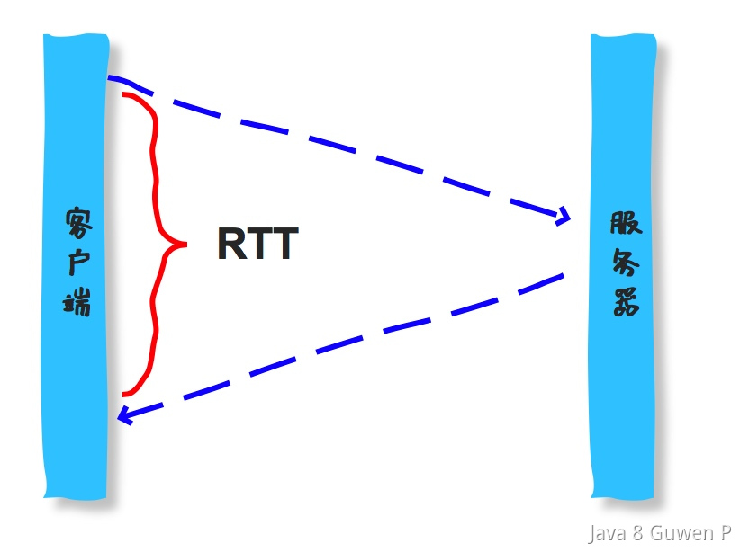

# ✅HTTP/2存在什么问题，为什么需要HTTP/3？

# 典型回答

## TCP队头阻塞

HTTP/2虽然**解决了HTTP队头阻塞的问题。**HTTP/2仍然会存在TCP队头阻塞的问题，那是因为HTTP/2其实还是依赖TCP协议实现的。

TCP传输过程中会把数据拆分为一个个**按照顺序**排列的数据包，这些数据包通过网络传输到了接收端，接收端再**按照顺序**将这些数据包组合成原始数据，这样就完成了数据传输。

但是如果其中的某一个数据包没有按照顺序到达，接收端会一直保持连接等待数据包返回，这时候就会阻塞后续请求。这就发生了**TCP队头阻塞**。

HTTP/1.1的管道化持久连接也是使得同一个TCP链接可以被多个HTTP使用，但是HTTP/1.1中规定一个域名可以有6个TCP连接。而HTTP/2中，同一个域名只是用一个TCP连接。

所以，**在HTTP/2中，TCP队头阻塞造成的影响会更大**，因为HTTP/2的多路复用技术使得多个请求其实是基于同一个TCP连接的，那如果某一个请求造成了TCP队头阻塞，那么多个请求都会受到影响。

## TCP握手时长

一提到TCP协议，大家最先想到的一定是他的三次握手与四次关闭的特性。

**因为TCP是一种可靠通信协议，而这种可靠就是靠三次握手实现的，通过三次握手，TCP在传输过程中可以保证接收方收到的数据是完整，有序，无差错的。**

但是，问题是三次握手是需要消耗时间的，这里插播一个关于网络延迟的概念。

网络延迟又称为 RTT（Round Trip Time）。他是指一个请求从客户端浏览器发送一个请求数据包到服务器，再从服务器得到响应数据包的这段时间。RTT 是反映网络性能的一个重要指标。

我们知道，TCP三次握手的过程客户端和服务器之间需要交互三次，那么也就是说需要消耗1.5 RTT。

另外，如果使用的是安全的HTTPS协议，就还需要使用TLS协议进行安全数据传输，这个过程又要消耗一个RTT（TLS不同版本的握手机制不同，这里按照最小的消耗来算）

那么也就是说，一个纯HTTP/2的连接，需要消耗1.5个RTT，如果是一个HTTPS连接，就需要消耗3-4个RTT。

而具体消耗的时长根据服务器和客户端之间的距离则不尽相同，如果比较近的话，消耗在100ms以内，对于用户来说可能没什么感知，但是如果一个RTT的耗时达到300-400ms，那么，一次连接建立过程总耗时可能要达到一秒钟左右，这时候，用户就会明显的感知到网页加载很慢。

## 升级TCP是否可行？
基于上面我们提到的这些问题，很多人提出来说：既然TCP存在这些问题，并且我们也知道这些问题的存在，甚至解决方案也不难想到，为什么不能对协议本身做一次升级，解决这些问题呢？

其实，这就涉及到一个”**协议僵化**“的问题。

这样讲，我们在互联网上浏览数据的时候，数据的传输过程其实是极其复杂的。

我们知道的，想要在家里使用网络有几个前提，首先我们要通过运行商开通网络，并且需要使用路由器，而路由器就是网络传输过程中的一个中间设备。

中间设备是指插入在数据终端和信号转换设备之间，完成调制前或解调后某些附加功能的辅助设备。例如集线器、交换机和无线接入点、路由器、安全解调器、通信服务器等都是中间设备。

在我们看不到的地方，这种中间设备还有很多很多，**一个网络需要经过无数个中间设备的转发才能到达终端用户。**

如果TCP协议需要升级，那么意味着需要这些中间设备都能支持新的特性，我们知道路由器我们可以重新换一个，但是其他的那些中间设备呢？尤其是那些比较大型的设备呢？更换起来的成本是巨大的。

而且，除了中间设备之外，操作系统也是一个重要的因素，**因为TCP协议需要通过操作系统内核来实现，而操作系统的更新也是非常滞后的。**

所以，这种问题就被称之为”中间设备僵化”，也是导致”协议僵化”的重要原因。这也是限制着TCP协议更新的一个重要原因。

所以，近些年来，由IETF标准化的许多TCP新特性都因缺乏广泛支持而没有得到广泛的部署或使用！

## 放弃TCP？
上面提到的这些问题的根本原因都是因为HTTP/2是基于TCP实现导致的，而TCP协议自身的升级又是很难实现的。

那么，剩下的解决办法就只有一条路，那就是放弃TCP协议。

放弃TCP的话，就又有两个新的选择，是使用其他已有的协议，还是重新创造一个协议呢？

看到这里，聪明的读者一定也想到了，**创造新的协议一样会受到中间设备僵化的影响**。近些年来，因为在互联网上部署遭遇很大的困难，创造新型传输层协议的努力基本上都失败了！

所以，想要升级新的HTTP协议，那么就只剩一条路可以走了，那就是基于已有的协议做一些改造和支持，UDP就是一个绝佳的选择了。

> 原文: <https://www.yuque.com/hollis666/dr9x5m/pg5ika>