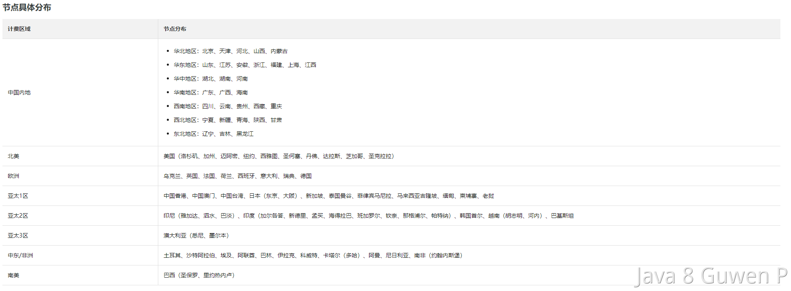

# ✅什么是CDN，为什么他可以做缓存？

# 典型回答

CDN是Content Delivery Network的缩写，翻译成内容分发网络（这个中文名我一直记不住），它主要是通过将内容存储在全球各地的**边缘节点**上，以就近原则向用户提供内容。

**CDN可以做缓存是因为它在全球范围内部署了多个边缘节点，这些节点分布在不同的地理位置，靠近用户所在的区域。**当用户请求某个资源（例如网页、图片、视频等），CDN会根据用户的位置，将资源从最近的边缘节点提供给用户。

比如说我在内蒙古呼和浩特，我想要访问部署在上海的淘宝服务器，这时候发起一次请求的话，就需要从呼和浩特把请求发送到上海。那如果能够更近一点的区域快速拿到一些资源的话，就可以不用这么慢了。

那么CDN刚好是可以部署在很多地方的边缘节点，你比如说阿里云的CDN（非广告，哈哈哈），在全球拥有3200+节点。中国内地（大陆）拥有2300+节点，覆盖31个省级区域；中国香港、中国澳门、中国台湾、其他国家和地区拥有900+节点，覆盖70多个国家和地区。

如果很多静态资源可以放到CDN上面，那么就可以就近的访问到CDN，然后快速的获取到这些静态的资源。

CDN具有广泛的应用场景，可实现图片小文件、大文件下载和视音频点播业务类型的存储，以实现加速的目的。

用户首次访问这些资源的时候，CDN会将资源从服务器获取到，并将其缓存到边缘节点上。当其他用户在同一地区请求相同的资源时，CDN会直接从边缘节点返回缓存的副本，而不必再次访问源服务器。这样可以减少网络延迟和带宽消耗，提高内容的传输速度和响应性能。

> 原文: <https://www.yuque.com/hollis666/dr9x5m/bztzrb0lz77vfpxf>