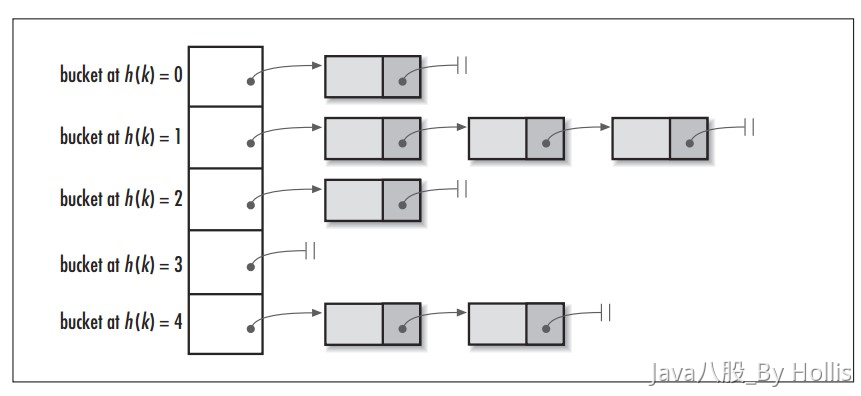
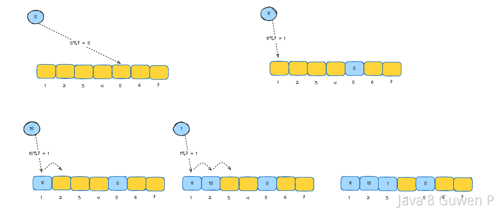
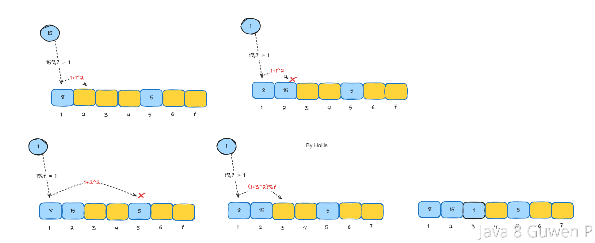
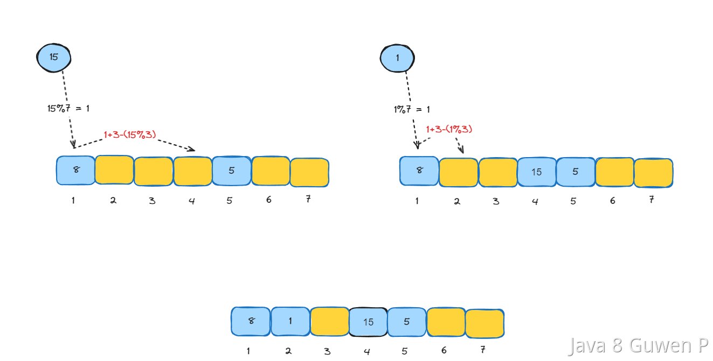
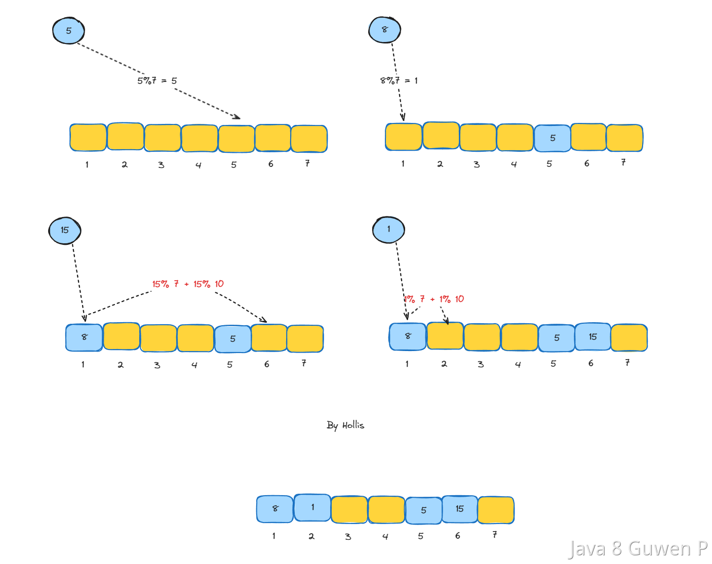

# ✅hash冲突通常怎么解决？

# 典型回答

常见的5种方法：

1. 开放定址法
   - 开放定址法就是一旦发生了冲突，就去寻找下一个空的散列地址，只要散列表足够大，空的散列地址总能找到，并将记录存入。
   - 常见的开放寻址技术有线性探测、二次探测和双重散列。
   - 这种方法的缺点是可能导致“聚集”问题，降低哈希表的性能。
2. 链地址法
   - 最常用的解决哈希冲突的方法之一。
   - 每个哈希桶（bucket）指向一个链表。当发生冲突时，新的元素将被添加到这个链表的末尾。
   - 在Java中，HashMap就是通过这种方式来解决哈希冲突的。Java 8之前，HashMap使用链表来实现；从Java 8开始，当链表长度超过一定阈值时，链表会转换为红黑树，以提高搜索效率。
3. 再哈希法
   - 当哈希地址发生冲突用其他的函数计算另一个哈希函数地址，直到冲突不再产生为止。
   - 这种方法需要额外的计算，但可以有效降低冲突率。
4. 建立公共溢出区
   - 将哈希表分为基本表和溢出表两部分，发生冲突的元素都放入溢出表中。
5. 一致性hash
   - 主要用于分布式系统中，如分布式缓存。它通过将数据均匀分布到多个节点上来减少冲突。

[✅什么是一致性哈希？](https://www.yuque.com/hollis666/dr9x5m/hgx0twgg4t7nqg6v?view=doc_embed)

# 扩展知识

## 链地址法
HashMap采用该方法，当出现hash冲突的时候，会使同一个hash的所有值形成一个链表。查询的时候，首先通过hash定位到该链表，然后再遍历链表获得结果。

此时，对于hash(5)和hash(6)的冲突来说，则会在hash表的第三个节点形成链表，如：hash[3]->5->6

优点：

1. 处理冲突简单
2. 适合经常插入和删除的情况下
3. 适合没有预定空间的情况

缺点

1. 当冲突较多的时候，查询复杂度趋近于O(n)

## 开放定址法
开放定址法是解决哈希表中哈希冲突的一种方法。与链地址法不同，开放寻址法在哈希表本身的数组中寻找空闲位置来存储冲突的元素。这种方法的关键在于，当一个新的键通过哈希函数定位到一个已被占用的槽位时，它将探索哈希表的其他槽位，直到找到一个空槽位。

开放寻址法主要有以下几种实现方式：

1. **线性探测（Linear Probing）**：
   - 当发生冲突时，顺序检查表中的下一个槽位。
   - 如果该槽位也被占用，则继续向下检查，直到找到一个空槽位。
   - 线性探测的问题在于“聚集”：一旦发生多次连续冲突，就会形成一长串被占用的槽位，这会影响后续插入和查找的效率。

如使用大小为7的hash表，依次存储5、8、15、1

2. **二次探测（Quadratic Probing）**：
   - 使用二次方的序列来探测下一个槽位（例如，1, 4, 9, 16, ...）。
   - 这种方法可以减少聚集的问题，但仍然可能存在较小范围的聚集。

同样是依次存储5、8、15、1，当存储到15和1的时候开始冲突，结果如下：

3. **双重散列（Double Hashing）**：
   - 使用两个不同的哈希函数。
   - 当第一个哈希函数导致冲突时，使用第二个哈希函数来确定探测序列。
   - 这种方法的优点是减少了聚集，并且能更好地分散键的分布。
   - 

同样是依次存储5、8、15、1，假设第二个哈希函数为 `hash2(key) = 3 - (key % 3)`。

   - 

开放定址法的**优点是**：

- 空间效率：由于不需要额外的数据结构（如链表），开放寻址法通常比链地址法使用更少的内存。
- 缓存友好性：由于数据存储在连续的内存空间，所以在寻址时可能有更好的缓存性能。

然而，开放寻址法也**有缺点**：

- 当负载因子（即表中已占用的槽位比例）较高时，查找空槽位的时间可能会显著增加。
- 删除操作相对复杂，因为简单地将槽位置为空可能会打断探测序列。

## 再哈希法
当发生冲突时，需要更换hash函数，直到新的hash函数没有冲突

假设两个哈希函数定义如下：

- 第一个哈希函数：`hash1(key) = key % 7`
- 第二个哈希函数：`hash2(key) = key % 7 + key % 10`

我们要插入的键值是：5、8、15、1

## **双重散列和再哈希的区别**

通过上面的例子，很多人会疑惑，双重散列和再哈希好像都是多个哈希函数进行的，看上去是一样的？

其实大差不差，要说区别的话，在哈希的两个函数没有任何关系，第二次哈希的结果是啥就按照啥进行存储，如`key % 7 + key % 10` 的结果是6，那么就直接向6这个位置上存储。而双重散列是开放定址的一种，第二个哈希的结果是在第一次冲突那个位置基础上进行寻址的，如哈希函数是`3-(key%3)` = 2 ，那么最终是在之前的冲突位置向后找2个。

> 原文: <https://www.yuque.com/hollis666/dr9x5m/pogt662wy87z24dr>