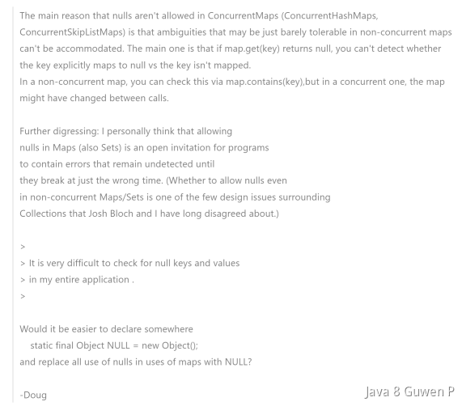

# ✅为什么ConcurrentHashMap不允许null值？

# 典型回答

我们知道，ConcurrentHashMap在使用时，和HashMap有一个比较大的区别，**那就是HashMap中，null可以作为键或者值都可以。而在ConcurrentHashMap中，key和value都不允许为null。**

那么，为什么呢？为啥ConcurrentHashMap要设计成这样的呢？

关于这个问题，其实最有发言权的就是ConcurrentHashMap的作者——Doug Lea

他自己曾经出面解释过这个问题，内容如下（[http://cs.oswego.edu/pipermail/concurrency-interest/2006-May/002485.html](http://cs.oswego.edu/pipermail/concurrency-interest/2006-May/002485.html) ，原文地址已经打不开了，大家将就着看一下截图吧） ：

**主要意思就是说：**

ConcurrentMap（如ConcurrentHashMap、ConcurrentSkipListMap）不允许使用null值的主要原因是，**在非并发的Map中（如HashMap)，是可以容忍模糊性（二义性）的，而在并发Map中是无法容忍的。**

假如说，所有的Map都支持null的话，那么map.get(key)就可以返回null，但是，这时候就会存在一个不确定性，当你拿到null的时候，你是不知道他是因为本来就存了一个null进去还是说就是因为没找到而返回了null。

在HashMap中，因为它的设计就是给单线程用的，所以当我们map.get(key)返回null的时候，我们是可以通过map.contains(key)检查来进行检测的，如果它返回true，则认为是存了一个null，否则就是因为没找到而返回了null。

但是，像ConcurrentHashMap，它是为并发而生的，它是要用在并发场景中的，当我们map.get(key)返回null的时候，是没办法通过map.contains(key)检查来准确的检测，因为在检测过程中可能会被其他线程所修改，而导致检测结果并不可靠。

所以，为了让ConcurrentHashMap的语义更加准确，不存在二义性的问题，他就不支持null。

> 原文: <https://www.yuque.com/hollis666/dr9x5m/ro41pfdt3hu4ocgq>