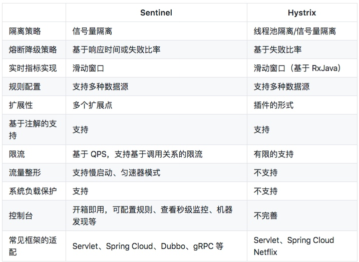

# ✅什么是服务降级？

# 典型回答
限流和降级都是对系统的保护功能，一般用户在流量高峰时期，比如双十一大促。

降级是通过开关配置将某些不重要的业务功能屏蔽掉，以提高服务处理能力。在大促场景中经常会对某些服务进行降级处理，大促结束之后再进行复原。

**区别于熔断机制，降级一般并不是彻底功能不可用，而是用一种默认返回、异步执行、延迟处理等方式进行降低处理。**

# 扩展知识

## 服务降级

服务降级的概念听起来可能不是很容易理解，举一个生活中的例子就很好理解了。

有的时候我们去饭店吃饭，吃完饭以后服务员会拿一张问卷，让就餐者填写一下用户反馈。但是，这种让用户填写反馈的请求，只有在店里不忙的时候才会出现。如果店里非常忙，顾客很多的话，店员就不会再找就餐者填写问卷了。

其实，这种就是服务降级。在人流量大的时候，用户反馈这个功能就被降级了。因为他相对来说并没有那么重要。

接着再来看分布式系统的降级。

上图是一张淘宝商品的详情页，对于很多剁手党来说这个页面真的是再熟悉不过了。

但是，这个页面我粗略的大致数了一下，至少有15个以上的功能模块，如：图片、标题、定价、库存、推荐、评价、物流、收藏、下单等。

虽然这些功能都展示在同一个页面上，但是其实这些功能并不都是在同一个应用里面的。这十几个模块可能分别在十几个应用中实现的。

详情页在渲染的时候，要和十几个应用进行网络交互。

这些功能中，有一些是非常重要的，比如：定价、库存、下单等。还有一些是相对来说没那么重要的，比如：推荐、收藏等。

> 这个识别哪些功能是核心功能、哪些功能是非核心功能，然后对非核心功能采取不同的降级方案制定的过程叫做**降级预案**。

双十一当天，整个网站的流量十分巨大的，详情页的访问量更是整个网站的重灾之地。所以，一旦有大促的时候，需要有限保证主要功能的可用，至于那些次要的功能就可以被降级掉，即不显示某些模块，或者返回一些默认内容。

## 降级的方式

还拿之前的饭店中给用户做问卷调查的例子来说。当人流量大的时候，直接取消问卷调查只是一种方式。还有很多其他方式可以选择的。比如：

1、先让用户填写一下手机号，然后离店后，给用户发短信，让其填写电子问卷。

2、在店门口放一个问卷，用户离店时自己去填写问卷。 等等，只要愿意想，其实是有很多种方案的。

同样，对于大型网站来说，服务的降级其实也是有很多方式可以选的，常见的几种如下：

### 延迟服务

比如发表了评论，重要服务，比如在文章中显示正常，但是延迟给用户增加积分，只是放到一个缓存中，等服务平稳之后再执行。

#### 在粒度范围内关闭服务（片段降级或服务功能降级）

比如关闭相关文章的推荐，直接关闭推荐区

#### 页面异步请求降级

比如商品详情页上有推荐信息/配送至等异步加载的请求，如果这些信息响应慢或者后端服务有问题，可以进行降级； **页面跳转（页面降级）**

比如可以有相关文章推荐，但是更多的页面则直接跳转到某一个地址。

#### 写降级

比如秒杀抢购，我们可以只进行Cache的更新，然后异步同步扣减库存到DB，保证最终一致性即可，此时可以将DB降级为Cache。

#### 读降级

比如多级缓存模式，如果后端服务有问题，可以降级为只读缓存，这种方式适用于对读一致性要求不高的场景；

> 11月11日的零点到11月12日的零点之间无法退款，其实是采用了关闭服务这种降级方式

## 降级的介入方式

按照是不是可以自动化降级，降级共有两种介入方式，分别是：**自动开关降级**和**人工开关降级**。

### 自动开关降级

自动开关降级的方式一般是当系统达到某些设定的条件（系统负载、资源使用情况、SLA等指标）之后，自动执行一些策略。

常见的可以作为自动降级条件的指标有以下几个：

#### 服务超时

当访问的数据库/http服务/远程调用响应慢或者长时间响应慢，且该服务不是核心服务的话可以在超时后自动降级；

比如前面提到的详情页上有推荐和收藏功能，即使出现问题也不会影响用户的正常下单。如果是调用别人的远程服务，和对方定义一个服务响应最大时间，如果超时了则可以自动降级。

#### 失败次数

调用外部服务的时候，除了超时以外，最常见的异常情况就是调用失败。比如详情页中的库存信息，如果是某一次查询请求失败了，那么就可以通过读取缓存数据等方式直接降级掉。

但是，这种降级可能存在一个问题，就是虽然一次请求展示了缓存，但是其他用户访问的时候还是会查询库存信息，这对于库存系统来说就是雪上加霜。因为他可能已经有问题了，但是上游系统还是在不断的对他发送请求。

所以，可以针对这个查询库存的接口做统一的降级。设定一个失败次数的阈值，一旦整体失败次数达到这个阈值了，就对后续一段时间内的该查询接口做降级。直到其功能恢复。

**发生故障**

上面提到的失败可能是服务不稳定造成的，过一段时间可以自动恢复的。还有一种情况可能是依赖的服务彻底跪了、或者网络不通了等等。这种情况就可以直接降级了。

当HTTP请求返回固定的错误码、或者一个RPC请求的时候底层服务抛了异常以后，就认为有故障发生，对其进行降级即可。

#### 限流降级

还有种电商网站常见的策略，那就是限流降级。对于某些功能，设定一个流量阈值，一旦流量达到阈值的话，就进行降级。

比如秒杀功能，如果一瞬间流量太大，就可以进行限流降级。对于后续访问的用户直接提示已售空、跳转错误页、或者让他输入验证码重试等。

### 人工开关降级

还有一种降级方式，那就是人工开关降级。

人工开关降级的方式是指当系统维护人员在发现系统异常之后，通过人工修改参数、关闭服务等方式进行降级的方法。

这种方式的好处是比较灵活，能够根据异常情况灵活应对；但弊端是对人的要求比较高，一来需要维护人员对系统有足够的了解，另外要求维护人员在系统异常时能够在第一时间进行处置。

还有一种情况，可能也会人工介入，那就是在大促之前，预估到流量会十分巨大，提早的识别出风险，为了节省资源保证主流程的可用，开发人员可以手动将某个功能降级掉。

这里说的人工开关降级，并不一定是一定要人工操作，也可能是人工通过一个定时任务进行定时触发的。

## 降级工具

目前市面上，针对流量控制，限流降级主要有以下两种选择：Netflix Hystrix 和 Alibaba Sentinal。

### Hystrix 

Hystrix是一个库，它提供了服务与服务之间的容错功能，主要体现在延迟容错和容错，从而做到控制分布式系统中的联动故障。Hystrix通过隔离服务的访问点，阻止联动故障，并提供故障的解决方案，从而提高了这个分布式系统的弹性。

Hystrix 的关注点在于以 隔离 和 熔断 为主的容错机制，超时或被熔断的调用将会快速失败，并可以提供 fallback 机制。

### Sentinel 

Sentinel 是阿里中间件团队开源的，面向分布式服务架构的轻量级高可用流量控制组件，主要以流量为切入点，从流量控制、熔断降级、系统负载保护等多个维度来帮助用户保护服务的稳定性。

Sentinel 的侧重点在于：多样化的流量控制、熔断降级、系统负载保护、实时监控和控制台等

### 对比



上图是Sentinel的文档中，关于Sentinel-与-Hystrix-的对比。详情地址：[https://github.com/alibaba/Sentinel/wiki/Sentinel-与-Hystrix-的对比](https://github.com/alibaba/Sentinel/wiki/Sentinel-%E4%B8%8E-Hystrix-%E7%9A%84%E5%AF%B9%E6%AF%94)

> 原文: <https://www.yuque.com/hollis666/dr9x5m/zc8a9ve759o242vr>